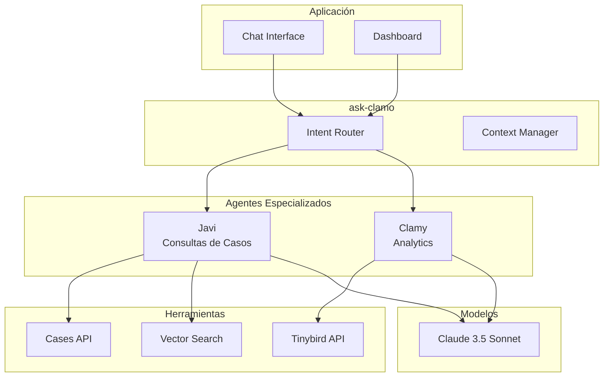
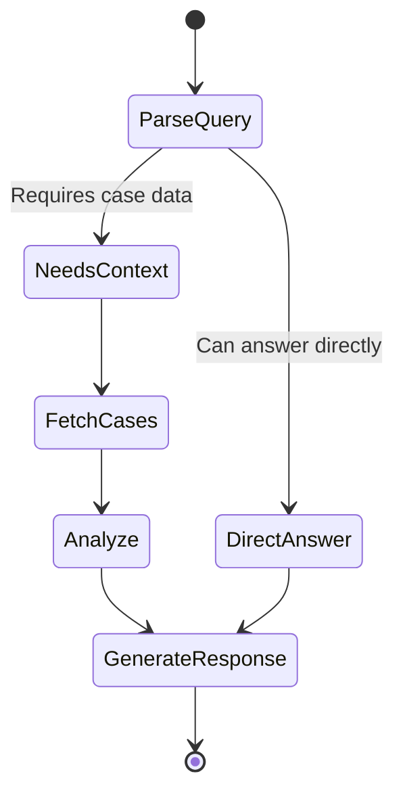

# Asistentes IA

Clamo integra asistentes de IA especializados construidos con LangGraph para proporcionar consultas inteligentes sobre casos y análisis predictivo.

## Arquitectura General



## Agentes

### Javi - Asistente de Casos

Especializado en consultas sobre expedientes judiciales específicos.

| Propiedad | Valor |
|-----------|-------|
| **Repositorio** | `GetClamo/javi` |
| **Framework** | LangGraph |
| **Modelo** | Claude 3.5 Sonnet |
| **Puerto** | 8123 |

#### Capacidades

- Buscar casos por criterios
- Explicar movimientos procesales
- Resumir estado actual de un caso
- Identificar próximos pasos probables
- Comparar casos similares

#### Grafo de Estados



#### Implementación

```python
from langgraph.graph import StateGraph, END
from langchain_anthropic import ChatAnthropic

class JaviState(TypedDict):
    messages: list[BaseMessage]
    cases: list[dict]
    context: str
    response: str

def create_javi_graph():
    graph = StateGraph(JaviState)
    
    # Nodos
    graph.add_node("parse_query", parse_query)
    graph.add_node("fetch_cases", fetch_cases)
    graph.add_node("analyze", analyze_cases)
    graph.add_node("generate", generate_response)
    
    # Edges
    graph.add_edge("parse_query", "fetch_cases")
    graph.add_edge("fetch_cases", "analyze")
    graph.add_edge("analyze", "generate")
    graph.add_edge("generate", END)
    
    graph.set_entry_point("parse_query")
    
    return graph.compile()

async def fetch_cases(state: JaviState) -> JaviState:
    """Obtiene casos relevantes de la API."""
    query = state["messages"][-1].content
    
    # Extraer filtros de la query
    filters = await extract_filters(query)
    
    # Llamar a la API de casos
    cases = await cases_api.search(
        company_id=state["context"]["company_id"],
        **filters,
    )
    
    return {"cases": cases}

async def analyze_cases(state: JaviState) -> JaviState:
    """Analiza los casos con el LLM."""
    llm = ChatAnthropic(model="claude-3-5-sonnet-20241022")
    
    analysis = await llm.ainvoke([
        SystemMessage(content=JAVI_SYSTEM_PROMPT),
        HumanMessage(content=f"""
            Casos encontrados:
            {json.dumps(state["cases"], indent=2)}
            
            Pregunta del usuario:
            {state["messages"][-1].content}
        """),
    ])
    
    return {"context": analysis.content}
```

### Clamy - Asistente de Analytics

Especializado en análisis de datos y métricas.

| Propiedad | Valor |
|-----------|-------|
| **Repositorio** | `GetClamo/clamy` |
| **Framework** | LangGraph + MCP |
| **Modelo** | Claude 3.5 Sonnet |
| **Puerto** | 8124 |

#### Capacidades

- Generar reportes de cartera
- Analizar tendencias temporales
- Calcular métricas de riesgo
- Proyecciones y predicciones
- Comparativas por período

#### Integración MCP (Model Context Protocol)

Clamy usa MCP para conectarse directamente a Tinybird:

```python
from mcp import ClientSession
from mcp.client.stdio import stdio_client

async def create_clamy_with_mcp():
    # Conectar a Tinybird via MCP
    async with stdio_client(
        command="npx",
        args=["@tinybirdco/mcp-tinybird"],
        env={"TINYBIRD_TOKEN": os.environ["TINYBIRD_TOKEN"]},
    ) as (read, write):
        async with ClientSession(read, write) as session:
            # Listar herramientas disponibles
            tools = await session.list_tools()
            
            # El LLM puede usar estas herramientas
            return create_clamy_graph(session, tools)
```

#### Consultas Generadas

Clamy puede generar y ejecutar queries SQL en Tinybird:

```python
async def execute_analytics_query(state: ClamyState) -> ClamyState:
    """Genera y ejecuta query de analytics."""
    llm = ChatAnthropic(model="claude-3-5-sonnet-20241022")
    
    # Generar SQL
    sql_response = await llm.ainvoke([
        SystemMessage(content=CLAMY_SQL_PROMPT),
        HumanMessage(content=f"""
            Esquema de datos:
            {TINYBIRD_SCHEMA}
            
            Pregunta:
            {state["messages"][-1].content}
            
            Genera una query SQL para Tinybird.
        """),
    ])
    
    sql = extract_sql(sql_response.content)
    
    # Ejecutar en Tinybird
    result = await tinybird.query(sql)
    
    return {"analytics_data": result}
```

## ask-clamo - Gateway Unificado

Punto de entrada único que enruta a los agentes especializados.

```python
class AskClamoRouter:
    def __init__(self):
        self.javi = create_javi_graph()
        self.clamy = create_clamy_graph()
        self.classifier = ChatAnthropic(model="claude-3-haiku-20240307")
    
    async def route(self, message: str, context: dict) -> str:
        # Clasificar intención
        intent = await self.classify_intent(message)
        
        if intent == "case_query":
            return await self.javi.ainvoke({
                "messages": [HumanMessage(content=message)],
                "context": context,
            })
        elif intent == "analytics":
            return await self.clamy.ainvoke({
                "messages": [HumanMessage(content=message)],
                "context": context,
            })
        else:
            # Respuesta directa sin agente
            return await self.direct_response(message)
    
    async def classify_intent(self, message: str) -> str:
        response = await self.classifier.ainvoke([
            SystemMessage(content="""
                Clasifica la intención del usuario:
                - case_query: Preguntas sobre casos específicos
                - analytics: Preguntas sobre métricas, tendencias, reportes
                - general: Preguntas generales o saludos
                
                Responde solo con la categoría.
            """),
            HumanMessage(content=message),
        ])
        return response.content.strip().lower()
```

## Herramientas (Tools)

### Cases API Tool

```python
@tool
async def search_cases(
    query: str,
    status: str | None = None,
    risk_level: str | None = None,
    limit: int = 10,
) -> list[dict]:
    """
    Busca casos en la base de datos.
    
    Args:
        query: Texto de búsqueda (expediente, partes)
        status: Filtrar por estado (EN_TRAMITE, ARCHIVADO, etc.)
        risk_level: Filtrar por riesgo (LOW, MEDIUM, HIGH, CRITICAL)
        limit: Número máximo de resultados
    
    Returns:
        Lista de casos que coinciden con los criterios
    """
    response = await cases_api.search(
        search=query,
        status=status,
        risk_level=risk_level,
        limit=limit,
    )
    return response["data"]
```

### Tinybird Tool

```python
@tool
async def query_analytics(sql: str) -> dict:
    """
    Ejecuta una query SQL en Tinybird.
    
    Args:
        sql: Query SQL válida para el esquema de Tinybird
    
    Returns:
        Resultados de la query
    """
    return await tinybird.query(sql)
```

### Vector Search Tool

```python
@tool
async def search_similar_cases(
    case_id: str,
    limit: int = 5,
) -> list[dict]:
    """
    Encuentra casos similares usando embeddings.
    
    Args:
        case_id: ID del caso de referencia
        limit: Número de casos similares a retornar
    
    Returns:
        Lista de casos similares con score de similitud
    """
    # Obtener embedding del caso
    case = await cases_api.get(case_id)
    embedding = await get_case_embedding(case)
    
    # Buscar similares en vector store
    similar = await vector_store.similarity_search(
        embedding,
        k=limit,
    )
    
    return similar
```

## Streaming

Los agentes soportan streaming para respuestas en tiempo real:

```python
async def stream_response(message: str, context: dict):
    async for event in ask_clamo.astream_events(
        {"messages": [HumanMessage(content=message)], "context": context},
        version="v2",
    ):
        if event["event"] == "on_chat_model_stream":
            yield event["data"]["chunk"].content
```

## Configuración

### Variables de Entorno

```bash
# LLM
ANTHROPIC_API_KEY=sk-ant-...

# APIs
CLAMO_CASES_URL=http://localhost:4000
TINYBIRD_TOKEN=p.eyJ...

# Vector Store (opcional)
PINECONE_API_KEY=...
PINECONE_INDEX=clamo-cases
```

## Prompts del Sistema

### Javi

```
Eres Javi, un asistente legal especializado en casos laborales peruanos.

Tu rol es ayudar a abogados y profesionales legales a:
- Entender el estado de sus casos
- Explicar movimientos procesales
- Identificar próximos pasos
- Alertar sobre plazos importantes

Reglas:
- Siempre cita el número de expediente cuando hables de un caso
- Explica términos legales de forma clara
- Si no tienes información suficiente, pregunta
- No inventes datos que no estén en el contexto
```

### Clamy

```
Eres Clamy, un asistente de analytics para gestión legal.

Tu rol es ayudar a analizar:
- Métricas de cartera de casos
- Tendencias temporales
- Distribución de riesgos
- Proyecciones y predicciones

Reglas:
- Siempre muestra los datos que respaldan tus conclusiones
- Usa visualizaciones cuando sea apropiado
- Explica las limitaciones de los datos
- Sugiere acciones basadas en los insights
```

## Próximos Pasos

<CardGroup cols={2}>
  <Card
    title="Analytics"
    icon="chart-line"
    href="/arquitectura/analiticas"
  >
    Pipeline de analytics con Tinybird.
  </Card>
  <Card
    title="Seguridad"
    icon="shield"
    href="/arquitectura/seguridad"
  >
    Arquitectura de seguridad.
  </Card>
</CardGroup>

