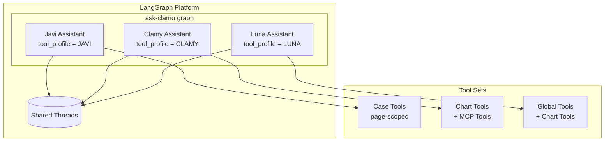
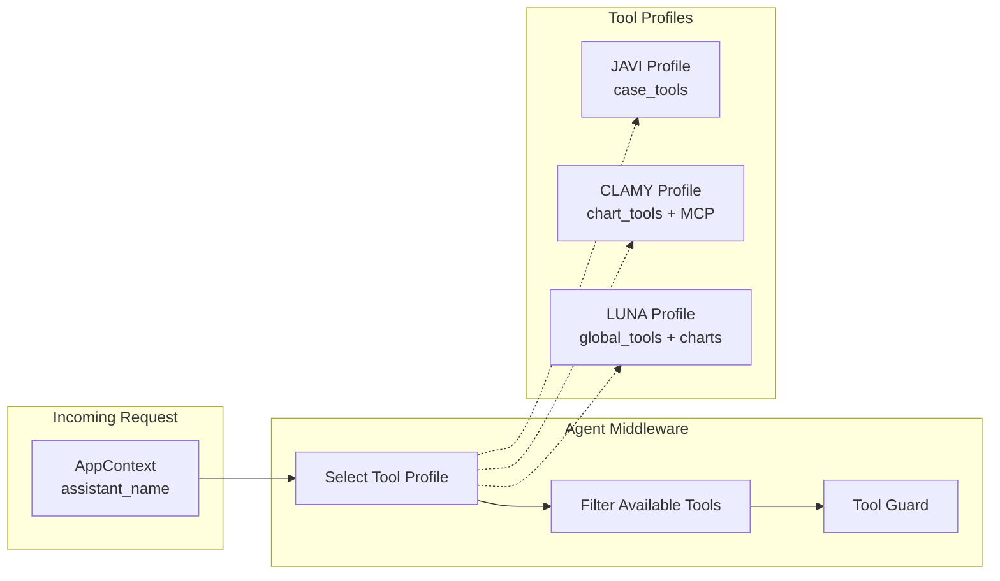

# AI Assistants

Clamo integrates specialized AI assistants built with LangGraph Platform. All three assistants are consolidated into a single deployment called **ask-clamo**.

## Architecture Overview



## Key Features

| Feature | Description |
|---------|-------------|
| **Single Deployment** | One graph serves all three assistants |
| **Shared Threads** | Javi, Clamy, and Luna share message history on the same thread |
| **Tool Isolation** | Each assistant only sees their designated tools via middleware + guard |
| **Dynamic Prompts** | System prompts selected based on `assistant_name` in context |
| **MCP Integration** | Clamy loads Tinybird analytics tools via MCP protocol |
| **Global Access** | Luna can query any case without page context |

## The Three Assistants

### Javi (Case Assistant)

Javi is the page-scoped case assistant embedded in case detail pages. It helps users understand individual legal cases.

**Capabilities:**
- Explain current case status and risk level
- Detail claimed amounts and financial exposure
- Summarize recent case movements
- Explain procedural stages and next steps

**Tools:**
- `get_case_details` - Complete case information (parties, amount, risk, status)
- `get_case_progress` - Process timeline by stages
- `get_case_movements` - Case file actions/movements
- `get_case_milestones` - Important milestones reached

**Required Context:**
- `case_id` - The specific case being viewed
- `company_id` - Tenant identifier
- `access_token` - User authentication

### Clamy (Analytics Assistant)

Clamy is the analytics assistant that generates charts and visualizations for legal portfolio insights.

**Capabilities:**
- Generate interactive charts and KPIs
- Query Tinybird analytics endpoints via MCP
- Create custom visualizations
- Provide portfolio-level insights

**Tools:**
- `show_chart` - Display predefined chart types
- `show_kpi` - Display key performance indicators
- `show_custom_chart` - Custom visualization generation
- `get_chart_template` - Get chart configuration templates
- MCP Tinybird tools (dynamically loaded)

**Required Context:**
- `company_id` - Tenant identifier
- `case_id` - Optional, for case-specific analytics

### Luna (Global Assistant)

Luna is the generalist assistant with access to ALL cases, not limited to a single page context.

**Capabilities:**
- Query any case in the portfolio
- Cross-case analysis and comparisons
- Portfolio overview and search
- Global statistics and trends

**Tools:**
- `get_case_details_by_id` - Case details with case_id as argument
- `get_case_progress_by_id` - Progress with case_id as argument
- `get_case_movements_by_id` - Movements with case_id as argument
- `get_case_milestones_by_id` - Milestones with case_id as argument
- `search_cases` - Search across all cases
- `list_cases` - List cases with filters
- Plus all chart tools from Clamy

**Required Context:**
- `company_id` - Tenant identifier
- `access_token` - User authentication
- `case_id` - NOT required (passed as tool argument)

**MCP Tool Whitelist:**
Luna has access to a curated set of safe MCP tools:
- `api_estadisticas` - Global KPIs
- `api_por_zona` - Geographic distribution
- `api_expedientes` - Filtered case listing
- `api_buscar` - Text search
- `api_estados_caso` - Status distribution
- `api_casos_atencion` - Critical cases
- `api_cases_trends` - Temporal trends
- `api_cases_distribution` - Dimensional distribution

## Tool Isolation Architecture



The middleware ensures:
1. Tool profile is selected based on `assistant_name` in context
2. Only tools from the selected profile are exposed to the LLM
3. A guard prevents execution of tools not in the profile

## Project Structure

```
ask-clamo/
├── langgraph.json          # LangGraph Platform config
├── pyproject.toml          # Python dependencies
└── src/
    └── ask_clamo/
        ├── agent.py            # Main graph entry point
        ├── settings.py         # Unified configuration
        ├── widget_types.py     # Chart type definitions
        ├── state/
        │   └── schemas.py      # AgentState + AppContext
        ├── tools/
        │   ├── registry.py     # Tool profiles (JAVI, CLAMY, LUNA)
        │   ├── case_api.py     # Javi's case tools (page-scoped)
        │   ├── charts.py       # Clamy's chart tools
        │   └── luna_global.py  # Luna's global tools
        ├── middleware/
        │   ├── case_context.py # Shared context fetcher
        │   └── agent_middleware.py  # Tool isolation
        └── prompts/
            ├── javi.py         # Javi system prompt
            ├── clamy.py        # Clamy system prompt
            └── luna.py         # Luna system prompt
```

## Configuration

Environment variables for ask-clamo:

| Variable | Description |
|----------|-------------|
| `LANGCHAIN_API_KEY` | LangSmith API key for tracing |
| `OPENAI_API_KEY` | OpenAI API key for LLM |
| `CLAMO_CASES_URL` | URL of clamo-cases service |
| `TINYBIRD_MCP_URL` | Tinybird MCP server URL |
| `TINYBIRD_TOKEN` | Tinybird authentication token |

## Local Development

```bash
# Navigate to ask-clamo
cd ask-clamo

# Install dependencies
uv sync

# Run locally
langgraph dev
```

The service runs on port **8123** by default.

## Related Documentation

- [ask-clamo Service](/en/services/ask-clamo) - Service-level documentation
- [Analytics Architecture](/en/architecture/analytics) - Tinybird integration details
