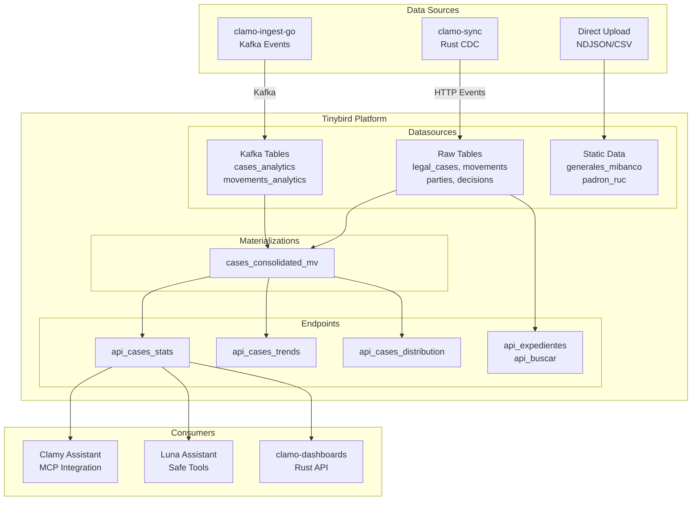
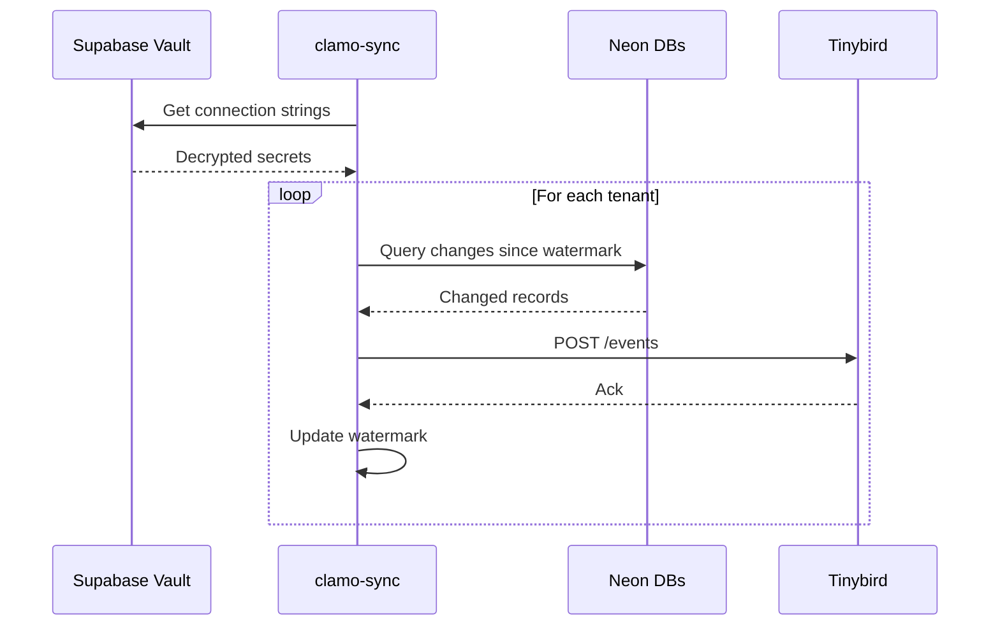
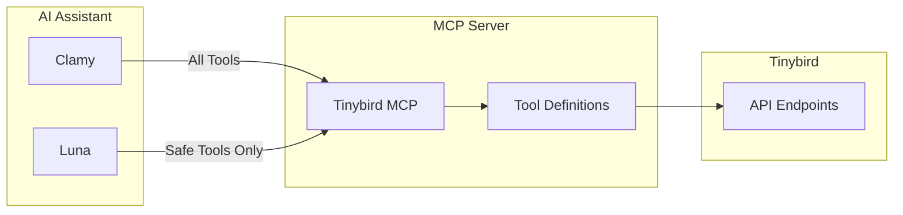
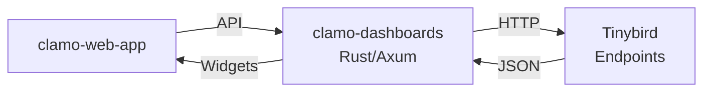

# Analytics Architecture

Clamo uses Tinybird as its analytics engine, providing real-time aggregations and insights across 200+ tenant databases consolidated into a single analytics layer.

## Architecture Overview



## Data Flow

### clamo-sync (Rust)

The primary data synchronization service that consolidates 200+ Neon PostgreSQL databases into Tinybird.

**Key Features**:
- **Incremental sync** using `updated_at` watermarks
- **Schema detection** with automatic full sync on changes
- **Delete detection** via reconciliation (configurable interval)
- **Rate limiting** with exponential backoff for Tinybird limits
- **Horizontal scaling** with configurable worker concurrency

**Sync Flow**:


### clamo-ingest-go (Kafka)

Streams real-time events from the ingestion pipeline directly to Tinybird via Kafka.

**Tables**:
- `cases_analytics` - Real-time case events
- `movements_analytics` - Movement notifications
- `milestones_analytics` - Milestone achievements

## Tinybird Configuration

The Tinybird configuration lives in the `clamo-clickhouse` repository.

### Datasources

| Datasource | Source | Description |
|------------|--------|-------------|
| `legal_cases` | clamo-sync | Core case data |
| `movements` | clamo-sync | Case movements/actions |
| `parties` | clamo-sync | Case parties (demandante/demandado) |
| `decisions` | clamo-sync | Court decisions |
| `case_states` | clamo-sync | Current state snapshots |
| `cases_analytics` | Kafka | Real-time case events |
| `movements_analytics` | Kafka | Real-time movement events |
| `cases_sync_consolidated` | ETL | Rust ETL output |
| `generales_mibanco` | Static | Reference data |
| `padron_ruc` | Static | RUC validation data |

### Materializations

**`cases_consolidated_mv`** - Pre-computed view that denormalizes case data with:
- Latest state
- Party information
- Movement counts
- Risk calculations
- Stage progress

### API Endpoints

| Endpoint | Description |
|----------|-------------|
| `api_cases_consolidated` | Full consolidated case list |
| `api_case_detail` | Single case with all relations |
| `api_cases_stats` | Aggregated KPIs |
| `api_cases_distribution` | Distribution by dimension |
| `api_cases_trends` | Time-series trends |
| `api_expedientes` | Filtered case listing |
| `api_buscar` | Full-text search |
| `api_estadisticas` | Global statistics |
| `api_analisis_juez` | Judge performance analysis |
| `api_analisis_tipologia` | Case type success rates |

## MCP Integration

Clamy and Luna access Tinybird through the MCP (Model Context Protocol) server.



**Luna Safe Tools** (whitelisted for global assistant):
- `api_estadisticas` - Global KPIs
- `api_por_zona` - Geographic distribution
- `api_expedientes` - Filtered listing
- `api_buscar` - Text search
- `api_estados_caso` - Status distribution
- `api_casos_atencion` - Critical cases
- `api_cases_trends` - Temporal trends
- `api_cases_distribution` - Dimensional distribution

**Luna Blocked Tools** (can generate errors):
- `text_to_sql` - Custom SQL generation
- `execute_query` - Custom SQL execution
- `explore_data` - Problematic queries

## clamo-dashboards Integration

The Rust-based dashboard service queries Tinybird for widget data:



**Dashboard Features**:
- Customizable widget layouts
- Cached query results
- Multi-tenant isolation
- Real-time updates

## Observability

### clamo-sync Metrics

Prometheus metrics exposed at `/metrics`:
- `sync_records_total` - Records synced per tenant
- `sync_duration_seconds` - Sync duration histogram
- `sync_errors_total` - Error counts by type
- `tinybird_rate_limit_hits` - Rate limit encounters

### Alerting

Alertmanager integration sends notifications via clamo-mailing:
- Sync failures
- Rate limit warnings
- Schema change detections
- Reconciliation mismatches

## Project Structure

```
clamo-clickhouse/
├── connections/
│   └── kafka_analytics.connection    # Kafka connection config
├── datasources/
│   ├── legal_cases.datasource
│   ├── movements.datasource
│   ├── parties.datasource
│   ├── decisions.datasource
│   ├── case_states.datasource
│   ├── cases_analytics.datasource    # Kafka
│   └── ...
├── endpoints/
│   ├── api_cases_consolidated.pipe
│   ├── api_cases_stats.pipe
│   ├── api_cases_trends.pipe
│   └── ...
├── materializations/
│   └── cases_consolidated.pipe
└── fixtures/
    └── generales_mibanco.ndjson      # Test data
```

## Related Documentation

- [clamo-sync Service](/en/services/clamo-sync)
- [clamo-dashboards Service](/en/services/clamo-dashboards)
- [AI Assistants Architecture](/en/architecture/ai-assistants)
