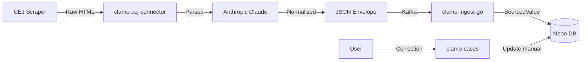

# Data Model

Clamo handles data from multiple origins: CEJ scrapers, AI inferences, and manual user corrections. This guide explains the architectural patterns for managing this complexity.

## The Problem: Multi-Origin Data

In a legal system like Clamo, the same field can have values from different sources:

```
Case Subject Matter:
├── CEJ says: "INDEMNIZACIÓN POR DESPIDO"
├── AI infers: "Wrongful Termination - Compensation"
└── User corrects: "Discriminatory Dismissal"
```

**Which is the correct value?** It depends on context:
- For auditing: you need to see all values
- For display: the user wants to see their correction
- For analytics: you might prefer the AI-normalized value

## SourcedValue Pattern

Clamo implements the **SourcedValue** (Trusted Source Value) pattern for fields that can have multiple origins:

```typescript
interface SourcedValue<T = string> {
  /** Value extracted from CEJ (scraper) */
  cej?: T;
  /** Value inferred by AI (normalization) */
  ai?: T;
  /** Value manually corrected by user */
  manual?: T;
  /** Timestamp of last update by source */
  updatedAt?: {
    cej?: string;
    ai?: string;
    manual?: string;
  };
}
```

### Database Storage

SourcedValue fields are stored as **JSONB** in PostgreSQL:

```prisma
model Case {
  id            String   @id
  expediente    String   @unique
  
  // Simple fields (single source)
  caseNumber    String
  filingDate    DateTime?
  
  // SourcedValue fields stored as JSONB
  subjectMatter    Json? @default("[]") // Array of SourcedValue
  processType      Json? // SourcedValue
  stage            Json? // SourcedValue
  abstract         Json? // SourcedValue (Sumilla)
  observation      Json? // SourcedValue
  conclusionReason Json? // SourcedValue
  
  // CEJ-sourced fields (raw, no transformation)
  cejJudicialDistrict String?
  cejProceduralStage  String?
  
  // AI-sourced fields
  aiConclusionDate DateTime?
}
```

### Data Example

```json
{
  "id": "case_abc123",
  "expediente": "00001-2024-0-1234-JR-LA-01",
  "subjectMatter": {
    "cej": "INDEMNIZACIÓN POR DESPIDO ARBITRARIO",
    "ai": "Wrongful Termination - Damages Compensation",
    "manual": null,
    "updatedAt": {
      "cej": "2024-01-15T10:00:00Z",
      "ai": "2024-01-15T10:05:00Z"
    }
  },
  "stage": {
    "cej": "EJECUCIÓN DE SENTENCIA",
    "ai": "Execution",
    "manual": "Execution - Pending Payment",
    "updatedAt": {
      "cej": "2024-01-15T10:00:00Z",
      "ai": "2024-01-15T10:05:00Z",
      "manual": "2024-01-20T14:30:00Z"
    }
  }
}
```

## Value Resolution

### Default Priority

The `resolveValue` function applies the following priority:

```typescript
function resolveValue<T>(sourced: SourcedValue<T>): T | null {
  // 1. Manual always wins (user has the last word)
  if (sourced.manual !== undefined && sourced.manual !== null) {
    return sourced.manual;
  }
  
  // 2. AI is preferred over CEJ (normalized)
  if (sourced.ai !== undefined && sourced.ai !== null) {
    return sourced.ai;
  }
  
  // 3. CEJ as fallback (raw)
  return sourced.cej ?? null;
}
```

### Contextual Resolution

For specific cases, you can request a particular source:

```typescript
function getValueBySource<T>(
  sourced: SourcedValue<T>, 
  source: 'cej' | 'ai' | 'manual' | 'resolved'
): T | null {
  switch (source) {
    case 'cej': return sourced.cej ?? null;
    case 'ai': return sourced.ai ?? null;
    case 'manual': return sourced.manual ?? null;
    case 'resolved': return resolveValue(sourced);
  }
}
```

## Data Sources

### ClaimSource Enum

For fields that only have one source (not SourcedValue), we use the `ClaimSource` enum:

```prisma
enum ClaimSource {
  CEJ     // Extracted from scraper
  AI      // Inferred by model
  MANUAL  // Entered by user
}

model Claim {
  id          String      @id
  type        ClaimType
  amount      Decimal?
  description String?
  source      ClaimSource // Indicates the claim's origin
}
```

## Movements and SourcedValue

Procedural movements also use SourcedValue for fields that can be enriched:

```prisma
model Movement {
  id              String   @id
  caseId          String
  
  // Raw CEJ data (immutable)
  cejDate         DateTime
  cejDescription  String?
  cejRawPayload   Json?    // Complete scraper payload
  
  // SourcedValue fields as JSONB
  name     Json?  // Normalized display name
  summary  Json?  // AI-generated summary
  tags     Json?  // Classification tags
  metadata Json?  // Additional metadata
}
```

## Pattern Benefits

### 1. Complete Traceability

You can always see where each value came from:

```typescript
// In the frontend
function renderFieldWithSource(field: SourcedValue<string>) {
  const resolved = resolveValue(field);
  const source = field.manual ? 'manual' : field.ai ? 'ai' : 'cej';
  
  return (
    <div>
      <span>{resolved}</span>
      <Badge variant={source}>{source.toUpperCase()}</Badge>
    </div>
  );
}
```

### 2. Audit and Compliance

For legal cases, it's critical to demonstrate data origin:

```sql
-- View change history by source
SELECT 
  id,
  expediente,
  subject_matter->>'cej' as cej_value,
  subject_matter->>'ai' as ai_value,
  subject_matter->>'manual' as manual_value,
  subject_matter->'updatedAt'->>'manual' as manual_updated_at
FROM "Case"
WHERE subject_matter->>'manual' IS NOT NULL;
```

### 3. Granular Rollback

If AI makes a mistake, the CEJ value is still available:

```typescript
async function rollbackToSource(caseId: string, field: string, source: 'cej' | 'ai') {
  const case = await db.case.findUnique({ where: { id: caseId } });
  const sourced = case[field] as SourcedValue;
  
  // Clear manual and use specified source
  await db.case.update({
    where: { id: caseId },
    data: {
      [field]: {
        ...sourced,
        manual: null,
      }
    }
  });
}
```

### 4. Differentiated Analytics

You can analyze the quality of each source:

```sql
-- Manual correction rate (indicates AI/CEJ issues)
SELECT 
  COUNT(*) FILTER (WHERE subject_matter->>'manual' IS NOT NULL) as corrected,
  COUNT(*) as total,
  ROUND(
    COUNT(*) FILTER (WHERE subject_matter->>'manual' IS NOT NULL)::numeric / 
    COUNT(*)::numeric * 100, 2
  ) as correction_rate
FROM "Case";
```

## Pipeline Integration

### Data Flow



### Ingestion Example

```typescript
// clamo-ingest-go receives the normalized envelope
const envelope = {
  case: {
    expediente: "00001-2024-0-1234-JR-LA-01",
    subjectMatter: "INDEMNIZACIÓN POR DESPIDO", // from CEJ
    normalizedSubjectMatter: "Wrongful Termination - Compensation", // from AI
  }
};

// Transformed to SourcedValue before insert
const caseData = {
  expediente: envelope.case.expediente,
  subjectMatter: {
    cej: envelope.case.subjectMatter,
    ai: envelope.case.normalizedSubjectMatter,
    manual: null,
    updatedAt: {
      cej: new Date().toISOString(),
      ai: new Date().toISOString(),
    }
  }
};
```

## Next Steps

<CardGroup cols={2}>
  <Card
    title="Multi-Tenancy"
    icon="building"
    href="/en/guides/multi-tenancy"
  >
    Database-per-tenant architecture.
  </Card>
  <Card
    title="Data Pipeline"
    icon="diagram-project"
    href="/en/architecture/data-pipeline"
  >
    Complete extraction and ingestion flow.
  </Card>
</CardGroup>
