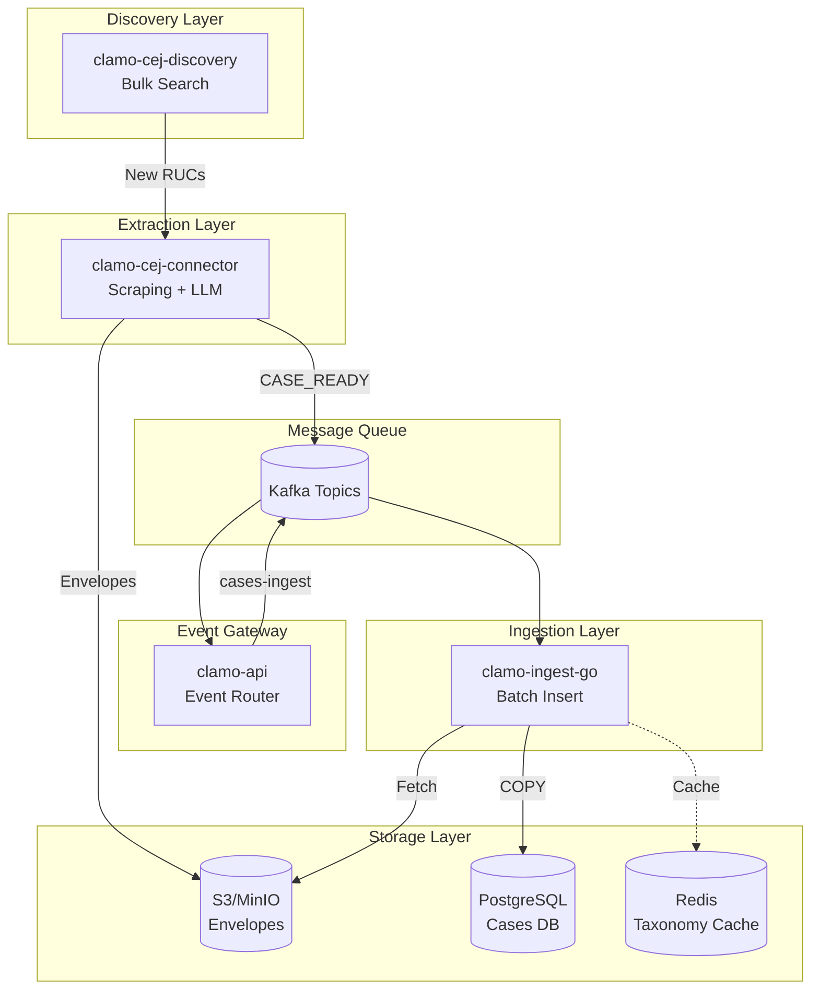
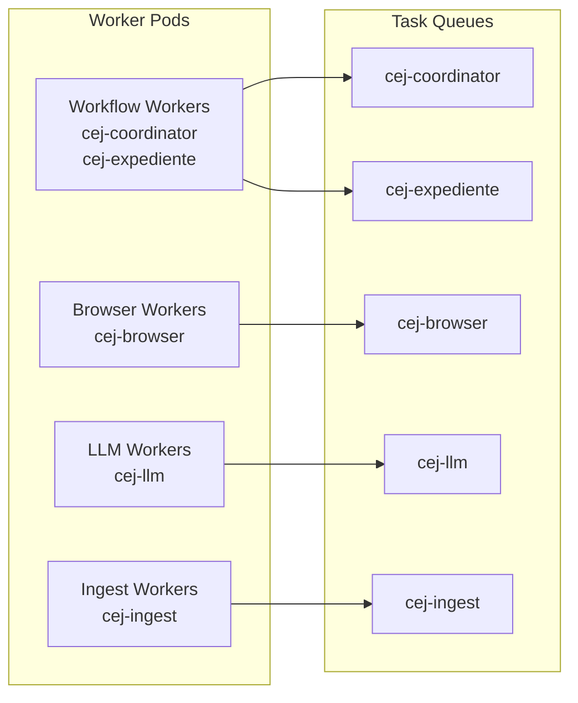
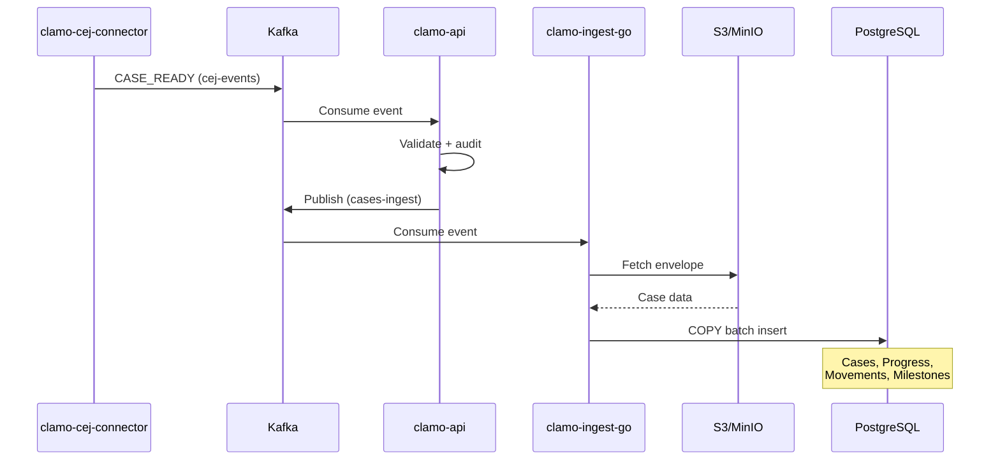
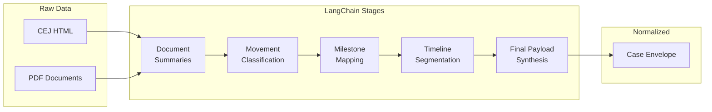

# Data Pipeline

The Clamo data pipeline automates the extraction, normalization, and ingestion of information from Peru's Electronic Justice Center (CEJ - Centro de Justicia Electrónico).

## Pipeline Overview

## Components

### clamo-cej-discovery

**Purpose**: Bulk discovery of new case identifiers (RUCs) from the CEJ.

**Technology**: Python, Playwright, Steel.dev, Temporal

**Key Features**:
- Mass search by correlative numbers (1-99999)
- Intelligent stopping when "not found" rate is high
- Incremental CSV storage to MinIO
- Real-time Ably notifications when cases are found

**Flow**:
1. Iterate through correlative numbers
2. Search CEJ for each correlative
3. Extract basic case metadata
4. Store results in CSV on MinIO
5. Notify downstream systems of new cases

### clamo-cej-connector

**Purpose**: Full case extraction with browser automation and LLM-based normalization.

**Technology**: Python, FastAPI, Playwright, Steel.dev, Temporal, Anthropic (Claude)

**Data Pipeline Stages**:

| Stage | Activity | Description |
|-------|----------|-------------|
| Browser | `cej_browser_search` | Steel session, CAPTCHA solving, HTML capture |
| Parsing | `cej_parse_html` | Convert HTML to `CejHtmlDetail` DTOs |
| Documents | `cej_download_documents` | Download PDFs, LlamaParse extraction |
| LLM | `cej_llm_*` | Summaries, classifications, milestones |
| DB | `cej_ingest_normalized_case` | Upsert via `CejIngestor` |

**Worker Topology**:

**Temporal Workflows**:
- `CejCaseJobWorkflow` - Top-level orchestrator, spawns child workflows
- `CejExpedienteWorkflow` - Full extraction flow for a single case

### clamo-ingest-go

**Purpose**: High-performance batch database insertion.

**Technology**: Go 1.25+, Kafka, Temporal, PostgreSQL (pgx), Redis

**Performance Optimizations**:
- PostgreSQL `COPY FROM` for bulk inserts (10-100x faster)
- Redis taxonomy cache reduces DB queries by 90%
- Connection pooling (20 max connections)
- Automatic retries with exponential backoff

**Data Flow**:

**Inserted Tables**:
- `Cases` - UPSERT on expediente + company_id
- `CaseProgress` - Stage/substage timeline
- `Movements` - Case file actions
- `StatusSnapshots` - Point-in-time status
- `CaseMilestones` - Important events

## LLM Normalization Pipeline

The connector uses Anthropic Claude for multi-stage normalization:

**LLM Stages**:
1. **Document Summaries** - Extract key information from PDFs
2. **Movement Classification** - Categorize case actions
3. **Milestone Mapping** - Identify important events
4. **Timeline Segmentation** - Split into stages/substages
5. **Final Synthesis** - Produce normalized envelope

## Caching Strategy

The CEJ connector implements multi-level caching:

| Setting | Default | Description |
|---------|---------|-------------|
| `CACHE_ENABLED` | `true` | Enable/disable caching |
| `CACHE_BACKEND` | `memory` | `memory` or `redis`/`valkey` |
| `CACHE_TTL_SECONDS` | `1200` | 20 minutes default TTL |
| `CACHE_FORCE_REFRESH_PARAM` | `force_refresh` | Query param to bypass cache |

Cached artifacts include:
- Browser session HTML
- Parsed case details
- Downloaded documents
- LLM normalization results

## Observability

### Tracing & Logging
- **Logfire** - Spans from FastAPI + Temporal activities
- **LangSmith** - LangChain stage tracing (summaries, classifications)

### Metrics
- Per-stage timings: `browser_time`, `http_time`, `llm_time`, `db_time`
- Queue depth for load shedding
- Workflow task execution latency (target less than 1s)

### Search Attributes (Temporal)
- `TenantId` - Company identifier
- `ExpedienteId` - Case identifier
- `ForceRefresh` - Cache bypass flag
- `CacheHit` - Cache hit/miss
- `MovementCount` - Number of movements

## Scaling Recommendations

For 150 concurrent job submissions:
- ~5 workflow pods
- ~15 activity pods (split across browser/LLM/ingest)
- All workers use same container image
- `WORKER_ROLE` env var determines queue assignment

## Related Documentation

- [clamo-cej-connector Service](/en/services/clamo-cej-connector)
- [clamo-cej-discovery Service](/en/services/clamo-cej-discovery)
- [clamo-ingest-go Service](/en/services/clamo-ingest-go)
