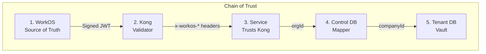
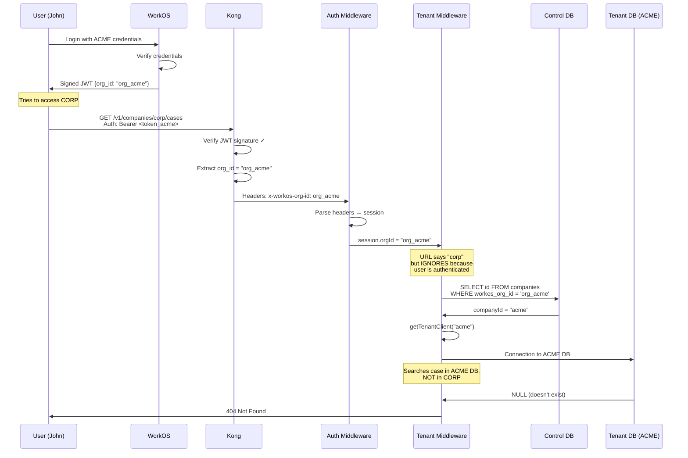
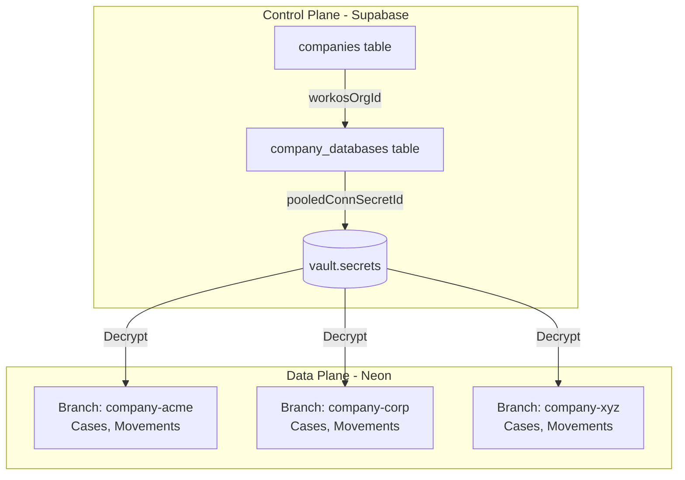

# Security Architecture

Clamo implements a comprehensive security architecture based on a **chain of trust** that guarantees complete isolation between tenants.

## The Chain of Trust



| Component | Responsibility |
|-----------|----------------|
| **WorkOS** | Generates JWT signed with private key. The `org_id` is INSIDE the signed JWT. |
| **Kong** | Verifies signature with public key. If valid → extracts claims to headers. If invalid → 401. |
| **Service** | If `x-workos-*` headers present → Kong already validated. Uses `org_id` from header, NOT from URL. |
| **Control DB** | Maps `workosOrgId` → internal `companyId`. One org only maps to one company. |
| **Tenant DB** | Each company has its own database. Without correct `companyId` = no access. |

## The JWT and Tenant Isolation

### Anatomy of a WorkOS JWT

When a user authenticates, WorkOS generates a signed JWT:

```json
{
  "sub": "user_123_john",
  "org_id": "org_acme_workos_id",  // ← FIXED, signed, not modifiable
  "role": "member",
  "permissions": ["cases:read", "cases:write"],
  "iss": "https://api.workos.com/...",
  "exp": 1234567890
}
```

<Warning>
**Critical Security Point:** The `org_id` is **SIGNED** inside the JWT.

- The user CANNOT change the `org_id` in their token
- Cannot "fake" belonging to another organization
- If they work for ACME, their token will ALWAYS have `org_id = "org_acme_workos_id"`
- If they try to modify the JWT, the signature becomes invalid and Kong rejects it
</Warning>

### Complete Validation Flow



## Impossible Attacks

### Attempt 1: Change the companyId in the URL

```bash
# John makes this malicious request:
GET /v1/companies/corp/cases/def
Authorization: Bearer <john_token_with_org_acme>
```

**What happens?**

```typescript
// 1. Kong decodes the JWT
const jwtPayload = {
  sub: "user_123_john",
  org_id: "org_acme_workos_id"  // ← ACME, not CORP
};

// 2. Kong injects headers
// x-workos-org-id: org_acme_workos_id  ← The REAL one from token

// 3. Auth Middleware creates session
session = {
  userId: "user_123_john",
  orgId: "org_acme_workos_id",  // ← Taken from header, not URL
};

// 4. Tenant Middleware IGNORES the URL for authenticated users
const requestedCompanyId = c.req.param("companyId");  // "corp" from URL
// ⚠️ BUT DOESN'T USE IT if user is authenticated!

// Instead, does lookup by orgId:
const company = await controlDb.company.findUnique({
  where: { workosOrgId: session.orgId }  // ← Uses "org_acme_workos_id"
});
// Result: company.id = "acme"

// 5. Gets ACME DB (not CORP)
const tenantDb = await getTenantClient({
  companyId: "acme",  // ← Always from the token
  connectionString: "postgres://...acme..."
});
```

**Result:** Searches for the case in ACME's database, not CORP. If it doesn't exist, returns 404.

### Attempt 2: Modify the JWT to change org_id

```bash
# John tries to create a fake JWT:
# Manually changes org_id from "org_acme" to "org_corp"
```

**What happens?**

```typescript
// 1. Kong validates the JWT signature
const isValid = verifyJwtSignature(
  token,
  publicKey  // WorkOS public key
);

// Result: false ❌
// Signature doesn't match because payload was modified

// 2. Kong rejects the request
HTTP 401 Unauthorized
{
  "error": "invalid_token",
  "message": "JWT signature verification failed"
}

// ❌ Request NEVER reaches the service
```

WorkOS signs JWTs with its private key. **Only WorkOS can create valid JWTs.**

### Attempt 3: Steal another user's JWT

```bash
# John steals Peter's token (who works at CORP)
GET /v1/companies/corp/cases/def
Authorization: Bearer <stolen_peter_token>
```

**What happens?**

The request **works**... but John would need to steal Peter's token.

**Protections against token theft:**

| Protection | Description |
|------------|-------------|
| **Short duration** | Tokens expire in 15-60 minutes |
| **HTTPS** | Encrypted transmission |
| **HttpOnly cookies** | Not accessible by JavaScript |
| **Revocation** | User can invalidate sessions |

## Multi-Organization Users

WorkOS supports users who work at multiple companies:

```typescript
// User works at ACME and CORP
const user = {
  id: "user_john",
  organizations: [
    { id: "org_acme", role: "admin" },
    { id: "org_corp", role: "member" }
  ]
};
```

### How does it work?

1. In the login UI, John chooses which organization to enter
2. WorkOS generates a JWT **specific to that org**:

```javascript
// If chooses ACME:
const tokenACME = {
  sub: "user_john",
  org_id: "org_acme",
  role: "admin"
};

// If chooses CORP:
const tokenCORP = {
  sub: "user_john",
  org_id: "org_corp",
  role: "member"
};
```

3. To switch orgs, must use an "org switcher" that regenerates the JWT

<Note>
**Implication:** Even with multi-org access, the token at that moment only represents **ONE** organization. Cannot access both simultaneously with a single token.
</Note>

## Internal Access (Service-to-Service)

Internal services access without JWT, using the `companyId` from the URL:

```bash
# From an internal service (Tailscale/K8s network)
GET /internal/v1/companies/corp/cases/def
# No authentication headers
```

**What happens?**

```typescript
// 1. No headers → Auth middleware detects internal call
// 2. Creates internal session
session = { 
  principalType: "service", 
  orgId: "internal", 
  role: "admin" 
};

// 3. Tenant middleware detects principalType === "service"
// 4. USES companyId from URL: c.req.param("companyId") = "corp"
// 5. Gets CORP connection string
// 6. Accesses CORP tenant DB
```

<Warning>
**Why is this secure?** The internal network (Tailscale/K8s) is trusted. Only Clamo services can access this network. The `/internal/...` endpoints are not publicly exposed.
</Warning>

## Multi-Tenant Database Architecture

### Two-Plane Model

| Plane | Database | Purpose |
|-------|----------|---------|
| **Control Plane** | Supabase (PostgreSQL) | Tenant metadata, users, org→company mapping |
| **Data Plane** | Neon (PostgreSQL branches) | Isolated per-company case data |

### Tenant Isolation



### Connection String Security

Connection strings are stored **encrypted** in Supabase Vault:

```sql
-- Vault structure
vault.secrets (
  id uuid,
  name text,        -- e.g., "company-acme-pooled"
  secret text,      -- Encrypted connection string
)

-- Decryption view (requires permissions)
vault.decrypted_secrets (
  id uuid,
  name text,
  decrypted_secret text  -- Plaintext connection string
)
```

## Secrets Management

### Supabase Vault

| Secret Type | Example |
|-------------|---------|
| Database connections | Neon pooled/direct URLs |
| API keys | Tinybird, SendGrid, Ably |
| Service credentials | Steel.dev, Anthropic |

### Environment Variables

| Variable | Description |
|----------|-------------|
| `SUPABASE_URL` | Control plane URL |
| `SUPABASE_SERVICE_KEY` | Service role key (vault access) |
| `WORKOS_API_KEY` | WorkOS API key |
| `WORKOS_CLIENT_ID` | WorkOS Client ID |

## API Security

### Kong Headers (Production)

In production, Kong API Gateway validates the JWT and adds upstream headers:

| Header | Description |
|--------|-------------|
| `x-workos-user-id` | Authenticated user ID |
| `x-workos-org-id` | WorkOS organization ID |
| `x-workos-role` | User's role in the organization |
| `x-workos-permissions` | User's permissions |

### Rate Limiting

| Endpoint Type | Limit |
|---------------|-------|
| Public | 100 req/min |
| Authenticated | 1000 req/min |
| Webhook | 10 req/sec |

## Encryption

| Data State | Method |
|------------|--------|
| At Rest | AES-256 (Neon, Supabase) |
| In Transit | TLS 1.3 |
| Secrets | Supabase Vault encryption |
| JWTs | RS256 (asymmetric signature) |

## Summary: Why the System is Secure

```
┌─────────────────────────────────────────────────────────────────┐
│  SECURITY GUARANTEES                                            │
├─────────────────────────────────────────────────────────────────┤
│                                                                  │
│  ✅ The org_id is SIGNED in the JWT                             │
│     → Cannot be forged without WorkOS private key               │
│                                                                  │
│  ✅ Kong validates BEFORE reaching the service                  │
│     → Invalid JWTs never reach business logic                   │
│                                                                  │
│  ✅ Service uses org_id from HEADER, not URL                    │
│     → Manipulating URL doesn't change which tenant you access   │
│                                                                  │
│  ✅ Each tenant has its own database                            │
│     → Physical isolation, not just logical                      │
│                                                                  │
│  ✅ Connection strings encrypted in Vault                       │
│     → Even with control plane access, can't see credentials     │
│                                                                  │
│  ✅ Internal network isolated (Tailscale/K8s)                   │
│     → Internal endpoints not publicly exposed                   │
│                                                                  │
└─────────────────────────────────────────────────────────────────┘
```

## Next Steps

<CardGroup cols={2}>
  <Card
    title="Multi-Tenancy"
    icon="building"
    href="/en/guides/multi-tenancy"
  >
    Database-per-tenant architecture.
  </Card>
  <Card
    title="Authentication"
    icon="key"
    href="/en/guides/authentication"
  >
    WorkOS integration guide.
  </Card>
  <Card
    title="Service SDKs"
    icon="plug"
    href="/en/architecture/service-sdks"
  >
    Service-to-service communication.
  </Card>
  <Card
    title="API Reference"
    icon="code"
    href="/en/api-reference/introduction"
  >
    Public and internal endpoints.
  </Card>
</CardGroup>
