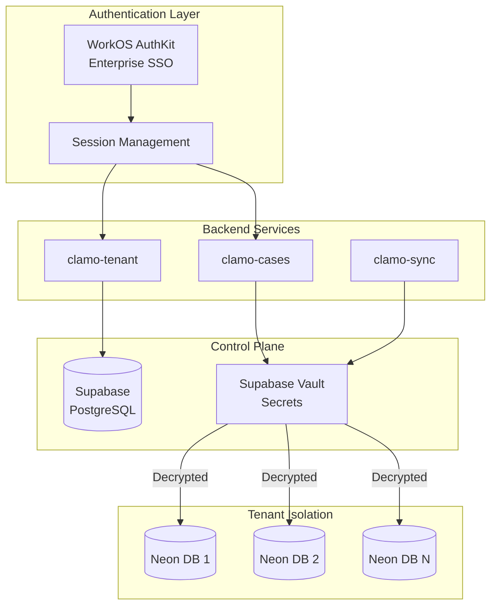
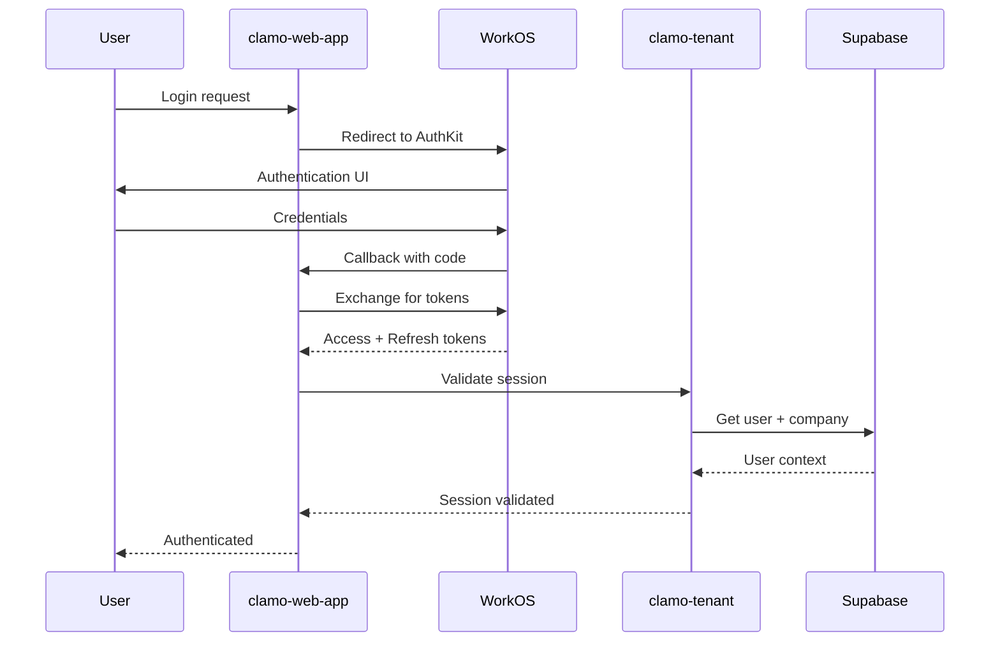
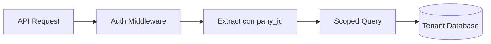
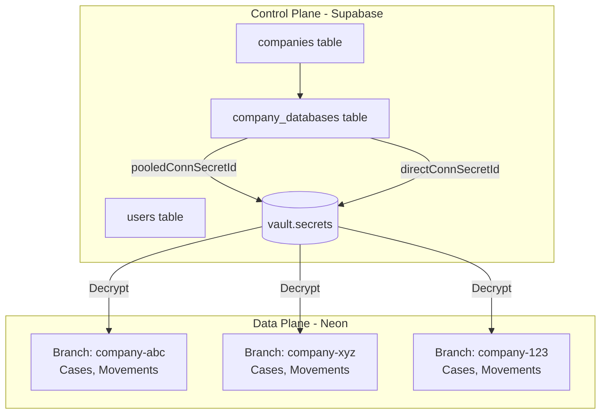

# Security Architecture

Clamo implements a comprehensive security architecture covering authentication, authorization, multi-tenancy isolation, and secrets management.

## Overview



## Authentication

### WorkOS AuthKit

Clamo uses [WorkOS AuthKit](https://workos.com/docs/user-management) for authentication, providing:

- **Email/Password** - Standard authentication
- **Social Login** - Google, Microsoft, GitHub
- **Enterprise SSO** - SAML, OIDC for enterprise customers
- **Directory Sync** - Automatic user provisioning from IdPs

**Integration Points**:
- `clamo-web-app` - Uses `@workos-inc/authkit-nextjs` for server-side auth
- `clamo-tenant` - Syncs WorkOS organizations with internal companies

### Session Flow



### Token Structure

| Token | Purpose | Lifetime |
|-------|---------|----------|
| Access Token | API authentication | 15 minutes |
| Refresh Token | Token renewal | 30 days |
| Session Token | Frontend state | Browser session |

## Authorization

### Role-Based Access Control (RBAC)

Users are assigned roles within their organization:

| Role | Permissions |
|------|-------------|
| `owner` | Full access, billing, user management |
| `admin` | User management, all case operations |
| `member` | Standard case access |
| `viewer` | Read-only access |

### Organization Isolation

Each API request is scoped to the user's organization:



The `company_id` is extracted from the authenticated session and used to:
1. Route to the correct tenant database
2. Filter all queries to that tenant's data
3. Enforce row-level security

## Multi-Tenant Database Architecture

### Two-Plane Model

| Plane | Database | Purpose |
|-------|----------|---------|
| **Control Plane** | Supabase (PostgreSQL) | Tenant metadata, users, reference data |
| **Data Plane** | Neon (PostgreSQL branches) | Isolated per-company case data |

### Tenant Isolation

Each company has a dedicated Neon database branch:



### Connection String Security

Connection strings are stored encrypted in Supabase Vault:

```sql
-- Vault structure
vault.secrets (
  id uuid,
  name text,        -- e.g., "company-abc-pooled"
  secret text,      -- Encrypted connection string
  ...
)

-- Decryption view (requires RLS)
vault.decrypted_secrets (
  id uuid,
  name text,
  decrypted_secret text  -- Plaintext connection string
)
```

Services access connection strings via the vault decryption view:

```sql
SELECT 
  cd.company_id,
  vs_pooled.decrypted_secret as pooled_connection,
  vs_direct.decrypted_secret as direct_connection
FROM company_databases cd
LEFT JOIN vault.decrypted_secrets vs_pooled 
  ON vs_pooled.name = cd."pooledConnSecretId"
LEFT JOIN vault.decrypted_secrets vs_direct 
  ON vs_direct.name = cd."directConnSecretId"
WHERE cd.company_id = $1
```

## Secrets Management

### Supabase Vault

All sensitive configuration is stored in Supabase Vault:

| Secret Type | Example |
|-------------|---------|
| Database connections | Neon pooled/direct URLs |
| API keys | Tinybird, SendGrid, Ably |
| Service credentials | Steel.dev, Anthropic |

### Environment Variables

Services receive non-sensitive configuration via environment variables:

| Variable | Description |
|----------|-------------|
| `SUPABASE_URL` | Control plane URL |
| `SUPABASE_SERVICE_KEY` | Service role key (vault access) |
| `TINYBIRD_HOST` | Analytics endpoint |

### clamo-sync Vault Integration

The Rust sync service fetches tenant connections from vault:

```rust
// discovery/supabase.rs
pub async fn list_tenants(&self) -> Result<Vec<TenantConfig>> {
    // Use RPC to execute query with vault decryption
    let tenants = self.client
        .rpc("get_active_tenants_with_connections", json!({}))
        .execute()
        .await?;
    
    Ok(tenants)
}
```

## API Security

### Request Authentication

All API endpoints require authentication:

```typescript
// Middleware pattern
app.use("/api/*", async (c, next) => {
  const token = c.req.header("Authorization")?.replace("Bearer ", "");
  
  if (!token) {
    return c.json({ error: "Unauthorized" }, 401);
  }
  
  const session = await validateToken(token);
  c.set("session", session);
  
  await next();
});
```

### Rate Limiting

API endpoints implement rate limiting:

| Endpoint Type | Limit |
|---------------|-------|
| Public | 100 req/min |
| Authenticated | 1000 req/min |
| Webhook | 10 req/sec |

### CORS Configuration

Cross-origin requests are restricted to allowed origins:

```typescript
const corsConfig = {
  origin: [
    "https://app.clamo.dev",
    "https://*.clamo.dev",
    process.env.NODE_ENV === "development" && "http://localhost:3000",
  ].filter(Boolean),
  credentials: true,
};
```

## Data Security

### Encryption

| Data State | Method |
|------------|--------|
| At Rest | AES-256 (Neon, Supabase) |
| In Transit | TLS 1.3 |
| Secrets | Supabase Vault encryption |

### Data Retention

| Data Type | Retention |
|-----------|-----------|
| Case data | Indefinite (client data) |
| Audit logs | 2 years |
| Session data | 30 days |
| Analytics | 1 year |

### Audit Logging

Critical operations are logged:

- User authentication events
- Data access (read/write)
- Configuration changes
- API key usage

## Related Documentation

- [Multi-Tenancy Guide](/en/guides/multi-tenancy)
- [Authentication Guide](/en/guides/authentication)
- [clamo-tenant Service](/en/services/clamo-tenant)
