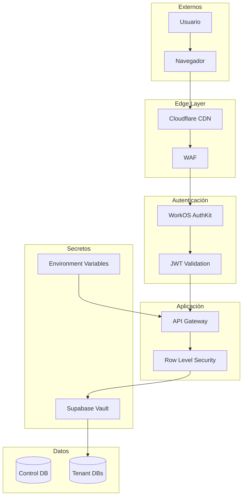
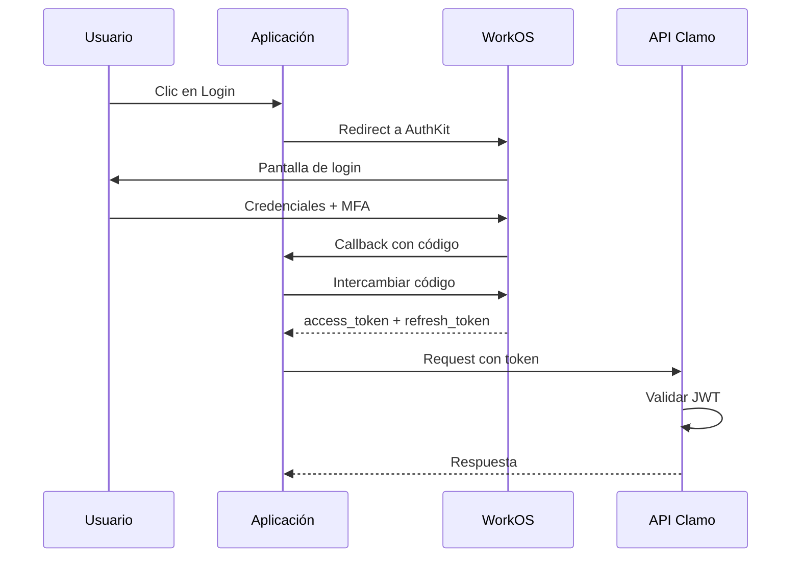

# Seguridad

La seguridad es fundamental en Clamo dado que maneja información legal sensible. Esta página describe la arquitectura de seguridad implementada.

## Arquitectura de Seguridad



## Autenticación

### WorkOS AuthKit

Clamo utiliza WorkOS AuthKit para autenticación enterprise-grade:

| Característica | Descripción |
|----------------|-------------|
| SSO | Single Sign-On con SAML/OIDC |
| MFA | Autenticación multifactor |
| Directory Sync | Sincronización con AD/LDAP |
| Audit Logs | Registro de eventos de autenticación |

### Flujo de Autenticación



### Validación de Tokens

```typescript
import { jwtVerify } from 'jose';

async function validateToken(token: string): Promise<TokenPayload> {
  const JWKS = createRemoteJWKSet(
    new URL('https://api.workos.com/.well-known/jwks.json')
  );
  
  const { payload } = await jwtVerify(token, JWKS, {
    issuer: 'https://api.workos.com',
    audience: process.env.WORKOS_CLIENT_ID,
  });
  
  return payload as TokenPayload;
}
```

## Autorización

### Modelo de Roles

| Rol | Descripción | Permisos |
|-----|-------------|----------|
| `admin` | Administrador de empresa | CRUD completo, invitar usuarios, configuración |
| `member` | Miembro | Lectura de casos, comentarios |

### Row Level Security

Cada request se ejecuta en el contexto del tenant:

```typescript
// Middleware de RLS
async function applyRLS(c: Context, next: Next) {
  const session = decodeSession(c.req.header('x-clamo-session'));
  
  // Verificar que el usuario pertenece a la empresa
  const user = await controlPrisma.user.findFirst({
    where: {
      id: session.userId,
      companyId: session.companyId,
    },
  });
  
  if (!user) {
    throw new ForbiddenError('Access denied');
  }
  
  // Obtener conexión del tenant
  const tenantDb = await getTenantConnection(session.companyId);
  
  // Adjuntar al contexto
  c.set('user', user);
  c.set('tenantDb', tenantDb);
  
  await next();
}
```

### Verificación de Permisos

```typescript
function requireRole(allowedRoles: Role[]) {
  return async (c: Context, next: Next) => {
    const user = c.get('user');
    
    if (!allowedRoles.includes(user.role)) {
      throw new ForbiddenError(
        `This action requires one of: ${allowedRoles.join(', ')}`
      );
    }
    
    await next();
  };
}

// Uso
app.post('/admin/companies', requireRole(['admin']), createCompany);
```

## Manejo de Secretos

### Supabase Vault

Las credenciales de bases de datos de tenant se almacenan en Supabase Vault:

```typescript
import { createClient } from '@supabase/supabase-js';

const supabase = createClient(
  process.env.SUPABASE_URL!,
  process.env.SUPABASE_SERVICE_KEY!,
);

// Almacenar secreto
async function storeSecret(name: string, value: string): Promise<string> {
  const { data, error } = await supabase.rpc('vault.create_secret', {
    secret: value,
    name: name,
  });
  
  if (error) throw error;
  return data.id;
}

// Obtener secreto
async function getSecret(secretId: string): Promise<string> {
  const { data, error } = await supabase.rpc('vault.read_secret', {
    secret_id: secretId,
  });
  
  if (error) throw error;
  return data.decrypted_secret;
}
```

### Variables de Entorno

Secretos de aplicación se manejan con variables de entorno:

```bash
# Nunca commitear a git
# .env.local (desarrollo)
# Vercel/Railway (producción)

# WorkOS
WORKOS_API_KEY=sk_live_...
WORKOS_CLIENT_ID=client_...

# Supabase
SUPABASE_URL=https://...
SUPABASE_SERVICE_KEY=eyJ...

# Neon
NEON_API_KEY=...

# Anthropic
ANTHROPIC_API_KEY=sk-ant-...
```

### Rotación de Secretos

```typescript
async function rotateNeonCredentials(companyId: string) {
  const company = await controlPrisma.companyDatabase.findUnique({
    where: { companyId },
  });
  
  // 1. Crear nuevas credenciales en Neon
  const newCredentials = await neon.rotatePassword({
    projectId: company.neonProjectId,
    branchId: company.neonBranchId,
  });
  
  // 2. Crear nuevos secretos en Vault
  const newPooledSecretId = await storeSecret(
    `tenant-${companyId}-pooled-${Date.now()}`,
    newCredentials.pooledUri,
  );
  
  const newDirectSecretId = await storeSecret(
    `tenant-${companyId}-direct-${Date.now()}`,
    newCredentials.directUri,
  );
  
  // 3. Actualizar referencias
  await controlPrisma.companyDatabase.update({
    where: { companyId },
    data: {
      pooledConnSecretId: newPooledSecretId,
      directConnSecretId: newDirectSecretId,
    },
  });
  
  // 4. Eliminar secretos antiguos (después de grace period)
  setTimeout(async () => {
    await deleteSecret(company.pooledConnSecretId);
    await deleteSecret(company.directConnSecretId);
  }, 60000); // 1 minuto
}
```

## Encriptación

### En Tránsito

- TLS 1.3 obligatorio para todas las conexiones
- HSTS habilitado
- Certificate pinning en aplicaciones móviles

### En Reposo

- Neon: Encriptación AES-256 automática
- Supabase Vault: Encriptación con claves gestionadas
- Backups: Encriptados con claves rotadas

## Protección de APIs

### Rate Limiting

```typescript
import { Ratelimit } from '@upstash/ratelimit';
import { Redis } from '@upstash/redis';

const ratelimit = new Ratelimit({
  redis: Redis.fromEnv(),
  limiter: Ratelimit.slidingWindow(100, '1 m'),
  analytics: true,
});

async function rateLimitMiddleware(c: Context, next: Next) {
  const identifier = c.get('user')?.id || c.req.header('x-forwarded-for');
  
  const { success, limit, remaining, reset } = await ratelimit.limit(identifier);
  
  c.header('X-RateLimit-Limit', limit.toString());
  c.header('X-RateLimit-Remaining', remaining.toString());
  c.header('X-RateLimit-Reset', reset.toString());
  
  if (!success) {
    throw new RateLimitError('Too many requests');
  }
  
  await next();
}
```

### Input Validation

```typescript
import { z } from 'zod';

const CreateCaseSchema = z.object({
  expediente: z.string()
    .regex(/^\d{5}-\d{4}-\d-\d{4}-[A-Z]{2}-[A-Z]{2}-\d{2}$/)
    .max(30),
  plaintiff: z.string().min(2).max(200),
  defendant: z.string().min(2).max(200),
  claimAmount: z.number().positive().optional(),
});

function validateInput<T>(schema: z.Schema<T>) {
  return async (c: Context, next: Next) => {
    const body = await c.req.json();
    
    const result = schema.safeParse(body);
    
    if (!result.success) {
      throw new ValidationError(result.error.errors);
    }
    
    c.set('validatedBody', result.data);
    await next();
  };
}
```

### SQL Injection Prevention

```typescript
// Siempre usar queries parametrizadas
// CORRECTO
const cases = await prisma.case.findMany({
  where: {
    expediente: { contains: searchTerm },
  },
});

// INCORRECTO - Vulnerable a SQL injection
// const cases = await prisma.$queryRaw`
//   SELECT * FROM cases WHERE expediente LIKE '%${searchTerm}%'
// `;
```

## Audit Logging

```typescript
interface AuditLog {
  timestamp: Date;
  userId: string;
  companyId: string;
  action: string;
  resource: string;
  resourceId: string;
  details: Record<string, unknown>;
  ip: string;
  userAgent: string;
}

async function logAuditEvent(c: Context, action: string, resource: string, resourceId: string) {
  const user = c.get('user');
  
  const log: AuditLog = {
    timestamp: new Date(),
    userId: user.id,
    companyId: user.companyId,
    action,
    resource,
    resourceId,
    details: {},
    ip: c.req.header('x-forwarded-for') || 'unknown',
    userAgent: c.req.header('user-agent') || 'unknown',
  };
  
  await auditLogService.create(log);
}
```

## Compliance

### GDPR

- Derecho de acceso: API para exportar datos del usuario
- Derecho al olvido: Proceso de eliminación de datos
- Portabilidad: Exportación en formato estándar

### Retención de Datos

| Tipo de Dato | Retención |
|--------------|-----------|
| Casos activos | Indefinida |
| Casos archivados | 10 años |
| Audit logs | 2 años |
| Session logs | 90 días |

## Checklist de Seguridad

<Steps>
  <Step title="Autenticación">
    - WorkOS AuthKit configurado
    - MFA habilitado para admins
    - Tokens con expiración corta
    - Refresh token rotation
  </Step>
  
  <Step title="Autorización">
    - RBAC implementado
    - Row Level Security activo
    - Validación de pertenencia a tenant
  </Step>
  
  <Step title="Secretos">
    - Credenciales en Vault
    - Variables de entorno seguras
    - Rotación periódica
  </Step>
  
  <Step title="APIs">
    - Rate limiting activo
    - Input validation
    - SQL injection prevention
    - CORS configurado
  </Step>
  
  <Step title="Monitoreo">
    - Audit logging
    - Alertas de seguridad
    - Detección de anomalías
  </Step>
</Steps>

## Reporte de Vulnerabilidades

Si encuentras una vulnerabilidad de seguridad, por favor repórtala de forma responsable a:

- Email: security@getclamo.com
- No publiques la vulnerabilidad antes de que sea corregida

## Próximos Pasos

<CardGroup cols={2}>
  <Card
    title="Autenticación"
    icon="key"
    href="/guias/autenticacion"
  >
    Guía de integración con WorkOS.
  </Card>
  <Card
    title="Multi-Tenancy"
    icon="building"
    href="/guias/multi-tenancy"
  >
    Arquitectura multi-tenant.
  </Card>
</CardGroup>

