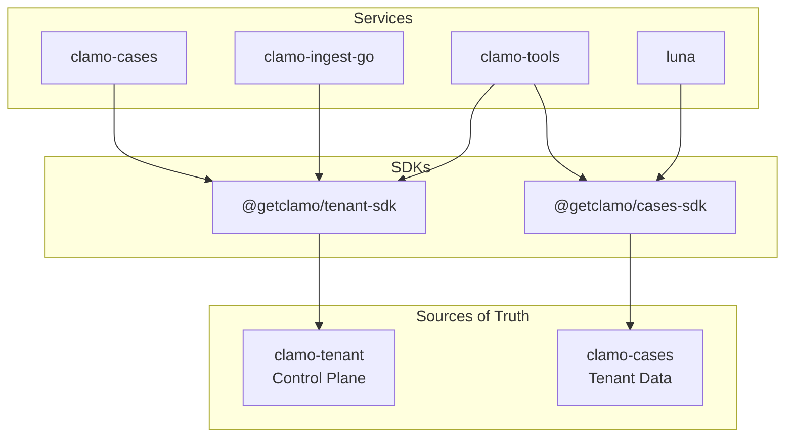
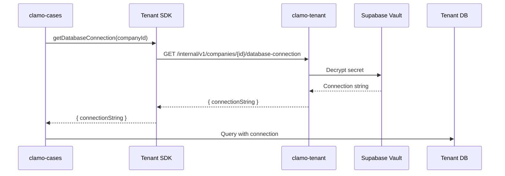

# Service SDKs

Clamo uses **service SDKs** for all communication between microservices. This ensures typed contracts, centralized validations, and a single source of truth for each domain.

## Principle: No Direct Queries

<Warning>
**Fundamental Rule:** Services should **never** make direct queries to other domains' databases. All communication goes through SDKs that encapsulate business logic.
</Warning>

### Why?

| Direct Queries | Service SDKs |
|----------------|--------------|
| Couples services to DB schemas | Stable contracts via API |
| Duplicates validations | Centralized validations |
| Hard to audit | Unified logging and tracing |
| No access control | Permissions per endpoint |
| Schema changes break everything | API versioning |

## Architecture



## clamo-tenant as Source of Truth

The `clamo-tenant` service is the **single source of truth** for:

- **Companies**: Registration, configuration, plans
- **Users**: Memberships, roles, permissions
- **DB Connections**: Tenant database credentials
- **WorkOS Organizations**: org → company mapping

### Tenant SDK

```typescript
import Tenant from "@getclamo/tenant";

// Create client
const tenant = new Tenant({
  baseURL: process.env.TENANT_SERVICE_URL,
  apiKey: "internal-service-token", // For internal routes
});

// Get company by WorkOS organization
const company = await tenant.internal.companies.getByOrganization(orgId);

// Get tenant connection string
const { connectionString } = await tenant.internal.companies.getDatabaseConnection(companyId);
```

### Tenant Internal Endpoints

| Method | Endpoint | Description |
|--------|----------|-------------|
| `GET` | `/internal/v1/companies/by-org/{orgId}` | Company by WorkOS org |
| `GET` | `/internal/v1/companies/{id}/database-connection` | Connection string |
| `GET` | `/internal/v1/companies/{id}/users` | Company users |
| `POST` | `/internal/v1/companies/{id}/provision` | Provision DB |

## Tenant Resolution Flow

When a service needs to access tenant data:



### Implementation in clamo-cases

```typescript
// clamo-cases/src/clients/sdk/tenant.client.ts
import Tenant from "@getclamo/tenant";

let _client: Tenant | null = null;

export function getTenantClient(): Tenant {
  if (_client !== null) {
    return _client;
  }

  _client = new Tenant({
    baseURL: env.TENANT_SERVICE_URL,
    // Internal routes are secured by network isolation
    apiKey: "internal-service-token",
    defaultHeaders: { Authorization: null },
  });

  return _client;
}
```

### Tenant Middleware

```typescript
// clamo-cases/src/middleware/tenant.ts
import { getTenantClient } from "@getclamo/database";
import type Tenant from "@getclamo/tenant";

export function createTenantMiddleware(deps: {
  controlDb: PrismaClient;
  tenantSdk: Tenant;
}) {
  return async (c: Context, next: Next) => {
    const orgId = c.req.header("x-workos-org-id");
    
    // 1. Resolve company via SDK (no direct query)
    const company = await deps.tenantSdk.internal.companies.getByOrganization(orgId);
    
    // 2. Get connection string via SDK
    const { connectionString } = await deps.tenantSdk.internal.companies
      .getDatabaseConnection(company.id);
    
    // 3. Create tenant DB client
    const tenantDb = await getTenantClient({
      companyId: company.id,
      connectionString,
    });
    
    c.set("tenantDb", tenantDb);
    c.set("company", company);
    
    await next();
  };
}
```

## Connection Cache

To avoid resolving connections on every request, `clamo-database` implements an LRU cache:

```typescript
// clamo-database/src/tenant-client.ts
class TenantClientCache {
  private cache: Map<string, CacheEntry> = new Map();
  private config: TenantClientCacheConfig;

  async getClient(info: TenantConnectionInfo): Promise<PrismaClient> {
    // Check cache first
    const existing = this.cache.get(info.companyId);
    if (existing) {
      existing.lastAccessed = Date.now();
      return existing.client;
    }

    // Create new client
    const client = new PrismaClient({
      datasources: { db: { url: info.connectionString } },
    });
    await client.$connect();

    // Evict oldest if at capacity
    if (this.cache.size >= this.config.maxSize) {
      this.evictOldest();
    }

    this.cache.set(info.companyId, {
      client,
      lastAccessed: Date.now(),
      companyId: info.companyId,
    });

    return client;
  }
}
```

### Cache Configuration

```typescript
interface TenantClientCacheConfig {
  /** Maximum connections to cache (default: 20) */
  maxSize: number;
  /** TTL for idle connections in ms (default: 5 minutes) */
  idleTtlMs: number;
}

// Usage
const cache = getTenantClientCache({
  maxSize: 50,
  idleTtlMs: 10 * 60 * 1000, // 10 minutes
});
```

## Cases SDK

For services that need to access case data:

```typescript
import Cases from "@getclamo/cases";

const cases = new Cases({
  baseURL: process.env.CASES_SERVICE_URL,
  apiKey: "internal-service-token",
});

// From clamo-tools (for Luna)
const caseData = await cases.internal.companies(companyId).cases.get(caseId);
const movements = await cases.internal.companies(companyId).cases(caseId).movements.list();
```

### Cases Internal Endpoints

| Method | Endpoint | Description |
|--------|----------|-------------|
| `GET` | `/internal/v1/companies/{companyId}/cases` | List cases |
| `GET` | `/internal/v1/companies/{companyId}/cases/{id}` | Get case |
| `POST` | `/internal/v1/companies/{companyId}/cases` | Create case (ingestion) |
| `PUT` | `/internal/v1/companies/{companyId}/cases/{id}` | Update case |
| `POST` | `/internal/v1/companies/{companyId}/ingest-runs` | Create ingest run |

## Available SDKs

### TypeScript

```bash
pnpm add @getclamo/tenant-sdk
pnpm add @getclamo/cases-sdk
```

### Python

```bash
pip install getclamo-tenant
pip install getclamo-cases
```

### Rust

```bash
cargo add clamo-tenant-sdk
cargo add clamo-cases-sdk
```

## SDK Generation

SDKs are automatically generated from OpenAPI specs:

```bash
# In the service repo
pnpm run generate:openapi  # Generates openapi.yaml

# In the SDK repo
pnpm run generate          # Generates client from spec
pnpm run build
pnpm publish
```

## Benefits

### 1. Typed Contracts

```typescript
// SDK has complete types
const company = await tenant.internal.companies.get(id);
// company: Company (fully typed)

// Compile errors if API changes
company.nonExistentField; // ❌ TypeScript error
```

### 2. Centralized Validations

```typescript
// clamo-tenant validates everything before responding
// Consumers don't need to re-validate
const { connectionString } = await tenant.internal.companies
  .getDatabaseConnection(companyId);

// If we get here, we know:
// - Company exists
// - Has a provisioned DB
// - Connection string is valid
```

### 3. API Versioning

```typescript
// SDK v2 can coexist with v1
import TenantV1 from "@getclamo/tenant-sdk/v1";
import TenantV2 from "@getclamo/tenant-sdk/v2";

// Gradual migration
const tenant = useNewApi ? new TenantV2(config) : new TenantV1(config);
```

### 4. Observability

```typescript
// SDK includes automatic tracing
const tenant = new Tenant({
  baseURL: env.TENANT_SERVICE_URL,
  // Tracing headers are propagated automatically
  defaultHeaders: {
    "x-request-id": requestId,
  },
});
```

## Next Steps

<CardGroup cols={2}>
  <Card
    title="Multi-Tenancy"
    icon="building"
    href="/en/guides/multi-tenancy"
  >
    Database-per-tenant architecture.
  </Card>
  <Card
    title="API Reference"
    icon="code"
    href="/en/api-reference/introduction"
  >
    Public and internal endpoint documentation.
  </Card>
</CardGroup>
