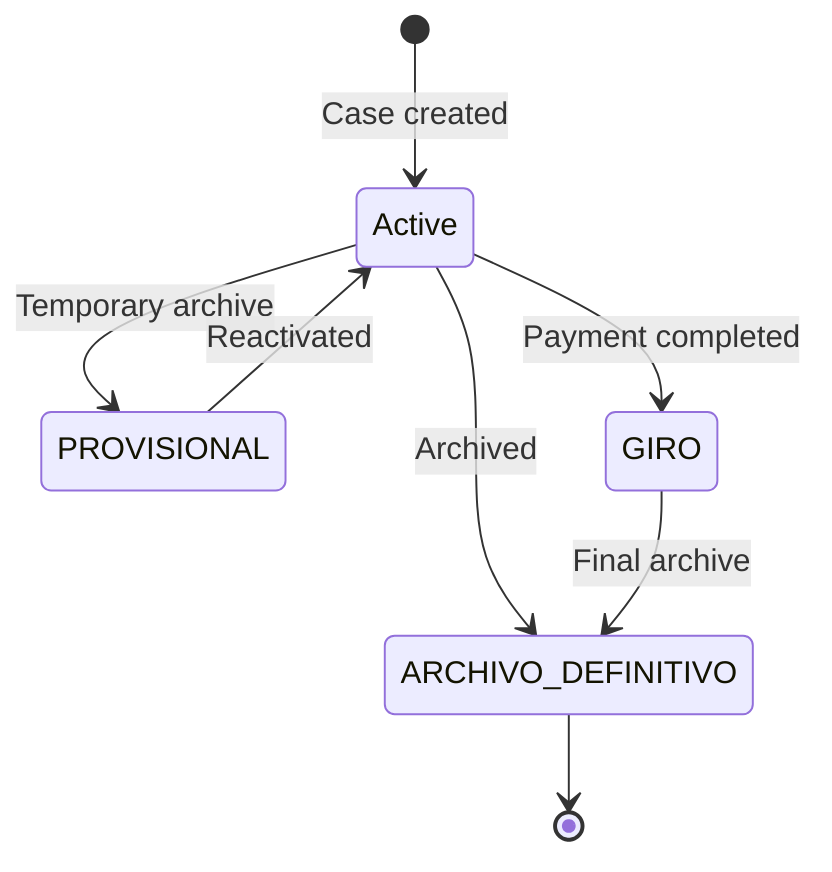
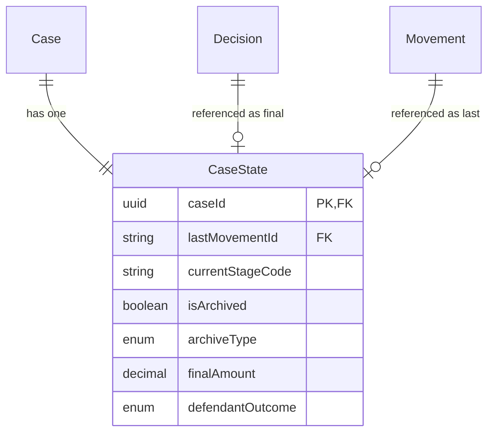

The **CaseState** entity is a projection table that maintains a denormalized view of each case's current status. It enables fast UI queries without complex joins or aggregations.

## Overview

CaseState follows the **projection pattern**: it's derived from source data (movements, decisions) and can be rebuilt at any time. This enables:

- Fast dashboard queries with simple filters
- Pre-computed aggregations for analytics
- Reduced query complexity in the application layer

<Note>
  There is exactly one CaseState record per Case. The `caseId` is both the primary key and the foreign key to Case.
</Note>

## Field Reference

### Movement Tracking

| Field | Type | Description |
|-------|------|-------------|
| `caseId` | `string` | Primary key, references Case.id |
| `lastMovementId` | `string?` | ID of most recent movement |
| `lastMovementAt` | `DateTime?` | Date of most recent movement |

### Stage Classification

| Field | Type | Description |
|-------|------|-------------|
| `currentStageCode` | `string?` | Current Stage.code |
| `currentSubStageCode` | `string?` | Current SubStage.code |
| `currentMilestoneCode` | `string?` | Current Milestone.code |

### Archive Status

| Field | Type | Description |
|-------|------|-------------|
| `isArchived` | `boolean` | Whether case is archived |
| `archiveType` | `ArchiveType?` | PROVISIONAL or DEFINITIVE |
| `finalStatus` | `EstadoFinal?` | Final status category |
| `archivedAt` | `DateTime?` | When case was archived |

### Procedural Flags

| Field | Type | Description |
|-------|------|-------------|
| `defaulted` | `Json?` | FlagState for rebelde (default judgment) |
| `noAppeal` | `Json?` | FlagState for consentido (no appeal) |

### Decision Summary

| Field | Type | Description |
|-------|------|-------------|
| `finalDecisionId` | `string?` | ID of final/authoritative decision |
| `finalAmount` | `Decimal?` | Total awarded amount |
| `defendantOutcome` | `DefendantOutcome?` | Final outcome for defendant |
| `decisionDate` | `DateTime?` | Date of final decision |

## Archive Types and Final Status

### Archive Types

| Type | Description |
|------|-------------|
| `PROVISIONAL` | Temporary archive, case may be reactivated |
| `DEFINITIVE` | Permanent archive, case is concluded |

### Final Status (EstadoFinal)

| Status | Description |
|--------|-------------|
| `GIRO` | Payment/execution completed |
| `ARCHIVO_DEFINITIVO` | Definitively archived |
| `PENDIENTE` | Pending resolution |

## Entity Relationships

<Warning>
  FlagState values (`defaulted`, `noAppeal`) are immutable once set to `true`. A rebelde or consentido status cannot be reversed in normal proceedings.
</Warning>

## Related Entities

<CardGroup cols={2}>
  <Card title="Case" icon="briefcase" href="/en/entities/case">
    Source case entity
  </Card>
  <Card title="Movement" icon="timeline" href="/en/entities/movement">
    Last movement reference
  </Card>
  <Card title="Decision" icon="gavel" href="/en/entities/decision">
    Final decision reference
  </Card>
  <Card title="Enums" icon="list" href="/en/entities/enums">
    ArchiveType, EstadoFinal, DefendantOutcome
  </Card>
</CardGroup>
