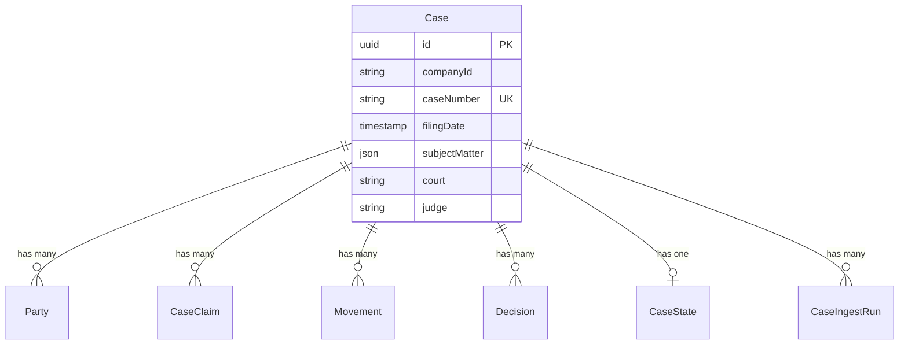

The **Case** entity is the central entity in Clamo, representing a legal case (expediente) in the Peruvian judicial system. Cases aggregate data from multiple sources: CEJ (Consulta de Expedientes Judiciales), AI analysis, and manual user input.

## Field Reference

### Core Fields

| Field | Type | Description |
|-------|------|-------------|
| `id` | `string` | UUID primary key, auto-generated |
| `companyId` | `string` | Company ID (validated at app level, no FK) |
| `caseNumber` | `string` | Official expediente number from CEJ |
| `filingDate` | `DateTime?` | Date the case was filed with the court |

### SourcedValue Fields

These fields store data from multiple sources (CEJ, AI, manual) in a JSONB structure. Priority is typically: manual > AI > CEJ.

| Field | Type | Description |
|-------|------|-------------|
| `subjectMatter` | `Json` | Array of legal subject matters (materias) |
| `processType` | `Json?` | Type of legal process |
| `stage` | `Json?` | Current procedural stage |
| `abstract` | `Json?` | Case summary/sumilla |
| `observation` | `Json?` | General observations |
| `conclusionReason` | `Json?` | Reason for case conclusion |

### CEJ-Sourced Fields

| Field | Type | Description |
|-------|------|-------------|
| `cejJudicialDistrict` | `string?` | Judicial district (e.g., "Lima", "Callao") |
| `cejProceduralStage` | `string?` | Raw procedural stage from CEJ |
| `court` | `string?` | Court name (juzgado) |
| `judge` | `string?` | Name of presiding judge |
| `legalSpecialist` | `string?` | Assigned legal specialist |
| `specialty` | `string?` | Legal specialty (laboral, civil, etc.) |
| `location` | `string?` | Physical court location |

### AI and Manual Fields

| Field | Type | Description |
|-------|------|-------------|
| `aiConclusionDate` | `DateTime?` | AI-predicted case conclusion date |
| `manualInternalResponsibleId` | `string?` | User ID of internal responsible (cross-DB reference) |
| `manualExternalAdvisor` | `string?` | Name of external legal advisor |

<Warning>
  The `companyId` and `manualInternalResponsibleId` fields reference entities in the Control Plane database. These are scalar IDs without foreign key constraints and must be validated at the application level.
</Warning>

## Entity Relationships

## Related Entities

<CardGroup cols={2}>
  <Card title="Party" icon="users" href="/en/entities/party">
    Plaintiffs, defendants, and other parties
  </Card>
  <Card title="Claim" icon="file-invoice-dollar" href="/en/entities/claim">
    Legal claims and pretensions
  </Card>
  <Card title="Movement" icon="timeline" href="/en/entities/movement">
    Timeline events and history
  </Card>
  <Card title="Decision" icon="gavel" href="/en/entities/decision">
    Court decisions and outcomes
  </Card>
</CardGroup>
