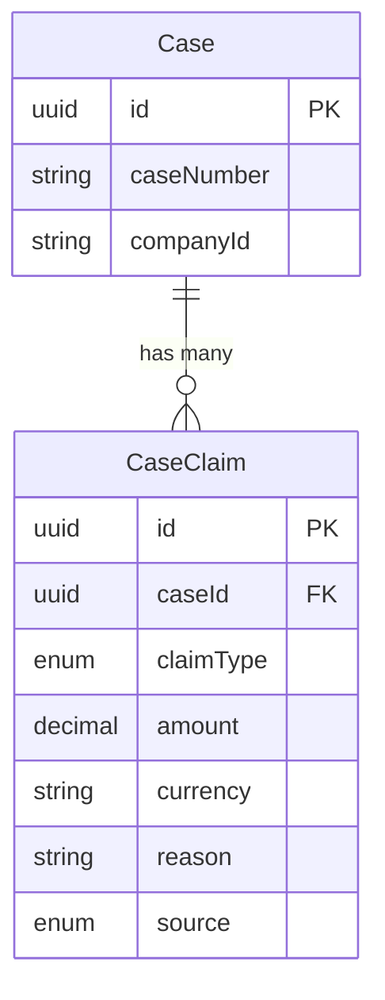

The **CaseClaim** entity represents individual claims (pretensiones) within a legal case. Claims are typed to capture different categories such as reinstatement, compensation, or action nullity, with type-specific fields for amounts, positions, and descriptions.

## Overview

A case can have multiple claims, each representing a specific legal demand. The claim type determines which fields are relevant:

| Claim Type | Primary Fields | Use Case |
|------------|---------------|----------|
| `REINSTATEMENT` | `position` | Employee seeking job restoration |
| `COMPENSATION` | `amount`, `currency` | Monetary damages |
| `ACTION_NULLITY` | `actionDescription` | Nullification of an action |
| `OTHER` | `description` | Miscellaneous claims |

## Field Reference

| Field | Type | Description |
|-------|------|-------------|
| `id` | `string` | UUID primary key, auto-generated |
| `caseId` | `string` | Foreign key to the parent Case |
| `claimType` | `ClaimType` | Category of the claim |
| `amount` | `Decimal?` | Monetary value with 2 decimal places |
| `currency` | `string?` | ISO currency code (typically "PEN") |
| `reason` | `string?` | Explanation for the claim |
| `actionDescription` | `string?` | Description of action to nullify |
| `position` | `string?` | Job title for reinstatement claims |
| `description` | `string?` | Free-text description for "OTHER" type |
| `source` | `ClaimSource` | Origin of this claim data |

## Claim Sources

| Source | Description | Reliability |
|--------|-------------|-------------|
| `CEJ` | Extracted from CEJ case data | Official but may be incomplete |
| `AI` | Identified by AI analysis | High accuracy, needs verification |
| `MANUAL` | Entered by user | User-verified |

<Note>
  Claims from different sources may overlap or conflict. The application should provide UI for users to merge, deduplicate, or prioritize claims.
</Note>

## Entity Relationships

## Related Entities

<CardGroup cols={2}>
  <Card title="Case" icon="briefcase" href="/en/entities/case">
    Parent case entity
  </Card>
  <Card title="Decision" icon="gavel" href="/en/entities/decision">
    Decisions may reference awarded amounts
  </Card>
  <Card title="Enums" icon="list" href="/en/entities/enums">
    ClaimType and ClaimSource enums
  </Card>
</CardGroup>
