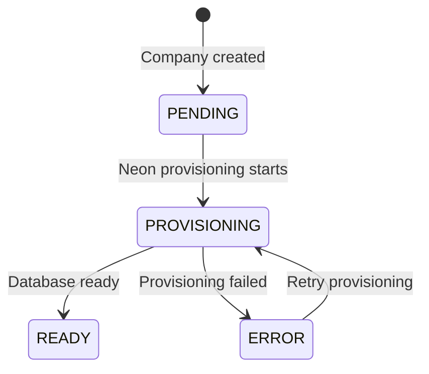

The **Company** entity represents an organization using Clamo. Each company has an associated **CompanyDatabase** record that stores connection information for its isolated Neon database branch.

## Company

The Company entity stores organization details, billing information, and tracks database provisioning status.

### Field Reference

| Field | Type | Description |
|-------|------|-------------|
| `id` | `string` | UUID primary key, auto-generated |
| `workosOrgId` | `string` | Unique identifier from WorkOS for SSO/directory sync |
| `name` | `string` | Human-readable company name |
| `ruc` | `string?` | Peruvian tax ID (Registro Unico de Contribuyentes), 11 digits |
| `parentId` | `string?` | References parent Company for hierarchical organizations |
| `plan` | `string?` | Subscription tier: `"free"`, `"pro"`, `"enterprise"` |
| `databaseStatus` | `DatabaseStatus` | Current state of database provisioning |
| `billingEmail` | `string?` | Email address for billing communications |
| `ownerUserId` | `string?` | ID of the user who owns this company |
| `ownerEmail` | `string?` | Email of the company owner |
| `settings` | `Json` | Company-specific configuration (JSON object) |
| `features` | `Json` | Array of enabled feature flag strings |
| `metadata` | `Json` | Arbitrary metadata for integrations |

### Database Status Lifecycle

<Note>
  The `databaseStatus` field tracks the Neon branch provisioning lifecycle. The application should poll or use webhooks to detect when status becomes `READY`.
</Note>

## CompanyDatabase

The CompanyDatabase entity stores Neon connection metadata for a company's isolated database branch.

### Field Reference

| Field | Type | Description |
|-------|------|-------------|
| `id` | `string` | UUID primary key |
| `companyId` | `string` | One-to-one reference to Company |
| `neonProjectId` | `string` | Neon project containing this branch |
| `neonBranchId` | `string` | Neon branch ID for this tenant |
| `neonEndpointId` | `string?` | Compute endpoint for direct connections |
| `databaseName` | `string` | Name of the PostgreSQL database |
| `databaseHost` | `string` | Hostname for database connections |
| `databaseUser` | `string` | PostgreSQL role for connections |
| `pooledConnSecretId` | `string` | Supabase Vault secret ID for PgBouncer connection string |
| `directConnSecretId` | `string` | Supabase Vault secret ID for direct connection string |
| `lastAccessedAt` | `DateTime?` | Tracks database usage for hibernation |

<Warning>
  Connection strings are stored in Supabase Vault, not directly in the database. The `pooledConnSecretId` and `directConnSecretId` fields reference Vault secrets.
</Warning>

## Related Entities

<CardGroup cols={2}>
  <Card title="User" icon="user" href="/en/entities/user">
    Users belonging to this company
  </Card>
  <Card title="Case" icon="briefcase" href="/en/entities/case">
    Cases stored in the tenant database
  </Card>
  <Card title="Enums" icon="list" href="/en/entities/enums">
    DatabaseStatus enum reference
  </Card>
</CardGroup>
