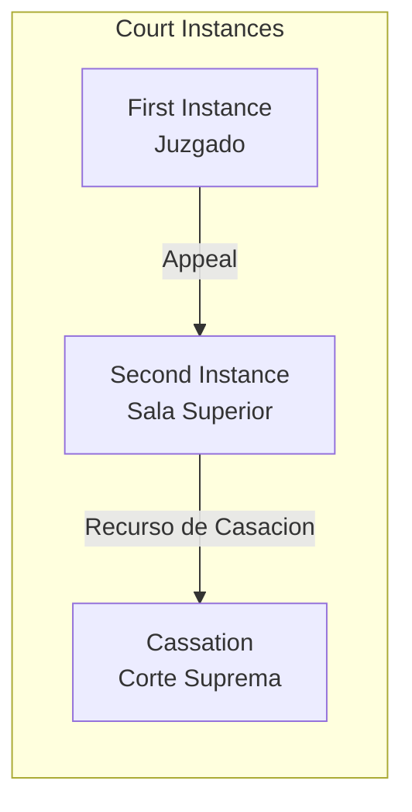
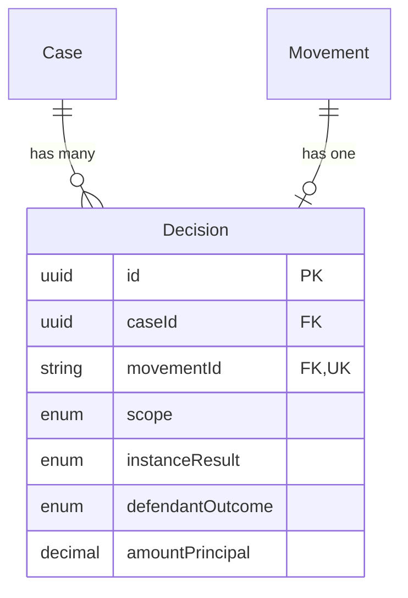

The **Decision** entity captures court decisions detected from case movements. Decisions track the scope (instance level), outcome, and any awarded amounts.

## Overview

Decisions are linked to specific movements in the case timeline. A single case may have multiple decisions at different instances:

- **First Instance**: Initial court ruling
- **Second Instance**: Appeal court ruling
- **Cassation**: Supreme court ruling

## Field Reference

### Core Fields

| Field | Type | Description |
|-------|------|-------------|
| `id` | `string` | UUID primary key |
| `caseId` | `string` | Foreign key to parent Case |
| `movementId` | `string` | Foreign key to source Movement (unique) |
| `scope` | `DecisionScope` | Instance level of the decision |
| `decidedAt` | `DateTime?` | Date the decision was issued |

### Outcome Fields

| Field | Type | Description |
|-------|------|-------------|
| `instanceResult` | `InstanceResult?` | Legal result of the decision |
| `defendantOutcome` | `DefendantOutcome?` | Whether favorable to defendant |
| `aiDocumentSummary` | `string?` | AI-generated summary of decision |
| `judges` | `Json?` | Array of judge names on the panel |
| `reportingJudge` | `string?` | Judge who authored the decision |

### Financial Fields

| Field | Type | Description |
|-------|------|-------------|
| `amountPrincipal` | `Decimal?` | Principal amount awarded |
| `amountOthers` | `Decimal?` | Additional amounts (interest, costs) |

## Decision Scope

| Scope | Description | Court Level |
|-------|-------------|-------------|
| `FIRST_INSTANCE` | Initial trial court decision | Juzgado |
| `SECOND_INSTANCE` | Appeal court decision | Sala Superior |
| `CASSATION` | Supreme court decision | Corte Suprema |

## Instance Results

| Result | Spanish | Description |
|--------|---------|-------------|
| `FUNDADA` | Fundada | Claim upheld (plaintiff wins) |
| `INFUNDADA` | Infundada | Claim rejected on merits |
| `IMPROCEDENTE` | Improcedente | Claim procedurally inadmissible |
| `CONFIRMA` | Confirma | Lower decision confirmed |
| `REVOCA` | Revoca | Lower decision reversed |
| `ANULA` | Anula | Lower decision nullified |

## Defendant Outcome

A simplified binary outcome from the defendant's perspective:

| Outcome | Description |
|---------|-------------|
| `FAVORABLE` | Decision favors the defendant |
| `DESFAVORABLE` | Decision against the defendant |

<Note>
  The `defendantOutcome` is derived from `instanceResult` and the defendant's position. A `FUNDADA` result is typically `DESFAVORABLE` for defendants in labor cases where the employer is the defendant.
</Note>

## Entity Relationships

## Related Entities

<CardGroup cols={2}>
  <Card title="Case" icon="briefcase" href="/en/entities/case">
    Parent case entity
  </Card>
  <Card title="Movement" icon="timeline" href="/en/entities/movement">
    Source movement for decision
  </Card>
  <Card title="Case State" icon="chart-line" href="/en/entities/case-state">
    State projection includes final decision
  </Card>
  <Card title="Enums" icon="list" href="/en/entities/enums">
    DecisionScope, InstanceResult, DefendantOutcome
  </Card>
</CardGroup>
