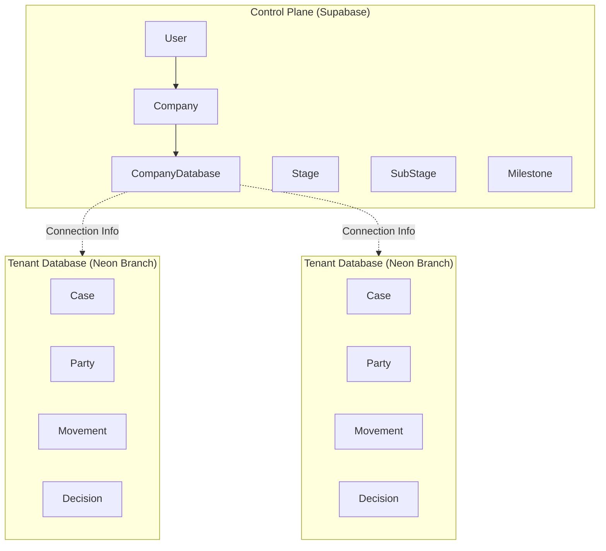
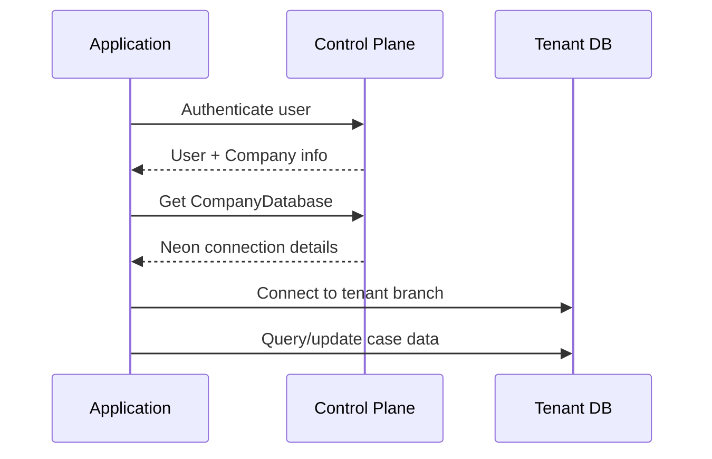

Clamo uses a **two-database architecture** to separate multi-tenant control plane concerns from isolated tenant data. This design provides strong data isolation, independent scaling, and compliance with data residency requirements.

## Architecture Overview

## Control Plane Database

The **Control Plane** is hosted on Supabase and stores:

- **Company management** - Organizations using the platform
- **User management** - User accounts and their company associations
- **Database metadata** - Neon connection information for each tenant
- **Reference data** - Procedural stages, sub-stages, and milestones

<CardGroup cols={2}>
  <Card title="Company" icon="building" href="/en/entities/company">
    Organization and database provisioning
  </Card>
  <Card title="User" icon="user" href="/en/entities/user">
    User accounts and onboarding
  </Card>
  <Card title="Stages" icon="layer-group" href="/en/entities/stages">
    Procedural stage reference data
  </Card>
  <Card title="Enums" icon="list" href="/en/entities/enums">
    All enumeration types
  </Card>
</CardGroup>

## Tenant Database

Each company has an isolated **Tenant Database** hosted on a Neon branch. Tenant databases store:

- **Case data** - Legal cases (expedientes) and their metadata
- **Parties** - Plaintiffs, defendants, and other involved parties
- **Timeline** - Movements, attachments, and notifications
- **Decisions** - Court decisions and outcomes
- **Projections** - Denormalized state for fast queries

<CardGroup cols={2}>
  <Card title="Case" icon="briefcase" href="/en/entities/case">
    The main legal case entity
  </Card>
  <Card title="Party" icon="users" href="/en/entities/party">
    Case participants
  </Card>
  <Card title="Claim" icon="file-invoice-dollar" href="/en/entities/claim">
    Legal claims and pretensions
  </Card>
  <Card title="Movement" icon="timeline" href="/en/entities/movement">
    Timeline events and history
  </Card>
  <Card title="Decision" icon="gavel" href="/en/entities/decision">
    Court decisions
  </Card>
  <Card title="Case State" icon="chart-line" href="/en/entities/case-state">
    Projection table for UI
  </Card>
  <Card title="Ingest Run" icon="download" href="/en/entities/ingest-run">
    Ingestion tracking
  </Card>
</CardGroup>

## Cross-Database References

<Warning>
  There are **no foreign keys** between the Control Plane and Tenant databases. Cross-database references use scalar IDs that are validated at the application level.
</Warning>

Common cross-database reference patterns:

| Tenant Field | References | Validation |
|--------------|------------|------------|
| `Case.companyId` | `Company.id` | App-level |
| `Case.manualInternalResponsibleId` | `User.id` | App-level |
| `Movement.stageCode` | `Stage.code` | App-level |
| `Movement.subStageCode` | `SubStage.code` | App-level |
| `Movement.milestoneCode` | `Milestone.code` | App-level |

## Data Flow

## Key Design Decisions

<AccordionGroup>
  <Accordion title="Why separate databases?">
    - **Data isolation**: Each tenant's data is physically separated
    - **Compliance**: Supports data residency requirements
    - **Performance**: Tenant databases can scale independently
    - **Security**: Breach of one tenant doesn't expose others
  </Accordion>

  <Accordion title="Why Neon branches?">
    Neon's branch-per-tenant model provides:
    - Instant database provisioning
    - Copy-on-write efficiency
    - Automatic scaling and hibernation
    - Point-in-time recovery per tenant
  </Accordion>

  <Accordion title="Why no cross-DB foreign keys?">
    Cross-database foreign keys would require:
    - Distributed transactions
    - Complex consistency guarantees
    - Tight coupling between databases

    Instead, we validate references at the application layer and maintain eventual consistency.
  </Accordion>
</AccordionGroup>
