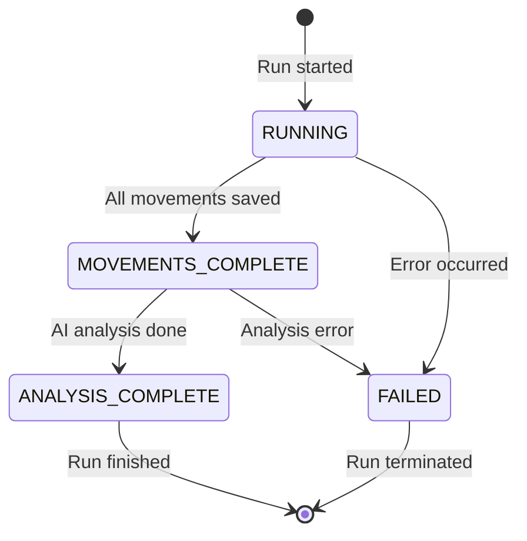
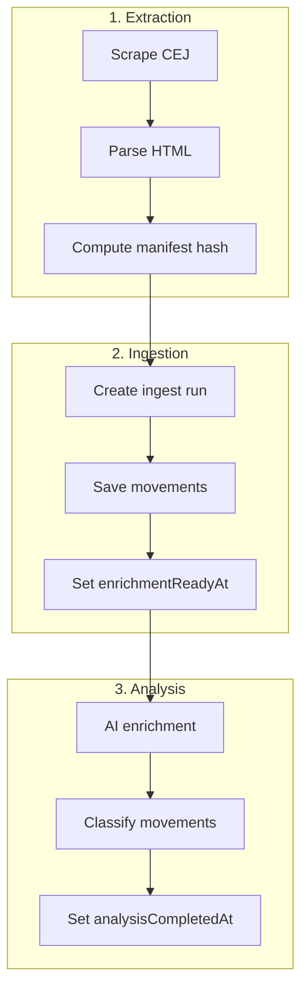
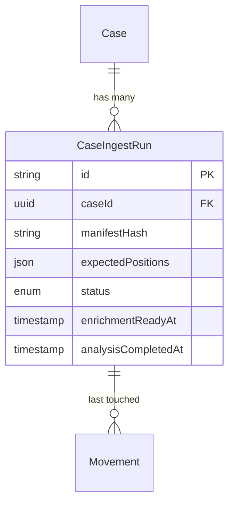

The **CaseIngestRun** entity tracks individual data extraction and ingestion operations for a case. It provides database-backed idempotency, completion tracking, and error handling for the ingestion pipeline.

## Overview

Each ingest run represents a single extraction operation from CEJ (Consulta de Expedientes Judiciales). The run tracks:

- Which movements are expected from this extraction
- Current status of the ingestion process
- Completion timestamps for pipeline stages
- Error information if the run fails

<Note>
  Ingest runs use client-supplied deterministic IDs, enabling idempotent operations. Re-running the same extraction with the same manifest produces the same run ID.
</Note>

## Field Reference

### Identity Fields

| Field | Type | Description |
|-------|------|-------------|
| `id` | `string` | Deterministic UUID (client-supplied) |
| `caseId` | `string` | Foreign key to parent Case |
| `expediente` | `string` | Case number for logging/debugging |

### Manifest Fields

| Field | Type | Description |
|-------|------|-------------|
| `manifestHash` | `string` | SHA-256 of the source HTML/manifest |
| `expectedPositions` | `Json` | Array of movement positions to ingest |

### Status Fields

| Field | Type | Description |
|-------|------|-------------|
| `status` | `CaseIngestRunStatus` | Current pipeline status |
| `enrichmentReadyAt` | `DateTime?` | When movements are ready for AI |
| `analysisCompletedAt` | `DateTime?` | When AI analysis completed |

### Error Fields

| Field | Type | Description |
|-------|------|-------------|
| `errorMessage` | `string?` | Human-readable error description |
| `errorDetails` | `Json?` | Structured error information |

## Ingest Run Status

| Status | Description | Next Step |
|--------|-------------|-----------|
| `RUNNING` | Extraction in progress | Wait for movements |
| `MOVEMENTS_COMPLETE` | All movements saved to DB | Start AI analysis |
| `ANALYSIS_COMPLETE` | AI enrichment finished | Run complete |
| `FAILED` | Error occurred | Check error details |

## Pipeline Flow

<Warning>
  The same manifest hash for the same case always produces the same run ID. This means re-processing unchanged data will find the existing run rather than creating a duplicate.
</Warning>

## Entity Relationships

## Related Entities

<CardGroup cols={2}>
  <Card title="Case" icon="briefcase" href="/en/entities/case">
    Parent case entity
  </Card>
  <Card title="Movement" icon="timeline" href="/en/entities/movement">
    Movements track lastIngestRunId
  </Card>
  <Card title="Enums" icon="list" href="/en/entities/enums">
    CaseIngestRunStatus enum
  </Card>
</CardGroup>
