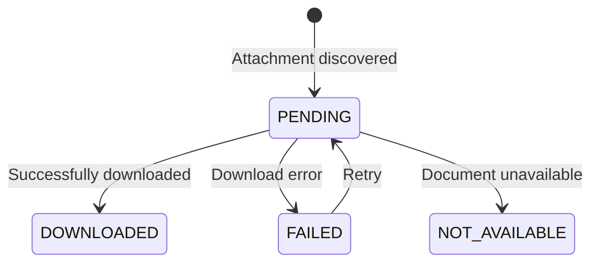
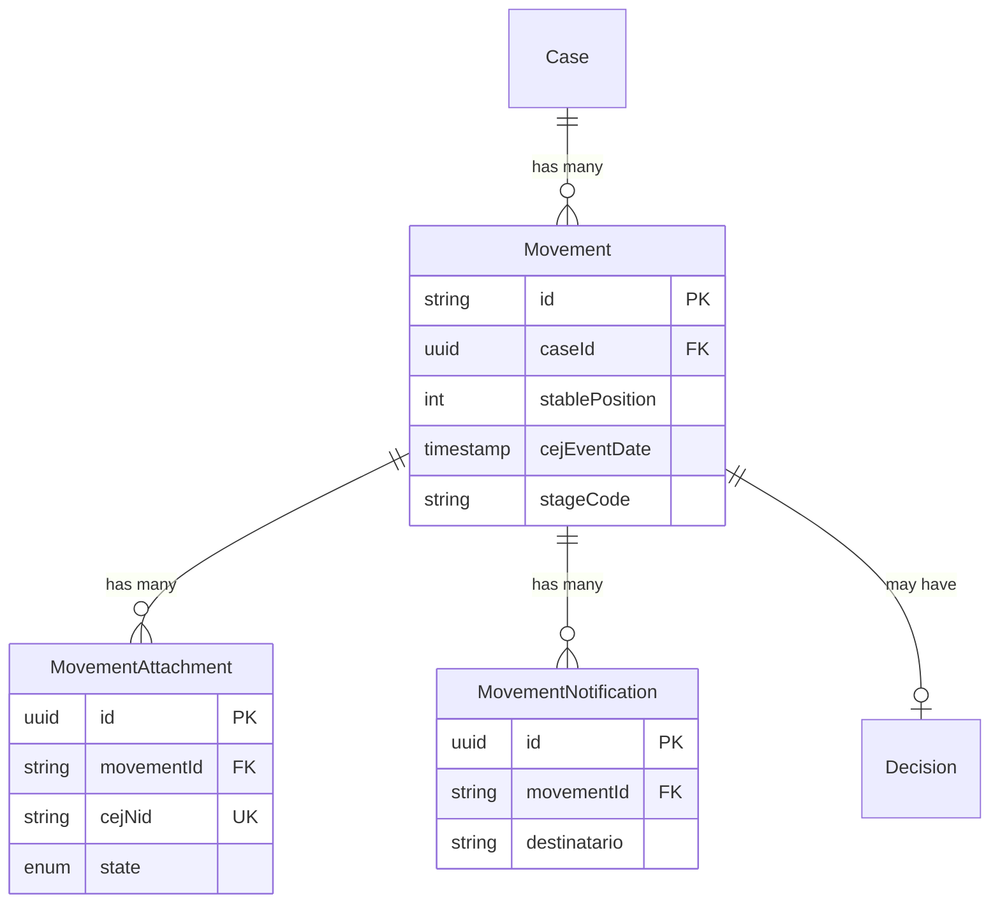

The **Movement** entity represents timeline events in a legal case, forming an immutable history of proceedings. Each movement can have **attachments** (documents) and **notifications** (delivery records).

## Movement

Movements are the chronological record of everything that happens in a case. They use a deterministic ID and stable positioning system designed for efficient incremental ingestion.

<Note>
  **Stable Position**: Movements use a `stablePosition` field where 1 = oldest movement. This never changes when new movements are added, unlike CEJ's position where 1 = newest.
</Note>

### Field Reference

#### Core Fields

| Field | Type | Description |
|-------|------|-------------|
| `id` | `string` | Deterministic UUID from case number + position |
| `caseId` | `string` | Foreign key to parent Case |
| `stablePosition` | `int` | Chronological position (1 = oldest) |

#### CEJ Fields

| Field | Type | Description |
|-------|------|-------------|
| `cejEventDate` | `DateTime?` | Date of resolution or entry |
| `cejDecreeDate` | `DateTime?` | Proveido (decree) date |
| `cejActo` | `string?` | Type of procedural act |
| `cejResolution` | `string?` | Resolution number/identifier |
| `cejDescription` | `string?` | Raw description from CEJ |
| `cejFolios` | `int?` | Number of document folios |
| `cejRawPayload` | `Json?` | Complete raw scraped data |

#### SourcedValue Fields

| Field | Type | Description |
|-------|------|-------------|
| `name` | `Json?` | Display name for UI |
| `summary` | `Json?` | AI-generated or manual summary |
| `tags` | `Json?` | Classification tags array |

#### Classification Fields

| Field | Type | Description |
|-------|------|-------------|
| `stageCode` | `string?` | References Stage.code |
| `subStageCode` | `string?` | References SubStage.code |
| `milestoneCode` | `string?` | References Milestone.code |

<Warning>
  The `stageCode`, `subStageCode`, and `milestoneCode` fields reference entities in the Control Plane database. These are validated at the application level, not by foreign keys.
</Warning>

## MovementAttachment

Documents attached to movements, such as PDFs, court orders, or evidence files.

### Field Reference

| Field | Type | Description |
|-------|------|-------------|
| `id` | `string` | UUID primary key |
| `movementId` | `string` | Parent movement reference |
| `cejNid` | `string?` | Unique CEJ document identifier |
| `kind` | `string` | Document format: `PDF`, `HTML`, `IMAGE` |
| `label` | `string?` | Human-readable document name |
| `url` | `string?` | Source URL for download |
| `state` | `AttachmentState` | Download/processing state |
| `aiExtractedText` | `string?` | Text extracted via AI/OCR |

### Attachment States

## MovementNotification

Notification records associated with movements, tracking delivery to parties.

### Field Reference

| Field | Type | Description |
|-------|------|-------------|
| `id` | `string` | UUID primary key |
| `movementId` | `string` | Parent movement reference |
| `destinatario` | `string` | Name of notification recipient |
| `fechaEnvio` | `DateTime?` | Date notification was sent |
| `formaEntrega` | `string?` | Delivery method (electronic, physical) |
| `extraFechas` | `Json?` | Map of additional dates |

## Entity Relationships

## Related Entities

<CardGroup cols={2}>
  <Card title="Case" icon="briefcase" href="/en/entities/case">
    Parent case entity
  </Card>
  <Card title="Decision" icon="gavel" href="/en/entities/decision">
    Decisions linked to movements
  </Card>
  <Card title="Stages" icon="layer-group" href="/en/entities/stages">
    Stage/SubStage/Milestone references
  </Card>
  <Card title="Enums" icon="list" href="/en/entities/enums">
    AttachmentState enum
  </Card>
</CardGroup>
