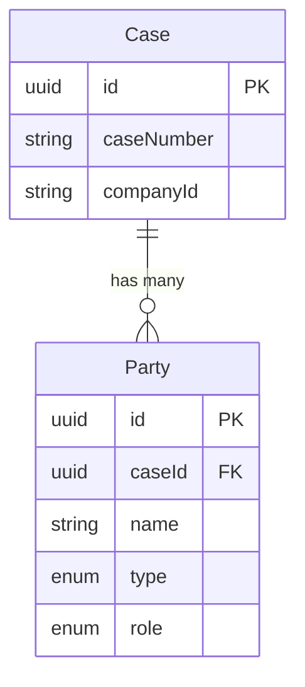

The **Party** entity represents individuals or organizations involved in a legal case. Parties are classified by their type (natural person or legal entity) and their role in the proceedings (plaintiff, defendant, third party, or other).

## Overview

Every case has one or more parties. Common configurations include:
- **Labor cases**: Employee (plaintiff) vs. Employer (defendant)
- **Civil cases**: Multiple plaintiffs and/or defendants
- **Complex cases**: Third parties, interveners, and other participants

## Field Reference

| Field | Type | Description |
|-------|------|-------------|
| `id` | `string` | UUID primary key, auto-generated |
| `caseId` | `string` | Foreign key to the parent Case |
| `name` | `string` | Full legal name of the party |
| `type` | `PartyType` | Classification of entity type |
| `role` | `PartyRole` | Role in the legal proceedings |
| `createdAt` | `DateTime` | When the party record was created |
| `updatedAt` | `DateTime` | When the party was last modified |

## Party Types

| Type | Description | Example |
|------|-------------|---------|
| `NATURAL` | Natural person / individual | "Juan Perez Garcia" |
| `JURIDICA` | Legal entity / corporation | "Empresa ABC S.A.C." |
| `UNKNOWN` | Type not yet determined | Unprocessed CEJ data |

<Note>
  The `UNKNOWN` type is used during initial data ingestion when the party type cannot be determined from the source data. It should be resolved through AI analysis or manual classification.
</Note>

## Party Roles

| Role | Description | Typical Position |
|------|-------------|------------------|
| `PLAINTIFF` | Initiating party / demandante | Brings the lawsuit |
| `DEFENDANT` | Responding party / demandado | Defends against claims |
| `THIRD_PARTY` | Third party / tercero | Joined or intervening party |
| `OTHER` | Other participants | Witnesses, experts, etc. |

## Entity Relationships

<Warning>
  CEJ data may contain duplicate party entries or inconsistent naming. The application should deduplicate parties by normalized name within a case.
</Warning>

## Related Entities

<CardGroup cols={2}>
  <Card title="Case" icon="briefcase" href="/en/entities/case">
    Parent case entity
  </Card>
  <Card title="Enums" icon="list" href="/en/entities/enums">
    PartyType and PartyRole enums
  </Card>
</CardGroup>
