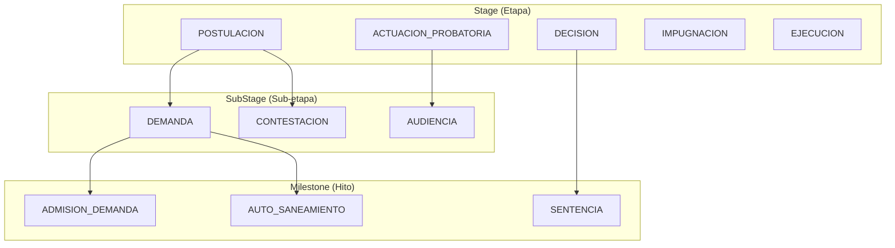
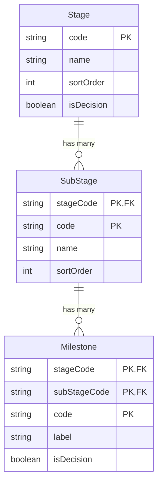

The **Stage**, **SubStage**, and **Milestone** entities form a hierarchical reference data system for classifying legal proceedings. This three-level taxonomy enables consistent categorization of case movements across the Peruvian judicial process.

## Overview

The stage hierarchy represents the procedural phases of a legal case:

<Note>
  Stage reference data is stored in the **Control Plane** database (Supabase) and shared across all tenants. Movement classification codes in tenant databases reference this shared taxonomy.
</Note>

## Stage

Stages represent the macro phases of a legal process.

| Field | Type | Description |
|-------|------|-------------|
| `code` | `string` | Unique identifier (PK) |
| `name` | `string` | Human-readable stage name |
| `sortOrder` | `int` | Display/workflow order |
| `description` | `string?` | Detailed description |
| `isDecision` | `boolean` | True if stage contains decisions |

### Common Stages

| Code | Name | Description |
|------|------|-------------|
| `POSTULACION` | Postulacion | Initial filing phase |
| `ACTUACION_PROBATORIA` | Actuacion Probatoria | Evidence presentation |
| `DECISION` | Decision | Judgment phase |
| `IMPUGNACION` | Impugnacion | Appeals phase |
| `EJECUCION` | Ejecucion | Enforcement phase |

## SubStage

SubStages represent phases within a stage. They use a composite primary key of `(stageCode, code)`.

| Field | Type | Description |
|-------|------|-------------|
| `stageCode` | `string` | References parent Stage.code |
| `code` | `string` | SubStage identifier |
| `name` | `string` | Human-readable name |
| `sortOrder` | `int` | Order within parent stage |
| `description` | `string?` | Detailed description |

## Milestone

Milestones are specific events within a sub-stage. They use a composite primary key of `(stageCode, subStageCode, code)`.

| Field | Type | Description |
|-------|------|-------------|
| `stageCode` | `string` | References Stage.code |
| `subStageCode` | `string` | References SubStage.code |
| `code` | `string` | Milestone identifier |
| `label` | `string` | Human-readable label |
| `isDecision` | `boolean` | True if milestone is a decision point |

<Warning>
  Stages are in the Control Plane, but movements are in tenant databases. There are no foreign keys between them. Application code must validate stage references.
</Warning>

## Entity Relationships

## Related Entities

<CardGroup cols={2}>
  <Card title="Movement" icon="timeline" href="/en/entities/movement">
    Movements reference stage codes
  </Card>
  <Card title="Case State" icon="chart-line" href="/en/entities/case-state">
    Current stage tracked in state
  </Card>
  <Card title="Decision" icon="gavel" href="/en/entities/decision">
    Decision milestones trigger detection
  </Card>
</CardGroup>
