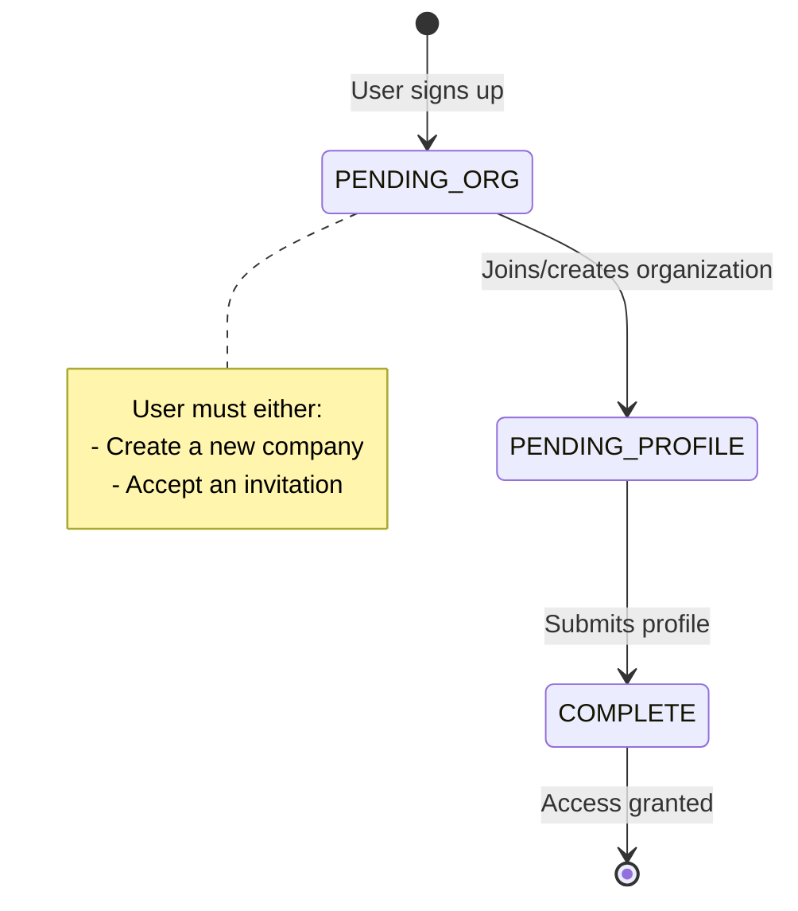

The **User** entity represents individual user accounts in Clamo. Users are associated with a company and tracked through an onboarding workflow that ensures proper organization setup before accessing case data.

## Overview

Users authenticate via WorkOS and progress through an onboarding flow that:
1. Associates them with an organization
2. Collects profile information
3. Grants access to their company's tenant database

## Field Reference

| Field | Type | Description |
|-------|------|-------------|
| `id` | `string` | UUID primary key, auto-generated |
| `workosUserId` | `string` | Unique identifier from WorkOS authentication |
| `email` | `string` | User's email address, must be unique |
| `firstName` | `string?` | User's first/given name |
| `lastName` | `string?` | User's last/family name |
| `companyId` | `string?` | References the Company this user belongs to |
| `role` | `string?` | User's role: `"owner"`, `"admin"`, `"member"` |
| `onboardingState` | `OnboardingState` | Current step in onboarding flow |
| `onboardingData` | `Json?` | Temporary storage for onboarding form responses |
| `invitedBy` | `string?` | ID of the user who invited this user |
| `invitedAt` | `DateTime?` | Timestamp when invitation email was sent |
| `acceptedAt` | `DateTime?` | Timestamp when user accepted the invitation |

## Onboarding State Machine

| State | Description | Next Action |
|-------|-------------|-------------|
| `PENDING_ORG` | User has authenticated but not joined a company | Create company or accept invitation |
| `PENDING_PROFILE` | User is associated with a company but profile incomplete | Complete profile form |
| `COMPLETE` | Onboarding finished, full access granted | N/A |

<Note>
  The `onboardingData` field temporarily stores form responses during the onboarding flow. This data can be cleared after onboarding completes.
</Note>

## User Roles

| Role | Permissions |
|------|-------------|
| `owner` | Full access, can delete company, manage billing |
| `admin` | Manage users, configure settings |
| `member` | Standard access to cases and reports |

<Warning>
  Role-based access control is enforced at the application layer. The database stores the role string but does not enforce permissions.
</Warning>

## Related Entities

<CardGroup cols={2}>
  <Card title="Company" icon="building" href="/en/entities/company">
    Organization the user belongs to
  </Card>
  <Card title="Case" icon="briefcase" href="/en/entities/case">
    Cases can reference users as internal responsible
  </Card>
  <Card title="Enums" icon="list" href="/en/entities/enums">
    OnboardingState enum reference
  </Card>
</CardGroup>
