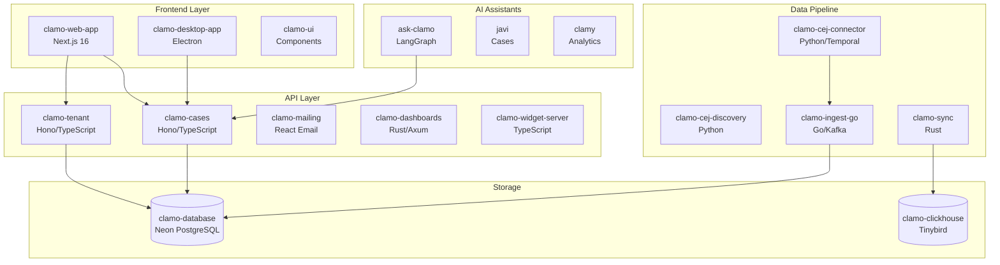
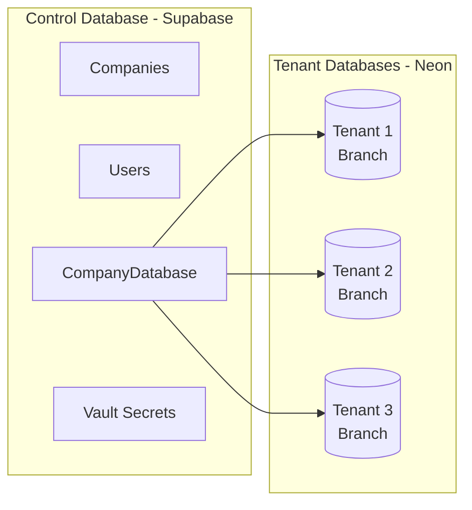

# System Architecture

Clamo is built as a distributed microservices architecture, optimized for legal data processing and multi-tenant scalability.

## General Diagram

## Components by Layer

### Frontend Layer

| Service | Technology | Description |
|---------|------------|-------------|
| `clamo-web-app` | Next.js 16, React 19 | Main web application with dashboard, case management, and onboarding |
| `clamo-desktop-app` | Electron, TypeScript | Desktop application for offline access |
| `clamo-ui` | React, Radix UI | Shared component library |

### API Layer

| Service | Technology | Port | Description |
|---------|------------|------|-------------|
| `clamo-tenant` | Hono, TypeScript | 4001 | Company, user, onboarding, and configuration management |
| `clamo-cases` | Hono, TypeScript | 4000 | CRUD for cases, movements, milestones, and documents |
| `clamo-mailing` | React Email, SendGrid | 4002 | Transactional emails and notifications |
| `clamo-dashboards` | Rust, Axum | 8020 | Dashboard and customizable widgets API |
| `clamo-widget-server` | TypeScript | 3005 | Embeddable widgets server |

### AI Assistants

| Service | Technology | Description |
|---------|------------|-------------|
| `ask-clamo` | LangGraph, Python | Unified agent that consolidates Javi and Clamy |
| `javi` | LangGraph, Python | Assistant specialized in case queries |
| `clamy` | LangGraph, Python | Analytics assistant with MCP/Tinybird integration |

### Data Pipeline

| Service | Technology | Description |
|---------|------------|-------------|
| `clamo-cej-connector` | Python, Temporal | CEJ scraping with browser automation and LLM normalization |
| `clamo-cej-discovery` | Python | Discovery of new cases by RUC |
| `clamo-ingest-go` | Go, Kafka | High-performance ingestion worker with batch inserts |
| `clamo-sync` | Rust | Data synchronization to Tinybird for analytics |

### Storage

| Service | Technology | Description |
|---------|------------|-------------|
| `clamo-database` | Prisma, Neon | Schemas and migrations for multi-tenant database |
| `clamo-clickhouse` | Tinybird | Datasources and pipes configuration for analytics |

## Multi-Tenant Model

Clamo implements a **database-per-tenant** model using Neon PostgreSQL:

### Provisioning Flow

1. Admin creates a company in the admin panel
2. `clamo-tenant` creates an Organization in WorkOS
3. A new branch is provisioned in Neon
4. Credentials are stored in Supabase Vault
5. Invitation is sent to the company administrator

## CEJ Data Flow

## Authentication and Security

- **WorkOS AuthKit**: SSO, invitations, and organization management
- **Supabase Vault**: Secure storage of secrets and credentials
- **Row Level Security**: Data isolation by tenant in queries

## Shared Packages

| Package | Description |
|---------|-------------|
| `@getclamo/contracts` | Shared Zod schemas and TypeScript types |
| `@getclamo/database` | Prisma client and database utilities |
| `@getclamo/tenant-sdk` | SDK for tenant service integration |
| `@getclamo/cases-sdk` | SDK for cases service integration |

## Next Steps

<CardGroup cols={2}>
  <Card
    title="Quickstart"
    icon="rocket"
    href="/en/getting-started/quickstart"
  >
    Start integrating with Clamo APIs.
  </Card>
  <Card
    title="Services"
    icon="server"
    href="/en/services/catalog"
  >
    Detailed documentation of each service.
  </Card>
</CardGroup>

