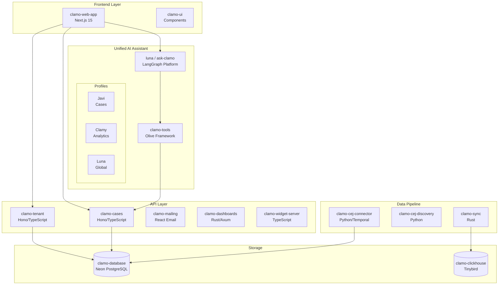
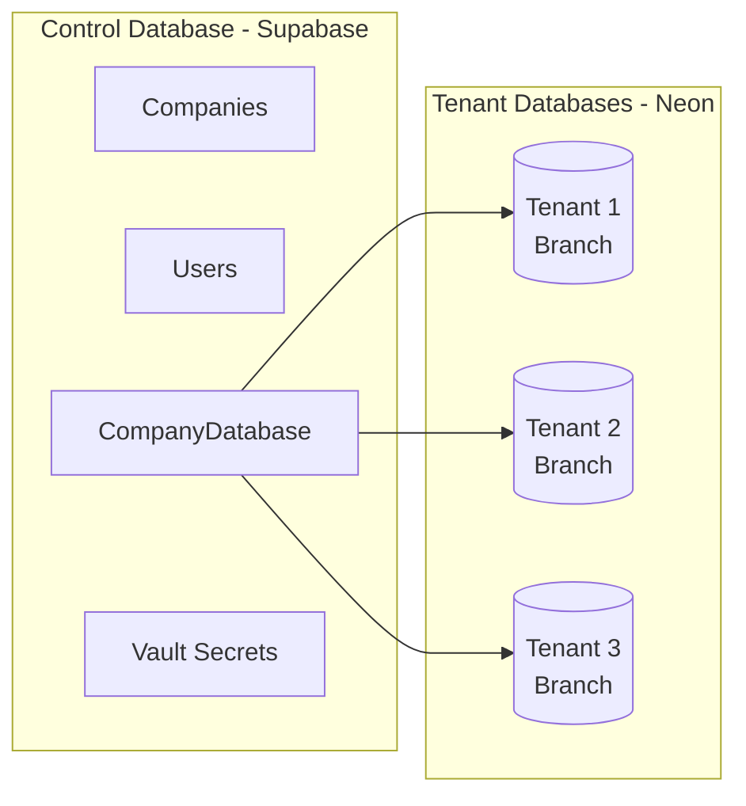
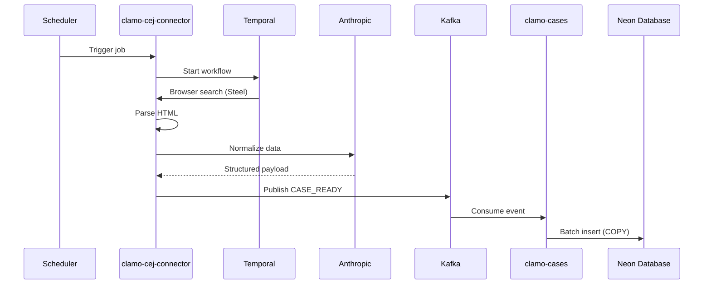

# System Architecture

Clamo is built as a distributed microservices architecture, optimized for legal data processing and multi-tenant scalability.

## General Diagram

## Components by Layer

### Frontend Layer

| Service | Technology | Description |
|---------|------------|-------------|
| `clamo-web-app` | Next.js 15, React 19 | Main web application with dashboard, case management, and onboarding |
| `clamo-ui` | React, Radix UI | Shared component library |

### API Layer

| Service | Technology | Port | Description |
|---------|------------|------|-------------|
| `clamo-tenant` | Hono, TypeScript | 4001 | Company, user, onboarding, and configuration management |
| `clamo-cases` | Hono, TypeScript | 4000 | CRUD for cases, movements, milestones, and documents |
| `clamo-mailing` | Hono, React Email | 4002 | Transactional emails and notifications |
| `clamo-dashboards` | Rust, Axum | 8020 | Dashboard and customizable widgets API |
| `clamo-widget-server` | TypeScript | 3005 | Embeddable widgets server |

### Unified AI Assistant

| Service | Technology | Description |
|---------|------------|-------------|
| `luna` / `ask-clamo` | LangGraph, Python | Unified service containing the Javi, Clamy, and Luna profiles |
| `clamo-tools` | Python, Olive | Remote tools server for the AI assistant |

<Note>
**Unified Architecture:** Javi, Clamy, and Luna are no longer separate services. They are **profiles** (tool profiles) within the unified `luna` service. The frontend sends `assistant_name` in the request to select the active profile.
</Note>

### Data Pipeline

| Service | Technology | Description |
|---------|------------|-------------|
| `clamo-cej-connector` | Python, Temporal | CEJ scraping with browser automation and LLM normalization |
| `clamo-cej-discovery` | Python | Discovery of new cases by RUC |
| `clamo-sync` | Rust | Data synchronization to Tinybird for analytics |

### Storage

| Service | Technology | Description |
|---------|------------|-------------|
| `clamo-database` | Prisma, Neon | Schemas and migrations for multi-tenant database |
| `clamo-clickhouse` | Tinybird | Datasources and pipes configuration for analytics |

## Multi-Tenant Model

Clamo implements a **database-per-tenant** model using Neon PostgreSQL:

### Provisioning Flow

1. Admin creates a company in the admin panel
2. `clamo-tenant` creates an Organization in WorkOS
3. A new branch is provisioned in Neon
4. Credentials are stored in Supabase Vault
5. Invitation is sent to the company administrator

## CEJ Data Flow

## Authentication and Security

- **WorkOS AuthKit**: SSO, invitations, and organization management
- **Supabase Vault**: Secure storage of secrets and credentials
- **Row Level Security**: Data isolation by tenant in queries

## Service SDKs

API contracts packages have been deprecated. All services now use **service SDKs** for API communication:

| Language | Tenant SDK | Cases SDK |
|----------|------------|-----------|
| TypeScript | `@getclamo/tenant` | `@getclamo/cases` |
| Python | `clamo-tenant-sdk-py` | `clamo-cases-sdk-py` |
| Rust | `clamo-tenant-sdk-rust` | `clamo-cases-sdk-rust` |

### SDK Repositories

- **TypeScript**: `GetClamo/clamo-tenant-sdk-ts`, `GetClamo/clamo-cases-sdk-ts`
- **Python**: `GetClamo/clamo-tenant-sdk-py`, `GetClamo/clamo-cases-sdk-py`
- **Rust**: `GetClamo/clamo-tenant-sdk-rust`, `GetClamo/clamo-cases-sdk-rust`

### Shared Packages

| Package | Description |
|---------|-------------|
| `@getclamo/database` | Prisma client and database utilities |
| `@getclamo/widget-core` | Widget definitions and schemas |
| `@getclamo/widget-ui` | Widget React components |

## Next Steps

<CardGroup cols={2}>
  <Card
    title="Quickstart"
    icon="rocket"
    href="/en/getting-started/quickstart"
  >
    Start integrating with Clamo APIs.
  </Card>
  <Card
    title="Data Pipeline"
    icon="diagram-project"
    href="/en/architecture/data-pipeline"
  >
    Complete extraction and ingestion flow.
  </Card>
</CardGroup>

