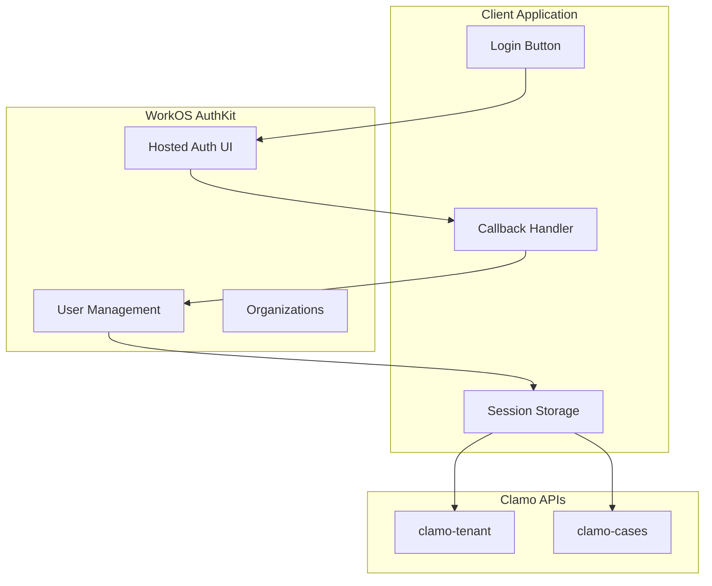

# Authentication Guide

This guide explains how to implement complete authentication with Clamo using WorkOS AuthKit.

## Authentication Architecture



## Prerequisites

1. WorkOS account with AuthKit enabled
2. WorkOS credentials:
   - `WORKOS_API_KEY`
   - `WORKOS_CLIENT_ID`
3. Redirect URI configured in WorkOS Dashboard

## WorkOS Configuration

### 1. Create Application in WorkOS

1. Access the [WorkOS Dashboard](https://dashboard.workos.com)
2. Create a new application or select an existing one
3. Enable "User Management"
4. Configure Redirect URIs:

```
# Development
http://localhost:3000/callback

# Production
https://your-app.com/callback
```

### 2. Environment Variables

```bash
# .env.local
WORKOS_API_KEY=sk_live_...
WORKOS_CLIENT_ID=client_...
WORKOS_REDIRECT_URI=http://localhost:3000/callback
```

## Next.js Implementation

### Installation

```bash
npm install @workos-inc/authkit-nextjs
```

### Configuration

```typescript
// middleware.ts
import { authkitMiddleware } from '@workos-inc/authkit-nextjs';

export default authkitMiddleware({
  middlewareAuth: {
    enabled: true,
    unauthenticatedPaths: ['/', '/login'],
  },
});

export const config = {
  matcher: [
    '/((?!_next/static|_next/image|favicon.ico).*)',
  ],
};
```

### Login Page

```tsx
// app/login/page.tsx
import { getSignInUrl } from '@workos-inc/authkit-nextjs';

export default async function LoginPage() {
  const signInUrl = await getSignInUrl();
  
  return (
    <div className="flex flex-col items-center justify-center min-h-screen">
      <h1 className="text-2xl font-bold mb-4">Sign In to Clamo</h1>
      <a
        href={signInUrl}
        className="bg-blue-600 text-white px-6 py-3 rounded-lg"
      >
        Continue with WorkOS
      </a>
    </div>
  );
}
```

### Callback Handler

```typescript
// app/callback/route.ts
import { handleAuth } from '@workos-inc/authkit-nextjs';

export const GET = handleAuth({
  returnPathname: '/dashboard',
});
```

### Get Session

```typescript
// app/dashboard/page.tsx
import { getSession } from '@workos-inc/authkit-nextjs';
import { redirect } from 'next/navigation';

export default async function DashboardPage() {
  const session = await getSession();
  
  if (!session) {
    redirect('/login');
  }
  
  const { user, accessToken, organizationId } = session;
  
  return (
    <div>
      <h1>Welcome, {user.firstName}</h1>
      <p>Organization: {organizationId}</p>
    </div>
  );
}
```

## Create Clamo Session Token

After authenticating with WorkOS, you need to create the Clamo session token:

```typescript
// lib/clamo-session.ts
import { getSession } from '@workos-inc/authkit-nextjs';

interface ClamoSession {
  userId: string;
  workosUserId: string;
  organizationId: string;
  companyId: string;
  email: string;
  role: 'admin' | 'member';
}

export async function getClamoSession(): Promise<{
  accessToken: string;
  sessionToken: string;
} | null> {
  const workosSession = await getSession();
  
  if (!workosSession) {
    return null;
  }
  
  // Get Clamo data
  const response = await fetch(`${process.env.CLAMO_API_URL}/v1/me`, {
    headers: {
      'Authorization': `Bearer ${workosSession.accessToken}`,
    },
  });
  
  if (!response.ok) {
    return null;
  }
  
  const clamoUser = await response.json();
  
  // Create session token
  const sessionData: ClamoSession = {
    userId: clamoUser.id,
    workosUserId: workosSession.user.id,
    organizationId: workosSession.organizationId!,
    companyId: clamoUser.companyId,
    email: clamoUser.email,
    role: clamoUser.role,
  };
  
  const sessionToken = Buffer.from(
    JSON.stringify(sessionData)
  ).toString('base64url');
  
  return {
    accessToken: workosSession.accessToken,
    sessionToken,
  };
}
```

## Clamo API Client

```typescript
// lib/clamo-client.ts
import { getClamoSession } from './clamo-session';

class ClamoClient {
  private baseUrl: string;
  
  constructor() {
    this.baseUrl = process.env.CLAMO_API_URL!;
  }
  
  private async getHeaders() {
    const session = await getClamoSession();
    
    if (!session) {
      throw new Error('Not authenticated');
    }
    
    return {
      'Authorization': `Bearer ${session.accessToken}`,
      'x-clamo-session': session.sessionToken,
      'Content-Type': 'application/json',
    };
  }
  
  async getCases(params?: Record<string, string>) {
    const headers = await this.getHeaders();
    const query = new URLSearchParams(params).toString();
    
    const response = await fetch(
      `${this.baseUrl}/v1/cases?${query}`,
      { headers }
    );
    
    if (!response.ok) {
      const error = await response.json();
      throw new Error(error.error.message);
    }
    
    return response.json();
  }
  
  async getCase(id: string) {
    const headers = await this.getHeaders();
    
    const response = await fetch(
      `${this.baseUrl}/v1/cases/${id}`,
      { headers }
    );
    
    if (!response.ok) {
      const error = await response.json();
      throw new Error(error.error.message);
    }
    
    return response.json();
  }
}

export const clamoClient = new ClamoClient();
```

## Organization Management

WorkOS allows a user to belong to multiple organizations. Clamo maps each organization to a company:

```typescript
// Get user organizations
import WorkOS from '@workos-inc/node';

const workos = new WorkOS(process.env.WORKOS_API_KEY);

async function getUserOrganizations(userId: string) {
  const { data: memberships } = await workos.userManagement.listOrganizationMemberships({
    userId,
  });
  
  return memberships.map(m => ({
    organizationId: m.organizationId,
    role: m.role,
  }));
}
```

### Switch Organization

```typescript
// Force organization selection on login
import { getSignInUrl } from '@workos-inc/authkit-nextjs';

const signInUrl = await getSignInUrl({
  organizationId: 'org_...',  // Pre-select organization
});
```

## Logout

```typescript
// app/api/logout/route.ts
import { signOut } from '@workos-inc/authkit-nextjs';

export async function GET() {
  return signOut();
}
```

## Protect API Routes

```typescript
// app/api/cases/route.ts
import { getSession } from '@workos-inc/authkit-nextjs';
import { NextResponse } from 'next/server';

export async function GET() {
  const session = await getSession();
  
  if (!session) {
    return NextResponse.json(
      { error: { code: 'UNAUTHORIZED', message: 'Not authenticated' } },
      { status: 401 }
    );
  }
  
  // Proxy to Clamo API
  const response = await fetch(`${process.env.CLAMO_API_URL}/v1/cases`, {
    headers: {
      'Authorization': `Bearer ${session.accessToken}`,
      'x-clamo-session': createSessionToken(session),
    },
  });
  
  const data = await response.json();
  return NextResponse.json(data);
}
```

## Roles and Permissions

### Verify Role

```typescript
import { getSession } from '@workos-inc/authkit-nextjs';

async function requireAdmin() {
  const session = await getSession();
  
  if (!session) {
    throw new Error('Not authenticated');
  }
  
  // Get Clamo role
  const response = await fetch(`${process.env.CLAMO_API_URL}/v1/me`, {
    headers: {
      'Authorization': `Bearer ${session.accessToken}`,
    },
  });
  
  const user = await response.json();
  
  if (user.role !== 'admin') {
    throw new Error('Administrator permissions required');
  }
  
  return user;
}
```

### Protection Component

```tsx
// components/AdminOnly.tsx
'use client';

import { useSession } from './SessionProvider';

export function AdminOnly({ children }: { children: React.ReactNode }) {
  const { user } = useSession();
  
  if (user?.role !== 'admin') {
    return null;
  }
  
  return <>{children}</>;
}
```

## Token Refresh

WorkOS automatically handles token refresh with AuthKit. If you need to do it manually:

```typescript
import WorkOS from '@workos-inc/node';

const workos = new WorkOS(process.env.WORKOS_API_KEY);

async function refreshAccessToken(refreshToken: string) {
  const { accessToken, refreshToken: newRefreshToken } = 
    await workos.userManagement.authenticateWithRefreshToken({
      clientId: process.env.WORKOS_CLIENT_ID!,
      refreshToken,
    });
  
  return { accessToken, refreshToken: newRefreshToken };
}
```

## Troubleshooting

<AccordionGroup>
  <Accordion title="Error: Organization not found">
    The user doesn't belong to any organization in WorkOS. Verify that:
    1. The user has been invited to an organization
    2. The organization is linked to a company in Clamo
  </Accordion>
  
  <Accordion title="Error: Session expired">
    The access token has expired. AuthKit should renew it automatically.
    If it persists, verify the middleware configuration.
  </Accordion>
  
  <Accordion title="Error: CORS">
    Calls to the Clamo API must be made from the server (Server Components or API Routes),
    not directly from the client.
  </Accordion>
</AccordionGroup>

## Next Steps

<CardGroup cols={2}>
  <Card
    title="Multi-Tenancy"
    icon="building"
    href="/en/guides/multi-tenancy"
  >
    Learn about Clamo's multi-tenant model.
  </Card>
  <Card
    title="API Reference"
    icon="code"
    href="/en/api-reference/authentication"
  >
    Technical authentication documentation.
  </Card>
</CardGroup>

