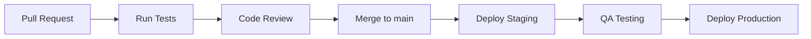

# Deployment Guide

This guide documents the deployment procedures for the different Clamo services.

## Environments

| Environment | Purpose | Base URL |
|-------------|---------|----------|
| Development | Local development | localhost:* |
| Staging | Testing and QA | staging.getclamo.com |
| Production | Production | app.getclamo.com |

## CI/CD Pipeline

### GitHub Actions

All repositories use GitHub Actions for CI/CD:

```yaml
# .github/workflows/deploy.yml
name: Deploy

on:
  push:
    branches: [main]
  pull_request:
    branches: [main]

jobs:
  test:
    runs-on: ubuntu-latest
    steps:
      - uses: actions/checkout@v4
      - uses: pnpm/action-setup@v2
      - uses: actions/setup-node@v4
        with:
          node-version: '20'
          cache: 'pnpm'
      - run: pnpm install
      - run: pnpm test
      - run: pnpm build

  deploy-staging:
    needs: test
    if: github.ref == 'refs/heads/main'
    runs-on: ubuntu-latest
    steps:
      - uses: actions/checkout@v4
      # Deploy steps...

  deploy-production:
    needs: deploy-staging
    if: github.ref == 'refs/heads/main'
    environment: production
    runs-on: ubuntu-latest
    steps:
      # Production deploy with manual approval
```

### Deployment Flow



## Deployment by Service

### Frontend (clamo-web-app)

**Platform**: Vercel

```bash
# Manual deploy to staging
vercel --env staging

# Deploy to production
vercel --prod
```

**Environment Variables in Vercel**:
- `NEXT_PUBLIC_API_URL`
- `NEXT_PUBLIC_TENANT_API_URL`
- `WORKOS_CLIENT_ID`
- `WORKOS_API_KEY`

### TypeScript APIs (clamo-tenant, clamo-cases)

**Platform**: Railway / Fly.io

```bash
# Deploy with Railway CLI
railway up

# Deploy with Fly.io
fly deploy
```

**Dockerfile**:

```dockerfile
FROM node:20-alpine AS builder
WORKDIR /app
COPY package.json pnpm-lock.yaml ./
RUN npm install -g pnpm && pnpm install --frozen-lockfile
COPY . .
RUN pnpm build

FROM node:20-alpine
WORKDIR /app
COPY --from=builder /app/dist ./dist
COPY --from=builder /app/node_modules ./node_modules
COPY --from=builder /app/package.json ./
EXPOSE 4001
CMD ["node", "dist/index.js"]
```

### CEJ Connector (Python)

**Platform**: Docker on VM / Kubernetes

```bash
# Build image
docker build -t clamo-cej-connector:latest .

# Push to registry
docker tag clamo-cej-connector:latest gcr.io/clamo/cej-connector:latest
docker push gcr.io/clamo/cej-connector:latest

# Deploy on Kubernetes
kubectl apply -f k8s/cej-connector.yaml
```

### Ingest Worker (Go)

**Platform**: Docker on VM / Kubernetes

```bash
# Build
docker build -t clamo-ingest-go:latest .

# Deploy
kubectl rollout restart deployment/clamo-ingest-go
```

## Database Migrations

### Migration Process

<Warning>
Database migrations must be executed **before** deploying new code.
</Warning>

```bash
# 1. Verify current status
clamo db status stg

# 2. Execute migrations on staging
clamo db migrate stg

# 3. Verify everything works
# ... manual testing ...

# 4. Execute on production
clamo db migrate prd
```

### Tenant Migrations

Tenant migrations are executed on all active databases:

```bash
# Mass migration script
clamo db migrate-all-tenants prd
```

## Rollback

### Code Rollback

```bash
# Vercel (frontend)
vercel rollback

# Railway
railway rollback

# Kubernetes
kubectl rollout undo deployment/clamo-tenant
```

### Database Rollback

<Warning>
Database rollbacks can cause data loss. Always backup before proceeding.
</Warning>

```bash
# With Prisma
npx prisma migrate resolve --rolled-back "migration_name"

# With Neon (point-in-time recovery)
# Create branch from a previous point
neon branches create --name recovery --parent main --point-in-time "2025-01-01T00:00:00Z"
```

## Health Checks

### Health Endpoints

All services expose:

| Endpoint | Purpose |
|----------|---------|
| `/health` | General status |
| `/health/live` | Liveness (service running) |
| `/health/ready` | Readiness (ready for traffic) |

### Post-Deploy Verification

```bash
#!/bin/bash
# verify-deploy.sh

SERVICES=(
  "https://api.getclamo.com/health"
  "https://tenant.getclamo.com/health"
  "https://app.getclamo.com/api/health"
)

for service in "${SERVICES[@]}"; do
  status=$(curl -s -o /dev/null -w "%{http_code}" $service)
  if [ $status -eq 200 ]; then
    echo "✓ $service is healthy"
  else
    echo "✗ $service returned $status"
    exit 1
  fi
done

echo "All services healthy!"
```

## Post-Deploy Monitoring

### Metrics to Observe

1. **Error Rate**: Should stay below 1%
2. **P95 Latency**: Should stay below 500ms
3. **CPU/Memory**: No abnormal spikes

### Alerts

Configured in Grafana/PagerDuty:

| Alert | Condition | Severity |
|-------|-----------|----------|
| High Error Rate | > 5% in 5min | Critical |
| High Latency | P95 > 2s | Warning |
| Service Down | Health check failed | Critical |
| Database Connection | Pool exhausted | Critical |

## Deployment Checklist

### Pre-Deploy

- [ ] Tests passing in CI
- [ ] Code review approved
- [ ] DB migrations executed
- [ ] Environment variables updated
- [ ] Documentation updated

### Deploy

- [ ] Staging deploy successful
- [ ] QA testing completed
- [ ] Production deploy
- [ ] Health checks passing

### Post-Deploy

- [ ] Monitor metrics for 30min
- [ ] Check error logs
- [ ] Notify the team
- [ ] Update changelog

## Next Steps

<CardGroup cols={2}>
  <Card
    title="Development Environment"
    icon="laptop-code"
    href="/en/getting-started/local-environment"
  >
    Local environment setup.
  </Card>
  <Card
    title="Debugging"
    icon="bug"
    href="/en/guides/debugging"
  >
    Troubleshooting guide.
  </Card>
</CardGroup>
