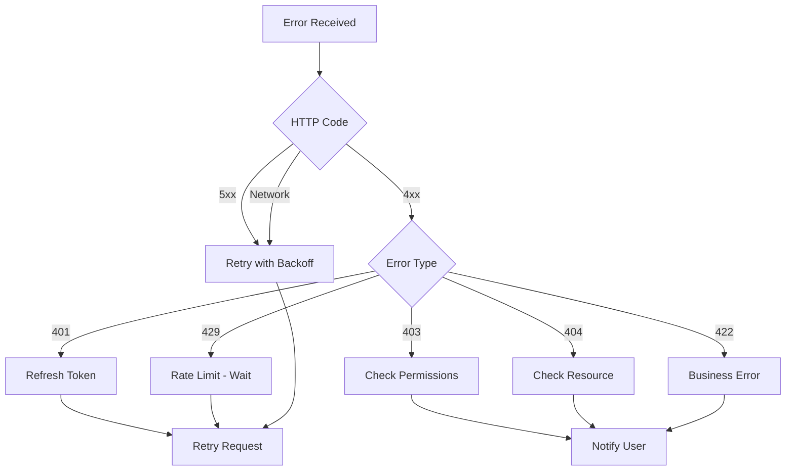

# Error Handling

This guide provides strategies for handling different types of errors that can occur when integrating with Clamo APIs.

## Error Categories

### Client Errors (4xx)

Errors caused by the client request. Generally should not be retried without fixing the problem.

### Server Errors (5xx)

Server-side errors. Can be retried with exponential backoff.

### Network Errors

Timeouts, connection refused, etc. Can be retried.

## Handling Strategy



## Implementation

### Client with Error Handling

```typescript
class ClamoApiError extends Error {
  constructor(
    public code: string,
    message: string,
    public details?: Record<string, unknown>,
    public statusCode?: number
  ) {
    super(message);
    this.name = 'ClamoApiError';
  }
}

class ClamoClient {
  private baseUrl: string;
  private maxRetries = 3;
  
  async request<T>(
    method: string,
    path: string,
    options: RequestOptions = {}
  ): Promise<T> {
    let lastError: Error;
    
    for (let attempt = 0; attempt < this.maxRetries; attempt++) {
      try {
        const response = await this.makeRequest(method, path, options);
        
        if (response.ok) {
          return response.json();
        }
        
        const error = await response.json();
        
        switch (response.status) {
          case 401:
            if (error.error.code === 'TOKEN_EXPIRED') {
              await this.refreshToken();
              continue;
            }
            throw new ClamoApiError(error.error.code, error.error.message, error.error.details, 401);
            
          case 429:
            const retryAfter = error.error.details?.retryAfter || 60;
            await this.sleep(retryAfter * 1000);
            continue;
            
          case 500:
          case 502:
          case 503:
          case 504:
            const backoff = Math.pow(2, attempt) * 1000;
            await this.sleep(backoff);
            continue;
            
          default:
            throw new ClamoApiError(error.error.code, error.error.message, error.error.details, response.status);
        }
      } catch (error) {
        if (error instanceof ClamoApiError) throw error;
        lastError = error as Error;
        const backoff = Math.pow(2, attempt) * 1000;
        await this.sleep(backoff);
      }
    }
    
    throw lastError!;
  }
}
```

## Common Errors and Solutions

### UNAUTHORIZED (401)

**Cause**: Missing, invalid, or expired token.

```typescript
if (error.code === 'UNAUTHORIZED' || error.code === 'TOKEN_EXPIRED') {
  const newToken = await refreshAccessToken();
  // Retry with new token
}
```

### FORBIDDEN (403)

**Cause**: User doesn't have permissions for the action.

```typescript
if (error.code === 'FORBIDDEN') {
  const user = await client.getMe();
  if (user.role !== 'admin') {
    showError('This action requires administrator permissions');
  }
}
```

### NOT_FOUND (404)

**Cause**: Resource doesn't exist or was deleted.

```typescript
if (error.code === 'NOT_FOUND') {
  cache.delete(resourceId);
  showNotFound('The requested case does not exist');
}
```

### RATE_LIMIT_EXCEEDED (429)

**Cause**: Too many requests in a short time.

```typescript
class RateLimiter {
  private requests: number[] = [];
  private limit: number;
  private window: number;
  
  async acquire(): Promise<void> {
    const now = Date.now();
    this.requests = this.requests.filter(t => now - t < this.window);
    
    if (this.requests.length >= this.limit) {
      const waitTime = this.window - (now - this.requests[0]);
      await new Promise(r => setTimeout(r, waitTime));
    }
    
    this.requests.push(Date.now());
  }
}
```

## Next Steps

<CardGroup cols={2}>
  <Card
    title="Best Practices"
    icon="lightbulb"
    href="/en/guides/best-practices"
  >
    Recommendations for robust integration.
  </Card>
  <Card
    title="API Reference"
    icon="code"
    href="/en/api-reference/errors"
  >
    Technical error documentation.
  </Card>
</CardGroup>

