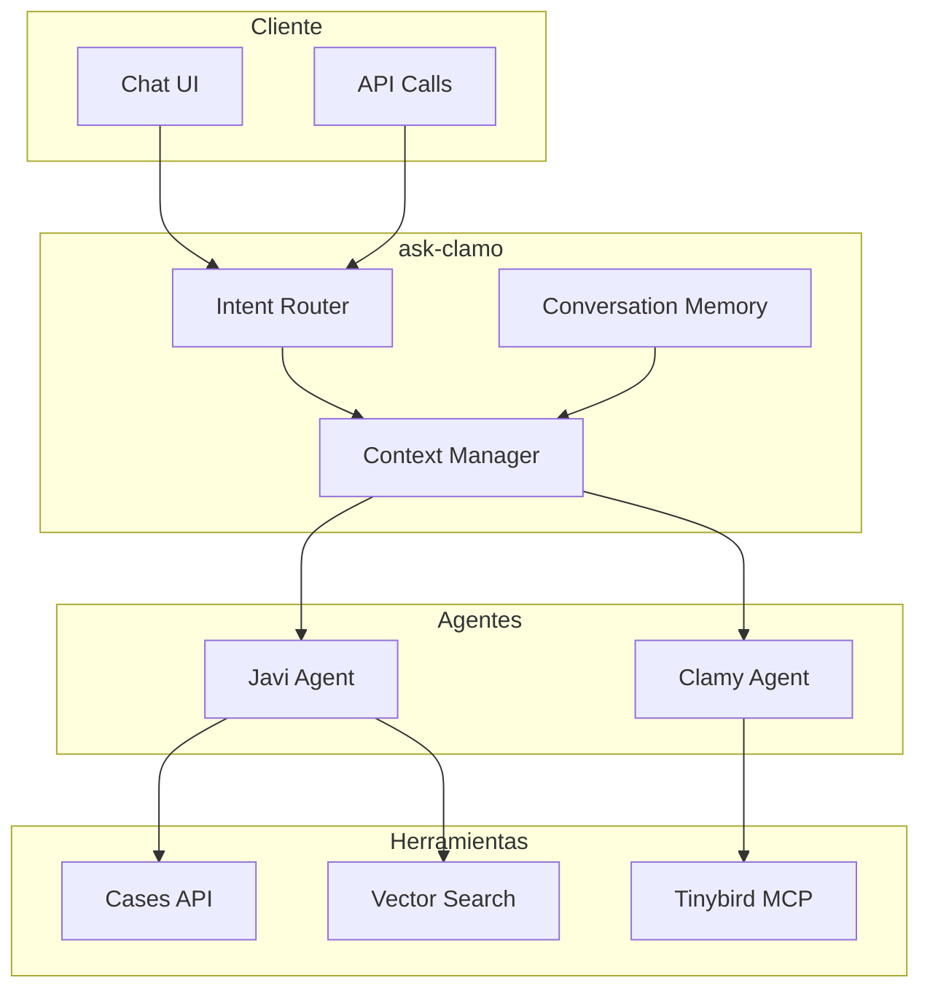

# ask-clamo

Gateway unificado para los asistentes de IA de Clamo, incluyendo Javi (consultas de casos) y Clamy (analytics).

## Información General

| Propiedad | Valor |
|-----------|-------|
| **Repositorio** | `GetClamo/ask-clamo` |
| **Lenguaje** | Python 3.11 |
| **Framework** | LangGraph |
| **LLM** | Anthropic Claude |
| **Puerto** | 8123 |

## Arquitectura



## Agentes

### Javi - Asistente de Casos

Especializado en consultas sobre expedientes judiciales.

**Capacidades:**
- Buscar casos por criterios
- Explicar movimientos procesales
- Resumir estado actual
- Identificar próximos pasos
- Comparar casos similares

### Clamy - Asistente de Analytics

Especializado en análisis de datos y métricas.

**Capacidades:**
- Generar reportes de cartera
- Analizar tendencias
- Calcular métricas de riesgo
- Proyecciones y predicciones

## Implementación

### Router Principal

```python
from langgraph.graph import StateGraph, END
from langchain_anthropic import ChatAnthropic

class AskClamoState(TypedDict):
    messages: list[BaseMessage]
    intent: str
    context: dict
    response: str

def create_ask_clamo_graph():
    graph = StateGraph(AskClamoState)
    
    # Nodos
    graph.add_node("classify", classify_intent)
    graph.add_node("javi", run_javi_agent)
    graph.add_node("clamy", run_clamy_agent)
    graph.add_node("direct", direct_response)
    
    # Routing condicional
    graph.add_conditional_edges(
        "classify",
        route_by_intent,
        {
            "case_query": "javi",
            "analytics": "clamy",
            "general": "direct",
        }
    )
    
    # Edges finales
    graph.add_edge("javi", END)
    graph.add_edge("clamy", END)
    graph.add_edge("direct", END)
    
    graph.set_entry_point("classify")
    
    return graph.compile()

async def classify_intent(state: AskClamoState) -> AskClamoState:
    """Clasifica la intención del usuario."""
    classifier = ChatAnthropic(model="claude-3-haiku-20240307")
    
    response = await classifier.ainvoke([
        SystemMessage(content="""
            Clasifica la intención del usuario:
            - case_query: Preguntas sobre casos específicos, expedientes, movimientos
            - analytics: Preguntas sobre métricas, tendencias, reportes, estadísticas
            - general: Saludos, preguntas generales, ayuda
            
            Responde SOLO con la categoría.
        """),
        state["messages"][-1],
    ])
    
    return {"intent": response.content.strip().lower()}

def route_by_intent(state: AskClamoState) -> str:
    return state["intent"]
```

### Javi Agent

```python
from langgraph.prebuilt import create_react_agent
from langchain_core.tools import tool

@tool
async def search_cases(
    query: str,
    status: str | None = None,
    risk_level: str | None = None,
) -> list[dict]:
    """
    Busca casos en la base de datos.
    
    Args:
        query: Texto de búsqueda
        status: Filtrar por estado
        risk_level: Filtrar por riesgo
    """
    return await cases_api.search(
        search=query,
        status=status,
        risk_level=risk_level,
    )

@tool
async def get_case_detail(case_id: str) -> dict:
    """
    Obtiene el detalle completo de un caso.
    
    Args:
        case_id: ID del caso
    """
    return await cases_api.get(case_id)

@tool
async def get_case_movements(case_id: str, limit: int = 10) -> list[dict]:
    """
    Obtiene los movimientos de un caso.
    
    Args:
        case_id: ID del caso
        limit: Número máximo de movimientos
    """
    return await cases_api.get_movements(case_id, limit=limit)

def create_javi_agent():
    llm = ChatAnthropic(model="claude-3-5-sonnet-20241022")
    
    tools = [
        search_cases,
        get_case_detail,
        get_case_movements,
    ]
    
    system_prompt = """
    Eres Javi, un asistente legal especializado en casos laborales peruanos.
    
    Tu rol es ayudar a abogados y profesionales legales a:
    - Entender el estado de sus casos
    - Explicar movimientos procesales
    - Identificar próximos pasos
    - Alertar sobre plazos importantes
    
    Reglas:
    - Siempre cita el número de expediente
    - Explica términos legales de forma clara
    - Si no tienes información suficiente, pregunta
    - No inventes datos
    - Responde en español
    """
    
    return create_react_agent(llm, tools, state_modifier=system_prompt)
```

### Clamy Agent con MCP

```python
from mcp import ClientSession
from mcp.client.stdio import stdio_client

async def create_clamy_agent():
    # Conectar a Tinybird via MCP
    async with stdio_client(
        command="npx",
        args=["@tinybirdco/mcp-tinybird"],
        env={"TINYBIRD_TOKEN": os.environ["TINYBIRD_TOKEN"]},
    ) as (read, write):
        async with ClientSession(read, write) as session:
            # Obtener herramientas de Tinybird
            tools_result = await session.list_tools()
            
            # Crear agente con herramientas MCP
            llm = ChatAnthropic(model="claude-3-5-sonnet-20241022")
            
            system_prompt = """
            Eres Clamy, un asistente de analytics para gestión legal.
            
            Tu rol es ayudar a analizar:
            - Métricas de cartera de casos
            - Tendencias temporales
            - Distribución de riesgos
            - Proyecciones y predicciones
            
            Tienes acceso a Tinybird para ejecutar queries SQL.
            
            Reglas:
            - Siempre muestra los datos que respaldan tus conclusiones
            - Explica las limitaciones de los datos
            - Sugiere acciones basadas en los insights
            - Responde en español
            """
            
            return create_react_agent(
                llm,
                tools_result.tools,
                state_modifier=system_prompt
            )
```

## API

### Endpoints

| Método | Endpoint | Descripción |
|--------|----------|-------------|
| POST | `/chat` | Enviar mensaje |
| POST | `/chat/stream` | Enviar mensaje (streaming) |
| GET | `/conversations/:id` | Obtener conversación |
| DELETE | `/conversations/:id` | Eliminar conversación |

### Chat Request

```python
from fastapi import FastAPI
from pydantic import BaseModel

app = FastAPI()

class ChatRequest(BaseModel):
    message: str
    conversation_id: str | None = None
    context: dict = {}

class ChatResponse(BaseModel):
    response: str
    conversation_id: str
    sources: list[dict] = []

@app.post("/chat")
async def chat(request: ChatRequest, session: Session = Depends(get_session)):
    graph = create_ask_clamo_graph()
    
    # Cargar historial si existe
    messages = []
    if request.conversation_id:
        messages = await load_conversation(request.conversation_id)
    
    messages.append(HumanMessage(content=request.message))
    
    # Ejecutar grafo
    result = await graph.ainvoke({
        "messages": messages,
        "context": {
            "company_id": session.company_id,
            "user_id": session.user_id,
            **request.context,
        },
    })
    
    # Guardar conversación
    conversation_id = request.conversation_id or str(uuid4())
    await save_conversation(conversation_id, result["messages"])
    
    return ChatResponse(
        response=result["response"],
        conversation_id=conversation_id,
    )
```

### Streaming

```python
from fastapi.responses import StreamingResponse

@app.post("/chat/stream")
async def chat_stream(request: ChatRequest, session: Session = Depends(get_session)):
    graph = create_ask_clamo_graph()
    
    async def generate():
        async for event in graph.astream_events(
            {
                "messages": [HumanMessage(content=request.message)],
                "context": {"company_id": session.company_id},
            },
            version="v2",
        ):
            if event["event"] == "on_chat_model_stream":
                chunk = event["data"]["chunk"].content
                yield f"data: {json.dumps({'chunk': chunk})}\n\n"
        
        yield "data: [DONE]\n\n"
    
    return StreamingResponse(
        generate(),
        media_type="text/event-stream",
    )
```

## Memoria de Conversación

```python
from langchain_core.chat_history import InMemoryChatMessageHistory
from langgraph.checkpoint.sqlite import SqliteSaver

# Checkpoint para persistencia
checkpointer = SqliteSaver.from_conn_string("conversations.db")

# Crear grafo con memoria
graph = create_ask_clamo_graph()
graph_with_memory = graph.compile(checkpointer=checkpointer)

# Usar thread_id para mantener contexto
config = {"configurable": {"thread_id": conversation_id}}
result = await graph_with_memory.ainvoke(state, config)
```

## Configuración

### Variables de Entorno

```bash
# Anthropic
ANTHROPIC_API_KEY=sk-ant-...

# APIs
CLAMO_CASES_URL=http://localhost:4000
TINYBIRD_TOKEN=p.eyJ...

# Database
DATABASE_URL=sqlite:///conversations.db

# Server
PORT=8123
```

### Requirements

```txt
langgraph>=0.2.0
langchain-anthropic>=0.2.0
langchain-core>=0.3.0
mcp>=1.0.0
fastapi>=0.109.0
uvicorn>=0.27.0
httpx>=0.26.0
```

## Desarrollo Local

```bash
# Instalar dependencias
uv sync

# Ejecutar servidor
uv run uvicorn ask_clamo.main:app --reload --port 8123

# O con LangGraph CLI
uv run langgraph dev

# Tests
uv run pytest
```

## LangGraph Studio

Para desarrollo visual:

```bash
# Iniciar LangGraph Studio
langgraph dev --studio

# Abre http://localhost:8000 para la UI
```

