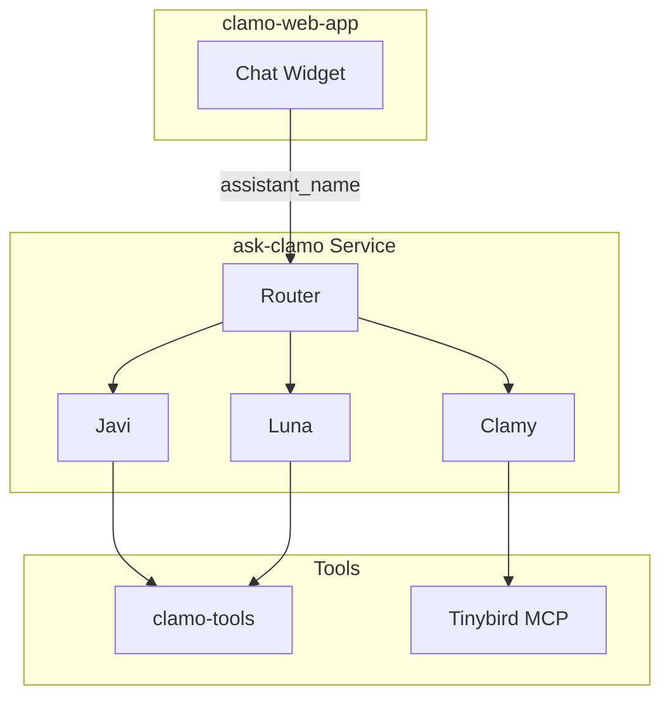

Unified AI Assistant for Clamo. Source code is in the **luna** repository, deployed as **ask-clamo**. Contains three profiles (Javi, Clamy, Luna) sharing the same LangGraph Platform deployment with tool isolation.

## General Information

| Property | Value |
|----------|-------|
| **Repository** | `GetClamo/luna` |
| **Deployed Service** | `ask-clamo` |
| **Language** | Python 3.13 |
| **Framework** | LangGraph Platform |
| **LLM** | Anthropic Claude |
| **Port** | 8000 |

## Architecture



## Profiles

| Profile | Purpose | Context |
|---------|---------|---------|
| **Javi** | Case assistant (page-scoped) | `case_id`, `company_id` |
| **Clamy** | Analytics assistant with charts | `company_id` |
| **Luna** | Global assistant (cross-case) | `company_id` |

## Configuration

### Environment Variables

```bash
# LLM
ANTHROPIC_API_KEY=sk-ant-...

# Backend APIs
CASES_SERVICE_URL=http://localhost:4000
CLAMO_TOOLS_URL=http://localhost:8080

# Tinybird MCP
TINYBIRD_TOKEN=p.eyJ...

# LangSmith (Tracing)
LANGCHAIN_API_KEY=ls__...
```

## Local Development

```bash
cd luna

# Install dependencies
uv sync

# Run server
uv run langgraph dev --port 8000

# Run clamo-tools (separate terminal)
cd clamo-tools && uv run uvicorn clamo_tools.app:app --port 8080
```

## Next Steps

<CardGroup cols={2}>
  <Card
    title="clamo-dashboards"
    icon="chart-bar"
    href="/en/services/clamo-dashboards"
  >
    Dashboard widgets API.
  </Card>
  <Card
    title="clamo-cases"
    icon="folder"
    href="/en/services/clamo-cases"
  >
    Cases API consumed by profiles.
  </Card>
</CardGroup>
