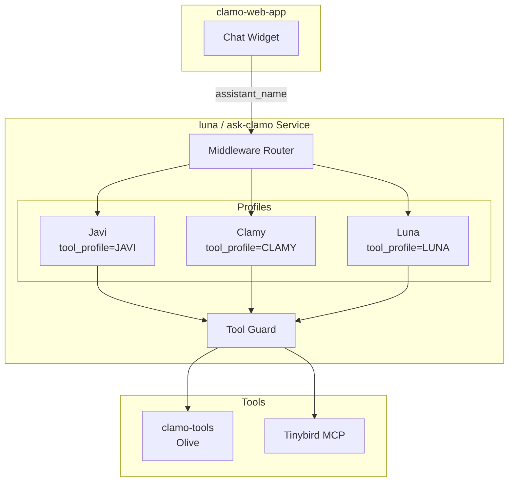

# ask-clamo (luna)

Unified AI Assistant for Clamo. The source code is in the **luna** repository and the deployed service is called **ask-clamo**. It contains three **profiles** (Javi, Clamy, Luna) that share the same LangGraph Platform deployment with tool isolation.

<Note>
**Unified Architecture:** Javi, Clamy, and Luna are **no longer separate services**. They are profiles (tool profiles) within a single service. The frontend selects the active profile by sending `assistant_name` in the request.
</Note>

## General Information

| Property | Value |
|----------|-------|
| **Repository** | `GetClamo/luna` |
| **Deployed Service** | `ask-clamo` |
| **Language** | Python 3.13 |
| **Framework** | LangGraph Platform |
| **LLM** | Anthropic Claude |
| **Port** | 8000 |

## Architecture



## Key Features

- **Single Deployment**: One LangGraph graph, three profiles
- **Shared Threads**: Javi, Clamy, and Luna can run on the same thread, sharing message history
- **Tool Isolation**: Each profile only sees its designated tools (middleware + guard)
- **Dynamic Prompts**: System prompts are selected based on `assistant_name` in context
- **MCP Integration**: Clamy loads analytics tools from Tinybird via MCP
- **Olive Integration**: Luna accesses remote tools via clamo-tools

## Profiles

### Javi (Case Assistant)

- **Purpose**: Help users understand individual legal cases (page-scoped)
- **Tools**: `get_case_details`, `get_case_progress`, `get_case_movements`, `get_case_milestones`
- **Required Context**: `case_id`, `company_id` (auto-injected from page context)
- **Use Case**: Embedded in case detail pages

### Clamy (Analytics Assistant)

- **Purpose**: Generate charts and visualizations for legal portfolio analysis
- **Tools**: `show_chart`, `show_kpi`, `show_custom_chart`, `get_chart_template`, plus Tinybird MCP tools
- **Required Context**: `company_id` (case_id optional)
- **Use Case**: Embedded in analytics/dashboard pages

### Luna (Global Assistant)

- **Purpose**: Generalist assistant with access to ALL cases (not page-scoped)
- **Tools**: `get_case_details_by_id`, `get_case_progress_by_id`, `search_cases`, `list_cases`, plus chart tools
- **Required Context**: `company_id` (case_id passed as tool argument)
- **Use Case**: Global chat widget, cross-case queries, portfolio overview

## Profile Selection

The frontend selects the active profile by sending `assistant_name` in the request:

```bash
curl -X POST http://localhost:8000/runs \
  -H "Content-Type: application/json" \
  -d '{
    "assistant_id": "luna",
    "thread_id": "thread_abc123",
    "input": {"messages": [{"role": "user", "content": "..."}]},
    "config": {
      "configurable": {
        "assistant_name": "javi",
        "case_id": "case_xyz789",
        "company_id": "cmp_abc123"
      }
    }
  }'
```

| Page | `assistant_name` | Additional Context |
|------|------------------|-------------------|
| Case detail | `javi` | `case_id` |
| Analytics | `clamy` | - |
| Global chat | `luna` | - |

## Configuration

### Environment Variables

```bash
# LLM
ANTHROPIC_API_KEY=sk-ant-...

# Backend APIs
CASES_SERVICE_URL=http://localhost:4000
TENANT_SERVICE_URL=http://localhost:8001
CLAMO_TOOLS_URL=http://localhost:8080  # REQUIRED

# Tinybird MCP
TINYBIRD_TOKEN=p.eyJ...
TINYBIRD_API_URL=https://api.tinybird.co

# LangSmith (Tracing)
LANGCHAIN_API_KEY=ls__...
LANGCHAIN_TRACING_V2=true
```

## Local Development

```bash
# Navigate to repo
cd luna

# Install dependencies
uv sync

# Run server (port 8000)
uv run langgraph dev --port 8000

# In another terminal, run clamo-tools
cd clamo-tools
uv run uvicorn clamo_tools.app:app --port 8080 --reload

# Tests
uv run pytest
```

## Next Steps

<CardGroup cols={2}>
  <Card
    title="Detailed Architecture"
    icon="sitemap"
    href="/en/architecture/ai-assistants"
  >
    Complete AI assistants architecture.
  </Card>
  <Card
    title="clamo-tools"
    icon="wrench"
    href="/en/services/clamo-tools"
  >
    Olive tools server.
  </Card>
</CardGroup>
