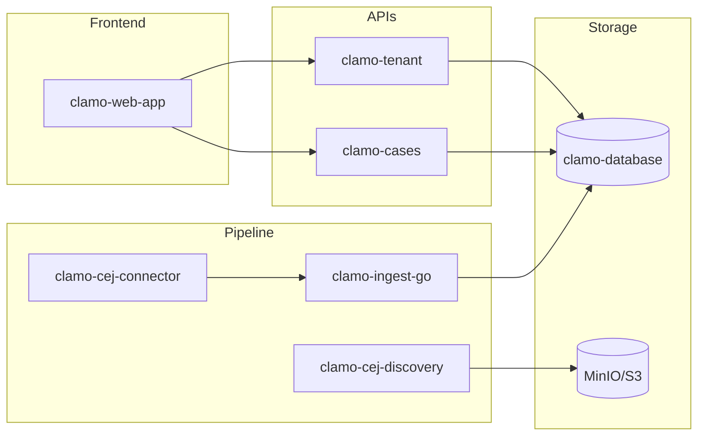

# Service Catalog

Clamo is composed of multiple specialized microservices. This page provides an overview of each one.

## Core Services

These are the fundamental services for the platform's operation.

<CardGroup cols={2}>
  <Card
    title="clamo-tenant"
    icon="building"
    href="/en/services/clamo-tenant"
  >
    **Tenant Management**
    
    Handles companies, users, onboarding, and multi-tenant configuration. Integrates with WorkOS for authentication.
    
    - TypeScript / Hono
    - Port: 4001
  </Card>
  
  <Card
    title="clamo-cases"
    icon="briefcase"
    href="/en/services/clamo-cases"
  >
    **Case Management**
    
    Complete CRUD for judicial cases, movements, milestones, and documents.
    
    - TypeScript / Hono
    - Port: 4000
  </Card>
  
  <Card
    title="clamo-database"
    icon="database"
    href="/en/services/clamo-database"
  >
    **Database Schemas**
    
    Prisma definitions, migrations, and utilities for control and tenant databases.
    
    - Prisma ORM
    - Neon PostgreSQL
  </Card>
</CardGroup>

## Data Pipeline

Services responsible for CEJ data ingestion and processing.

<CardGroup cols={2}>
  <Card
    title="clamo-cej-connector"
    icon="spider"
    href="/en/services/clamo-cej-connector"
  >
    **CEJ Connector**
    
    Automated scraping of the Electronic Justice Center with LLM normalization.
    
    - Python / Temporal
    - Steel + Playwright
  </Card>
  
  <Card
    title="clamo-cej-discovery"
    icon="magnifying-glass"
    href="/en/services/clamo-cej-discovery"
  >
    **CEJ Discovery**
    
    Discovery service for new cases by RUC. Generates CSV reports stored in MinIO/S3.
    
    - Python / Temporal
    - Steel + Playwright
  </Card>
  
  <Card
    title="clamo-ingest-go"
    icon="bolt"
    href="/en/services/clamo-ingest-go"
  >
    **Ingestion Worker**
    
    High-performance Kafka consumer for batch insertion into PostgreSQL.
    
    - Go
    - Kafka / Temporal
  </Card>
  
  <Card
    title="clamo-sync"
    icon="arrows-rotate"
    href="/en/services/clamo-sync"
  >
    **Analytics Sync**
    
    Synchronizes tenant data to Tinybird for real-time analytics.
    
    - Rust
    - Tinybird
  </Card>
</CardGroup>

## Additional Services

Complementary services for specific functionalities.

<CardGroup cols={2}>
  <Card
    title="clamo-mailing"
    icon="envelope"
    href="/en/services/clamo-mailing"
  >
    **Email Service**
    
    Transactional emails and notifications with React Email templates.
    
    - TypeScript / Hono
    - SendGrid
  </Card>
  
  <Card
    title="clamo-dashboards"
    icon="chart-line"
    href="/en/services/clamo-dashboards"
  >
    **Dashboards API**
    
    CRUD for customizable dashboards and analytics widgets.
    
    - Rust / Axum
    - Port: 8020
  </Card>
  
  <Card
    title="ask-clamo"
    icon="robot"
    href="/en/services/ask-clamo"
  >
    **AI Assistants**
    
    LangGraph agents for case queries (Javi) and analytics (Clamy).
    
    - Python / LangGraph
    - Anthropic
  </Card>
</CardGroup>

## Technology Matrix

| Service | Language | Framework | Database | Messaging |
|---------|----------|-----------|----------|-----------|
| clamo-tenant | TypeScript | Hono | Neon (Prisma) | - |
| clamo-cases | TypeScript | Hono | Neon (Prisma) | Ably |
| clamo-database | TypeScript | Prisma | Neon | - |
| clamo-cej-connector | Python | Temporal | PostgreSQL | Kafka |
| clamo-cej-discovery | Python | Temporal | PostgreSQL | - |
| clamo-ingest-go | Go | - | Neon | Kafka |
| clamo-sync | Rust | - | Neon | - |
| clamo-mailing | TypeScript | Hono | PostgreSQL | - |
| clamo-dashboards | Rust | Axum | Neon | - |
| ask-clamo | Python | LangGraph | - | - |

## Default Ports

| Service | Port |
|---------|------|
| clamo-web-app | 3001 |
| clamo-cases | 4000 |
| clamo-tenant | 4001 |
| clamo-mailing | 4002 |
| clamo-widget-server | 3005 |
| clamo-dashboards | 8020 |
| javi (LangGraph) | 8123 |
| clamy (LangGraph) | 8124 |

## Service Dependencies



## Health Checks

All services expose health check endpoints:

| Endpoint | Description |
|----------|-------------|
| `/health` | General status with dependency checks |
| `/health/live` | Liveness probe (service running) |
| `/health/ready` | Readiness probe (ready for traffic) |

Example response:

```json
{
  "status": "healthy",
  "timestamp": "2025-01-02T12:00:00Z",
  "checks": {
    "database": "healthy",
    "redis": "healthy",
    "kafka": "healthy"
  }
}
```

