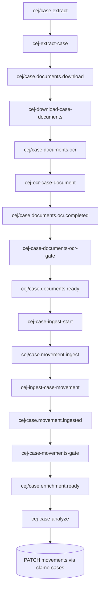

CEJ (Consulta de Expedientes Judiciales) extraction service with Inngest orchestration. Scrapes cases, downloads and OCRs documents, and runs LLM analysis stages.

## General Information

| Property | Value |
|----------|-------|
| **Repository** | `GetClamo/clamo-cases-cej-extractor` |
| **Language** | Python 3.12 |
| **Framework** | FastAPI + Inngest |
| **Port** | 8003 |
| **Browser** | Steel + Playwright |
| **OCR** | Llama Cloud |
| **LLM** | OpenRouter (Gemini, Claude) |

## Architecture



## Pipeline Steps

1. **Extract**: Scrapes CEJ using Steel + Playwright
2. **Download**: Downloads case documents
3. **OCR**: Processes documents with Llama Cloud
4. **Ingest**: Writes case + movements to clamo-cases
5. **Analyze**: Runs LLM stages (classification, enrichment)
6. **Update**: PATCHes movements with AI-generated fields

## Triggering a Run

```json
{
  "name": "cej/case.extract",
  "data": {
    "company_id": "550e8400-e29b-41d4-a716-446655440000",
    "expediente": "04719-2017-0-1601-JP-LA-01",
    "force_refresh": true
  }
}
```

## Configuration

### Environment Variables

```bash
# API
PORT=8003

# clamo-cases SDK
CASES_SERVICE_URL=http://localhost:4000

# Steel (browser automation)
STEEL_API_KEY=...

# Llama Cloud (OCR)
LLAMA_CLOUD_API_KEY=...

# OpenRouter (LLM)
OPENROUTER_API_KEY=...

# Inngest
INNGEST_DEV=1  # For local development
```

## Local Development

```bash
# Install dependencies
make install

# Start Inngest dev server (dashboard: http://localhost:8288)
make inngest-start

# Start API (health: http://localhost:8003/health)
make dev

# Run tests
make test-unit
make test-integration
```

## Next Steps

<CardGroup cols={2}>
  <Card
    title="clamo-cej-discovery"
    icon="magnifying-glass"
    href="/en/services/clamo-cej-discovery"
  >
    Mass case discovery service.
  </Card>
  <Card
    title="Case Entity"
    icon="database"
    href="/en/entities/case"
  >
    Case entity documentation.
  </Card>
</CardGroup>
