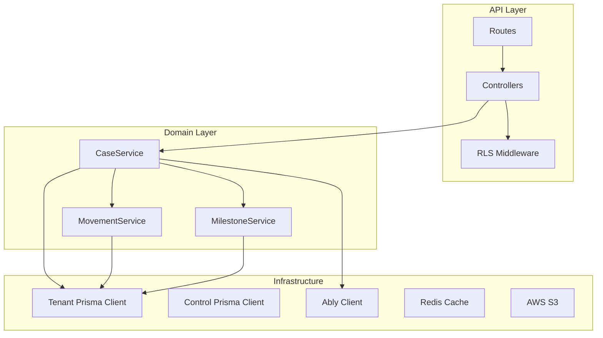

# clamo-cases

Servicio principal para la gestión de casos legales, movimientos procesales, hitos y documentos asociados.

## Información General

| Propiedad | Valor |
|-----------|-------|
| **Repositorio** | `GetClamo/clamo-cases` |
| **Lenguaje** | TypeScript |
| **Framework** | Hono |
| **Puerto** | 4000 |
| **Base de Datos** | Neon PostgreSQL (multi-tenant) |

## Responsabilidades

- CRUD de expedientes judiciales
- Gestión de movimientos procesales
- Tracking de hitos y etapas del proceso
- Almacenamiento de documentos y snapshots
- Notificaciones en tiempo real via Ably
- Integración con asistentes IA

## Arquitectura



## Endpoints Principales

### Casos

| Método | Endpoint | Descripción |
|--------|----------|-------------|
| GET | `/v1/cases` | Listar casos con filtros |
| GET | `/v1/cases/:id` | Obtener detalle de caso |
| POST | `/v1/cases` | Crear caso |
| PATCH | `/v1/cases/:id` | Actualizar caso |
| DELETE | `/v1/cases/:id` | Eliminar caso |

### Movimientos

| Método | Endpoint | Descripción |
|--------|----------|-------------|
| GET | `/v1/cases/:id/movements` | Listar movimientos |
| GET | `/v1/cases/:id/movements/:movementId` | Obtener movimiento |

### Hitos y Progreso

| Método | Endpoint | Descripción |
|--------|----------|-------------|
| GET | `/v1/cases/:id/milestones` | Hitos procesales |
| GET | `/v1/cases/:id/progress` | Progreso por etapas |

### Taxonomía

| Método | Endpoint | Descripción |
|--------|----------|-------------|
| GET | `/v1/taxonomy/stages` | Etapas procesales |
| GET | `/v1/taxonomy/substages` | Sub-etapas |
| GET | `/v1/taxonomy/milestones` | Tipos de hitos |

## Modelo de Datos

### Case

```typescript
interface Case {
  id: string;
  expediente: string;
  caseNumber: string;
  plaintiff: string;          // Demandante
  defendant: string;          // Demandado
  subjectMatter: string;      // Materia
  riskLevel: 'LOW' | 'MEDIUM' | 'HIGH' | 'CRITICAL';
  claimAmount: number | null; // Monto demandado
  district: string;
  court: string;
  currentJudge: string | null;
  processType: string;
  filingDate: Date;
  status: CaseStatus;
  stageCode: string;
  substageCode: string;
  companyId: string;
  monitoredEntityId: string;
  createdAt: Date;
  updatedAt: Date;
}

type CaseStatus = 
  | 'EN_TRAMITE'
  | 'EN_EJECUCION'
  | 'ARCHIVADO'
  | 'CONCLUIDO';
```

### Movement

```typescript
interface Movement {
  id: string;
  caseId: string;
  date: Date;
  description: string;
  resolution: string | null;
  actor: string | null;
  classification: MovementClassification;
  isNotification: boolean;
  documentUrl: string | null;
  summary: string | null;
  createdAt: Date;
}

type MovementClassification =
  | 'RESOLUCION'
  | 'ESCRITO'
  | 'NOTIFICACION'
  | 'AUDIENCIA'
  | 'OTRO';
```

### CaseProgress

```typescript
interface CaseProgress {
  id: string;
  caseId: string;
  stageCode: string;
  substageCode: string;
  startDate: Date;
  endDate: Date | null;
  durationDays: number | null;
  isCurrent: boolean;
}
```

### CaseMilestone

```typescript
interface CaseMilestone {
  id: string;
  caseId: string;
  milestoneCode: string;
  achievedAt: Date;
  movementId: string | null;
  metadata: Record<string, unknown>;
}
```

## Filtros Disponibles

### GET /v1/cases

| Parámetro | Tipo | Descripción |
|-----------|------|-------------|
| `status` | string | Filtrar por estado |
| `riskLevel` | string | Filtrar por nivel de riesgo |
| `stageCode` | string | Filtrar por etapa |
| `district` | string | Filtrar por distrito judicial |
| `search` | string | Búsqueda por expediente o partes |
| `page` | number | Página (default: 1) |
| `limit` | number | Resultados por página (default: 20) |
| `sortBy` | string | Campo para ordenar |
| `sortOrder` | 'asc' \| 'desc' | Dirección del orden |

## Ejemplos de Uso

### Listar Casos

```bash
curl -X GET "http://localhost:4000/v1/cases?status=EN_TRAMITE&riskLevel=HIGH" \
  -H "Authorization: Bearer $TOKEN" \
  -H "x-clamo-session: $SESSION"
```

Respuesta:

```json
{
  "data": [
    {
      "id": "case_abc123",
      "expediente": "00001-2024-0-1234-JR-LA-01",
      "plaintiff": "Juan Pérez García",
      "defendant": "Empresa S.A.C.",
      "subjectMatter": "Despido arbitrario",
      "riskLevel": "HIGH",
      "claimAmount": 50000,
      "status": "EN_TRAMITE",
      "stageCode": "CONOCIMIENTO",
      "substageCode": "SANEAMIENTO"
    }
  ],
  "pagination": {
    "page": 1,
    "limit": 20,
    "total": 150,
    "totalPages": 8
  }
}
```

### Obtener Detalle de Caso

```bash
curl -X GET "http://localhost:4000/v1/cases/case_abc123" \
  -H "Authorization: Bearer $TOKEN" \
  -H "x-clamo-session: $SESSION"
```

Respuesta:

```json
{
  "id": "case_abc123",
  "expediente": "00001-2024-0-1234-JR-LA-01",
  "plaintiff": "Juan Pérez García",
  "defendant": "Empresa S.A.C.",
  "subjectMatter": "Despido arbitrario",
  "riskLevel": "HIGH",
  "claimAmount": 50000,
  "district": "LIMA",
  "court": "1° Juzgado Laboral",
  "currentJudge": "Dr. María García",
  "filingDate": "2024-01-15T00:00:00Z",
  "status": "EN_TRAMITE",
  "movements": [
    {
      "id": "mov_001",
      "date": "2024-06-15T00:00:00Z",
      "description": "RESOLUCIÓN N° 15: Se tiene por contestada la demanda",
      "classification": "RESOLUCION"
    }
  ],
  "milestones": [
    {
      "milestoneCode": "DEMANDA_ADMITIDA",
      "achievedAt": "2024-01-20T00:00:00Z"
    }
  ],
  "progress": [
    {
      "stageCode": "CONOCIMIENTO",
      "substageCode": "CALIFICACION",
      "startDate": "2024-01-15T00:00:00Z",
      "endDate": "2024-01-20T00:00:00Z",
      "isCurrent": false
    }
  ]
}
```

### Obtener Movimientos

```bash
curl -X GET "http://localhost:4000/v1/cases/case_abc123/movements" \
  -H "Authorization: Bearer $TOKEN" \
  -H "x-clamo-session: $SESSION"
```

## Row Level Security (RLS)

El servicio implementa RLS para asegurar el aislamiento de datos por tenant:

1. El middleware extrae `companyId` del token de sesión
2. Se resuelve la conexión a la base de datos del tenant
3. Todas las queries se ejecutan en el contexto del tenant

```typescript
// Middleware simplificado
app.use('*', async (c, next) => {
  const session = decodeSession(c.req.header('x-clamo-session'));
  const tenantDb = await getTenantConnection(session.companyId);
  c.set('tenantDb', tenantDb);
  await next();
});
```

## Notificaciones en Tiempo Real

Clamo usa Ably para notificaciones push cuando hay nuevos movimientos:

```typescript
// Publicar evento
await ably.channels.get(`company:${companyId}`).publish('movement:new', {
  caseId: case.id,
  expediente: case.expediente,
  movement: newMovement,
});
```

## Configuración

### Variables de Entorno

```bash
# Base de datos de control (para resolver tenant)
CONTROL_DATABASE_URL=postgresql://...

# Redis (cache de taxonomía)
REDIS_URL=redis://localhost:6379

# Ably (notificaciones)
ABLY_API_KEY=...

# S3 (documentos)
AWS_ACCESS_KEY_ID=...
AWS_SECRET_ACCESS_KEY=...
S3_BUCKET=clamo-documents
```

## Desarrollo Local

```bash
# Instalar dependencias
pnpm install

# Ejecutar en modo desarrollo
pnpm dev

# Build
pnpm build

# Tests
pnpm test
```

## Dependencias Clave

| Paquete | Uso |
|---------|-----|
| `@getclamo/database` | Prisma clients |
| `@getclamo/tenant-sdk` | Resolución de tenant |
| `hono` | Framework HTTP |
| `ably` | Notificaciones real-time |
| `ioredis` | Cache |
| `@aws-sdk/client-s3` | Almacenamiento de documentos |


## SDK

This service publishes a TypeScript SDK for consumption by other services:

```bash
pnpm add @getclamo/cases-sdk
```

```typescript
import { CasesClient } from "@getclamo/cases-sdk";

const cases = new CasesClient({
  baseUrl: process.env.CASES_SERVICE_URL,
});

// List cases with filters
const result = await cases.list({
  status: "EN_TRAMITE",
  riskLevel: "HIGH",
  page: 1,
  limit: 20,
});

// Get case details
const caseDetail = await cases.get("case_abc123");

// Get case movements
const movements = await cases.movements("case_abc123");
```
