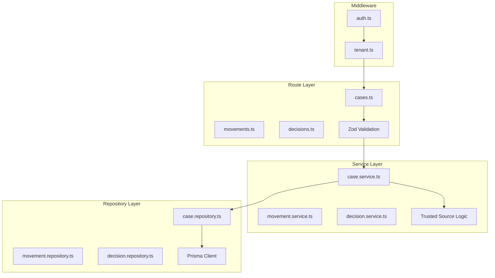

# clamo-cases

Main service for managing legal cases, procedural movements, decisions, and associated documents. Implements the **RRS (Repository-Route-Service)** pattern and the **Trusted Sources** model for multi-origin data.

## General Information

| Property | Value |
|----------|-------|
| **Repository** | `GetClamo/clamo-cases` |
| **Language** | TypeScript |
| **Framework** | Hono |
| **Port** | 4000 |
| **Database** | Neon PostgreSQL (multi-tenant) |
| **ORM** | Prisma (`@getclamo/database`) |

## RRS Architecture

The service strictly follows the **Repository-Route-Service** pattern:



## Directory Structure

```
clamo-cases/src/
├── routes/              # Route Layer - Only Zod validation and JSON response
│   ├── cases.ts
│   ├── movements.ts
│   ├── decisions.ts
│   ├── parties.ts
│   ├── ingest-runs.ts
│   └── stages.ts
├── services/            # Service Layer - Business logic and Trusted Source
│   ├── case.service.ts
│   ├── movement.service.ts
│   ├── decision.service.ts
│   └── ingest-run.service.ts
├── repositories/        # Repository Layer - Only Prisma queries
│   ├── case.repository.ts
│   ├── movement.repository.ts
│   ├── decision.repository.ts
│   └── ingest-run.repository.ts
├── middleware/          # Auth and tenant resolution
│   ├── auth.ts          # Parses x-workos-* headers
│   └── tenant.ts        # Resolves tenant connection
├── mappers/             # Data transformation
├── schemas/             # Zod schemas
└── clients/sdk/         # Tenant SDK for internal calls
```

## Authentication

The service uses `x-workos-*` headers injected by Kong after validating the JWT:

```typescript
// middleware/auth.ts
const userId = headers.get("x-workos-user-id");
const orgId = headers.get("x-workos-org-id");
const role = headers.get("x-workos-role") ?? "member";
const permissionsHeader = headers.get("x-workos-permissions");
```

<Note>
**In local development:** Without Kong, you must pass these headers manually in your requests.
</Note>

## Data Model with Trusted Sources

Critical fields use the **SourcedValue** pattern (JSONB) to track data origin:

```typescript
// SourcedValue structure in the database
interface SourcedValue<T> {
  cej: T | null;      // Value from CEJ scraper
  ai: T | null;       // Value normalized by AI
  manual: T | null;   // Value corrected by human
  updatedAt?: {
    cej?: string;
    ai?: string;
    manual?: string;
  };
}

// Fields using SourcedValue in Case
interface Case {
  id: string;
  caseNumber: string;
  companyId: string;
  filingDate: Date | null;
  
  // SourcedValue fields (JSONB)
  subjectMatter: SourcedValue<string[]>;  // Subject matters
  processType: SourcedValue<string>;      // Process type
  stage: SourcedValue<string>;            // Stage
  abstract: SourcedValue<string>;         // Summary
  observation: SourcedValue<string>;
  conclusionReason: SourcedValue<string>;
  
  // CEJ-sourced fields (direct string)
  cejJudicialDistrict: string | null;
  court: string | null;
  judge: string | null;
  // ...
}
```

### Value Resolution

```typescript
// services/case.service.ts
function resolveValue<T>(sourced: SourcedValue<T>): T | null {
  // Priority: manual > ai > cej
  return sourced.manual ?? sourced.ai ?? sourced.cej ?? null;
}
```

## Main Endpoints

### Cases

| Method | Endpoint | Description |
|--------|----------|-------------|
| GET | `/v1/cases` | List cases with filters |
| GET | `/v1/cases/:id` | Get case detail |
| PATCH | `/v1/cases/:id` | Update case |

### Movements

| Method | Endpoint | Description |
|--------|----------|-------------|
| GET | `/v1/cases/:caseId/movements` | List movements |
| GET | `/v1/cases/:caseId/movements/:id` | Get movement |

### Decisions

| Method | Endpoint | Description |
|--------|----------|-------------|
| GET | `/v1/cases/:caseId/decisions` | List decisions |
| GET | `/v1/decisions/:id` | Get decision |

### Ingest Runs

| Method | Endpoint | Description |
|--------|----------|-------------|
| GET | `/v1/cases/:caseId/ingest-runs` | List ingest runs |
| GET | `/v1/ingest-runs/:id` | Get run status |

### Internal Endpoints

<Warning>
**Service-to-service only.** Not publicly exposed.
</Warning>

| Method | Endpoint | Description |
|--------|----------|-------------|
| GET | `/internal/v1/companies/:companyId/cases` | List cases (internal) |
| POST | `/internal/v1/companies/:companyId/cases` | Create case (ingestion) |
| PATCH | `/internal/v1/companies/:companyId/cases/:id` | Update case (ingestion) |

## RRS Flow Example

### Route (Validation only)

```typescript
// routes/cases.ts
app.patch(
  "/:id",
  zValidator("json", UpdateCaseSchema),
  async (c) => {
    const id = c.req.param("id");
    const data = c.req.valid("json");
    const tenantDb = c.get("tenantDb");

    // Delegate EVERYTHING to service
    const result = await caseService.updateCase(tenantDb, id, data);

    return c.json(result);
  }
);
```

### Service (Business logic)

```typescript
// services/case.service.ts
async updateCase(
  tenantDb: PrismaClient,
  id: string,
  data: UpdateCaseInput
): Promise<Case> {
  const existing = await this.caseRepo.findById(tenantDb, id);

  if (!existing) {
    throw new NotFoundError("Case not found");
  }

  // Trusted Source logic
  const updateData: Partial<CaseUpdateData> = {};

  if (data.subjectMatter !== undefined) {
    const current = existing.subjectMatter as SourcedValue;
    
    // Only update if manual correction
    updateData.subjectMatter = {
      ...current,
      manual: data.subjectMatter,
      updatedAt: {
        ...current.updatedAt,
        manual: new Date().toISOString(),
      },
    };
  }

  return this.caseRepo.update(tenantDb, id, updateData);
}
```

### Repository (Prisma only)

```typescript
// repositories/case.repository.ts
async update(
  db: PrismaClient,
  id: string,
  data: Partial<CaseUpdateData>
): Promise<Case> {
  return db.case.update({
    where: { id },
    data,
  });
}
```

## Configuration

### Environment Variables

```bash
# Server
PORT=4000

# Control database (for tenant resolution)
CONTROL_DATABASE_URL=postgresql://...

# Supabase (for Vault)
SUPABASE_URL=https://...
SUPABASE_SERVICE_KEY=...

# Tenant SDK (for internal calls)
TENANT_SERVICE_URL=http://localhost:4001

# S3 (documents)
S3_ENDPOINT=http://localhost:9000
S3_ACCESS_KEY=...
S3_SECRET_KEY=...
S3_BUCKET=clamo-attachments

# Observability
OTEL_EXPORTER_OTLP_ENDPOINT=http://localhost:4318
```

## SDK

This service publishes a TypeScript SDK:

```bash
pnpm add @getclamo/cases
```

```typescript
import Cases from "@getclamo/cases";

const cases = new Cases({ baseURL: process.env.CASES_SERVICE_URL });

// List cases
const result = await cases.list({
  status: "EN_TRAMITE",
  page: 1,
  limit: 20,
});

// Get case
const caseDetail = await cases.get("case_abc123");

// Internal endpoints (service-to-service)
const internalCases = await cases.internal
  .companies(companyId)
  .cases.list();
```

## Local Development

```bash
# Install dependencies
pnpm install

# Run in development mode
pnpm dev

# Build
pnpm build

# Tests
pnpm test
```

## Next Steps

<CardGroup cols={2}>
  <Card
    title="RRS Pattern"
    icon="layer-group"
    href="/en/architecture/rrs-pattern"
  >
    Detailed pattern documentation.
  </Card>
  <Card
    title="Data Model"
    icon="database"
    href="/en/architecture/data-model"
  >
    Complete SourcedValue pattern.
  </Card>
</CardGroup>
