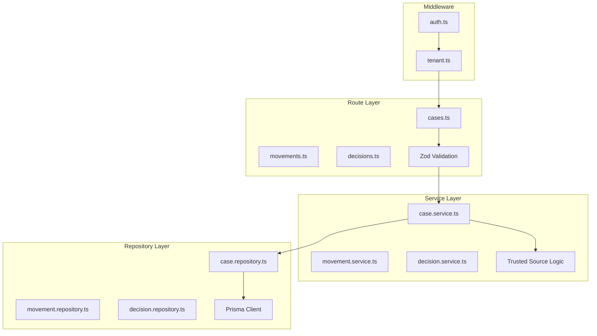

Main service for managing legal cases, procedural movements, decisions, and associated documents. Implements the **RRS (Repository-Route-Service)** pattern and the **Trusted Sources** model for multi-origin data.

## General Information

| Property | Value |
|----------|-------|
| **Repository** | `GetClamo/clamo-cases` |
| **Language** | TypeScript |
| **Framework** | Hono |
| **Port** | 4000 |
| **Database** | Neon PostgreSQL (multi-tenant) |
| **ORM** | Prisma (`@getclamo/database`) |

## Architecture

The service strictly follows the **Repository-Route-Service** pattern:



## Authentication

The service uses `x-workos-*` headers injected by Kong after validating the JWT:

```typescript
// middleware/auth.ts
const userId = headers.get("x-workos-user-id");
const orgId = headers.get("x-workos-org-id");
const role = headers.get("x-workos-role") ?? "member";
const permissionsHeader = headers.get("x-workos-permissions");
```

<Note>
**In local development:** Without Kong, you must pass these headers manually in your requests.
</Note>

## Data Model

<Info>
For complete entity documentation including Case, Movement, Decision, and all related entities, see the [Entities](/en/entities/case) section.
</Info>

<Info>
The SourcedValue pattern (Trusted Sources) is used for multi-origin data. Fields can have values from CEJ, AI, and manual sources with priority: manual > ai > cej.
</Info>

## API Endpoints

<Info>
For the complete interactive API documentation, see the [Cases API Reference](/api-reference/cases).
</Info>

## Configuration

### Environment Variables

```bash
# Server
PORT=4000

# Control database (for tenant resolution)
CONTROL_DATABASE_URL=postgresql://...

# Supabase (for Vault)
SUPABASE_URL=https://...
SUPABASE_SERVICE_KEY=...

# Tenant SDK (for internal calls)
TENANT_SERVICE_URL=http://localhost:4001

# S3 (documents)
S3_ENDPOINT=http://localhost:9000
S3_ACCESS_KEY=...
S3_SECRET_KEY=...
S3_BUCKET=clamo-attachments

# Observability
OTEL_EXPORTER_OTLP_ENDPOINT=http://localhost:4318
```

## SDKs

This service publishes typed SDKs generated from the OpenAPI specification using [Stainless](https://stainless.com) (TypeScript/Python) and OpenAPI Generator (Rust).

| SDK | Package | Repository |
|-----|---------|------------|
| TypeScript | `@getclamo/cases` | [GetClamo/clamo-cases-sdk-ts](https://github.com/GetClamo/clamo-cases-sdk-ts) |
| Python | `getclamo-cases` | [GetClamo/clamo-cases-sdk-py](https://github.com/GetClamo/clamo-cases-sdk-py) |
| Rust | `clamo-cases-sdk` | [GetClamo/clamo-cases-sdk-rust](https://github.com/GetClamo/clamo-cases-sdk-rust) |

### Installation

<CodeGroup>
```bash TypeScript
pnpm add @getclamo/cases
# or
npm install @getclamo/cases
```

```bash Python
pip install getclamo-cases
```

```bash Rust
cargo add clamo-cases-sdk
```
</CodeGroup>

### Usage

<Tabs>
<Tab title="TypeScript">
```typescript
import Cases from "@getclamo/cases";

const cases = new Cases({ baseURL: process.env.CASES_SERVICE_URL });

// List cases
const result = await cases.list({
  status: "EN_TRAMITE",
  page: 1,
  limit: 20,
});

// Get case
const caseDetail = await cases.get("case_abc123");

// Internal endpoints (service-to-service)
const internalCases = await cases.internal
  .companies(companyId)
  .cases.list();
```
</Tab>
<Tab title="Python">
```python
from getclamo_cases import Cases

cases = Cases(base_url=os.environ["CASES_SERVICE_URL"])

# List cases
result = cases.list(status="EN_TRAMITE", page=1, limit=20)

# Get case
case_detail = cases.get("case_abc123")

# Internal endpoints (service-to-service)
internal_cases = cases.internal.companies(company_id).cases.list()
```
</Tab>
<Tab title="Rust">
```rust
use clamo_cases_sdk::Client;

let cases = Client::new(std::env::var("CASES_SERVICE_URL")?);

// List cases
let result = cases.list()
    .status("EN_TRAMITE")
    .page(1)
    .limit(20)
    .send()
    .await?;

// Get case
let case_detail = cases.get("case_abc123").send().await?;
```
</Tab>
</Tabs>

## Local Development

```bash
# Install dependencies
pnpm install

# Run in development mode
pnpm dev

# Build
pnpm build

# Tests
pnpm test
```

## Next Steps

<CardGroup cols={2}>
  <Card
    title="Case Entity"
    icon="database"
    href="/en/entities/case"
  >
    Case entity with SourcedValue fields.
  </Card>
  <Card
    title="Best Practices"
    icon="lightbulb"
    href="/en/guides/best-practices"
  >
    Developer best practices guide.
  </Card>
</CardGroup>
