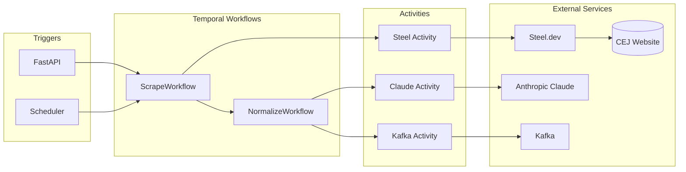

# clamo-cej-connector

Service that extracts case data from the CEJ (Centro de Justicia Electrónico) using Temporal workflows, Steel.dev browser automation, and AI normalization with Claude.

## General Information

| Property | Value |
|----------|-------|
| **Repository** | `GetClamo/clamo-cej-connector` |
| **Language** | Python |
| **Framework** | FastAPI + Temporal |
| **Port** | 8000 |
| **Browser** | Steel.dev |
| **LLM** | Anthropic Claude |

## Architecture



## Directory Structure

```
clamo-cej-connector/
├── src/
│   ├── api/
│   │   ├── routes/
│   │   │   ├── scrape.py      # Scraping endpoints
│   │   │   └── health.py
│   │   └── main.py            # FastAPI app
│   ├── workflows/
│   │   ├── scrape.py          # Main scraping workflow
│   │   └── normalize.py       # AI normalization workflow
│   ├── activities/
│   │   ├── steel.py           # Browser automation
│   │   ├── claude.py          # LLM normalization
│   │   └── kafka.py           # Event publishing
│   ├── models/
│   │   ├── case.py            # Case data models
│   │   └── movement.py        # Movement models
│   └── worker.py              # Temporal worker
├── pyproject.toml
└── Dockerfile
```

## Temporal Workflows

### Scrape Workflow

```python
# workflows/scrape.py
from temporalio import workflow
from temporalio.common import RetryPolicy
from datetime import timedelta

@workflow.defn
class ScrapeWorkflow:
    @workflow.run
    async def run(self, input: ScrapeInput) -> ScrapeResult:
        # 1. Create browser session with Steel
        session = await workflow.execute_activity(
            create_steel_session,
            start_to_close_timeout=timedelta(minutes=5),
            retry_policy=RetryPolicy(maximum_attempts=3),
        )
        
        try:
            # 2. Navigate to CEJ and search
            raw_data = await workflow.execute_activity(
                scrape_case,
                ScrapeParams(
                    session_id=session.id,
                    expediente=input.expediente,
                ),
                start_to_close_timeout=timedelta(minutes=10),
            )
            
            # 3. Normalize with AI
            normalized = await workflow.execute_child_workflow(
                NormalizeWorkflow.run,
                NormalizeInput(raw_data=raw_data),
            )
            
            # 4. Publish to Kafka
            await workflow.execute_activity(
                publish_to_kafka,
                KafkaMessage(
                    topic="cej.case.ready",
                    payload=normalized,
                ),
                start_to_close_timeout=timedelta(seconds=30),
            )
            
            return ScrapeResult(
                success=True,
                case_id=normalized.case_id,
                movements_count=len(normalized.movements),
            )
            
        finally:
            # Always cleanup session
            await workflow.execute_activity(
                close_steel_session,
                session.id,
                start_to_close_timeout=timedelta(seconds=30),
            )
```

### Normalize Workflow

```python
# workflows/normalize.py
@workflow.defn
class NormalizeWorkflow:
    @workflow.run
    async def run(self, input: NormalizeInput) -> NormalizedCase:
        # Normalize case metadata
        case_data = await workflow.execute_activity(
            normalize_case_metadata,
            input.raw_data.case,
            start_to_close_timeout=timedelta(minutes=2),
        )
        
        # Normalize movements in parallel (batches of 10)
        movements = []
        for batch in chunks(input.raw_data.movements, 10):
            batch_results = await asyncio.gather(*[
                workflow.execute_activity(
                    normalize_movement,
                    movement,
                    start_to_close_timeout=timedelta(minutes=1),
                )
                for movement in batch
            ])
            movements.extend(batch_results)
        
        return NormalizedCase(
            case=case_data,
            movements=movements,
        )
```

## Steel.dev Integration

```python
# activities/steel.py
from steel import Steel

steel_client = Steel(api_key=os.environ["STEEL_API_KEY"])

@activity.defn
async def create_steel_session() -> SteelSession:
    session = await steel_client.sessions.create(
        use_proxy=True,
        solve_captcha=True,
        session_timeout=600_000,  # 10 minutes
    )
    return SteelSession(id=session.id, ws_url=session.ws_url)

@activity.defn
async def scrape_case(params: ScrapeParams) -> RawCaseData:
    browser = await steel_client.sessions.connect(params.session_id)
    page = await browser.new_page()
    
    # Navigate to CEJ
    await page.goto("https://cej.pj.gob.pe/cej/forms/busquedaform.html")
    
    # Fill search form
    await page.fill("#expediente", params.expediente)
    await page.click("#btnBuscar")
    
    # Wait for results
    await page.wait_for_selector(".resultado-busqueda")
    
    # Extract data
    case_data = await extract_case_data(page)
    movements = await extract_movements(page)
    
    return RawCaseData(case=case_data, movements=movements)
```

## Claude Normalization

```python
# activities/claude.py
from anthropic import Anthropic

client = Anthropic(api_key=os.environ["ANTHROPIC_API_KEY"])

@activity.defn
async def normalize_case_metadata(raw: RawCase) -> NormalizedCaseMetadata:
    response = await client.messages.create(
        model="claude-sonnet-4-20250514",
        max_tokens=2000,
        messages=[{
            "role": "user",
            "content": f"""Normalize the following legal case data from Peru's CEJ.
            
Raw data:
{json.dumps(raw, ensure_ascii=False)}

Extract and normalize:
1. subjectMatter: List of legal subject matters
2. processType: Type of legal process
3. stage: Current procedural stage
4. abstract: Brief summary (sumilla)

Return JSON with these fields."""
        }],
    )
    
    return NormalizedCaseMetadata.parse_raw(response.content[0].text)
```

## Kafka Events

```python
# activities/kafka.py
from aiokafka import AIOKafkaProducer

@activity.defn
async def publish_to_kafka(message: KafkaMessage) -> None:
    producer = AIOKafkaProducer(
        bootstrap_servers=os.environ["KAFKA_BROKERS"],
    )
    await producer.start()
    
    try:
        await producer.send_and_wait(
            message.topic,
            value=json.dumps(message.payload).encode(),
            key=message.payload["case_id"].encode(),
        )
    finally:
        await producer.stop()
```

## API Endpoints

| Method | Endpoint | Description |
|--------|----------|-------------|
| POST | `/v1/scrape` | Trigger scraping for a case |
| GET | `/v1/scrape/:workflowId` | Get workflow status |
| POST | `/v1/scrape/batch` | Batch scraping |

## Configuration

### Environment Variables

```bash
# Server
PORT=8000

# Temporal
TEMPORAL_HOST=localhost:7233
TEMPORAL_NAMESPACE=default
TEMPORAL_TASK_QUEUE=cej-connector

# Steel.dev
STEEL_API_KEY=...

# Anthropic
ANTHROPIC_API_KEY=sk-ant-...

# Kafka
KAFKA_BROKERS=localhost:9092

# Tenant SDK
TENANT_SERVICE_URL=http://localhost:4001
```

### Docker

```dockerfile
FROM python:3.11-slim

WORKDIR /app

# Install uv
RUN pip install uv

# Install dependencies
COPY pyproject.toml uv.lock ./
RUN uv sync --frozen

# Copy source
COPY src ./src

# Run worker
CMD ["uv", "run", "python", "-m", "src.worker"]
```

## Local Development

```bash
# Install dependencies
uv sync

# Start Temporal (if not running)
temporal server start-dev

# Run worker
uv run python -m src.worker

# Run API (separate terminal)
uv run uvicorn src.api.main:app --reload --port 8000
```

## Next Steps

<CardGroup cols={2}>
  <Card
    title="clamo-cej-discovery"
    icon="magnifying-glass"
    href="/en/services/clamo-cej-discovery"
  >
    Mass case discovery service.
  </Card>
  <Card
    title="clamo-ingest-go"
    icon="database"
    href="/en/services/clamo-ingest-go"
  >
    High-performance ingestion worker.
  </Card>
</CardGroup>
