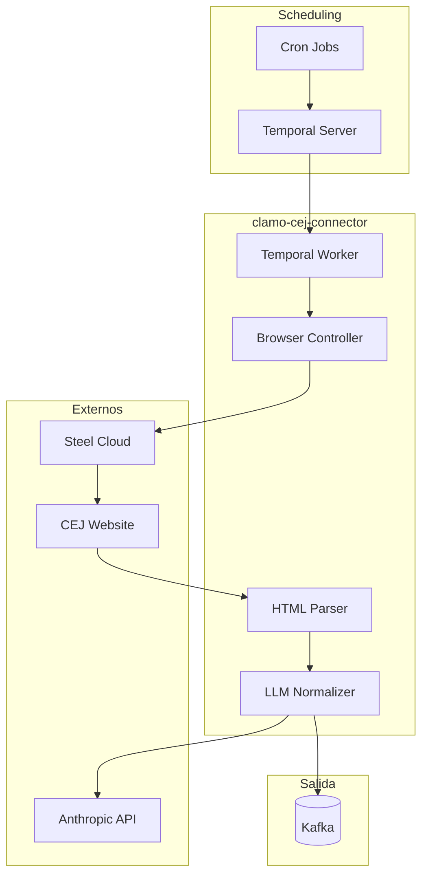

# clamo-cej-connector

Servicio Python que automatiza la extracción de datos de expedientes judiciales desde el CEJ (Centro de Justicia Electrónico) del Poder Judicial peruano.

## Información General

| Propiedad | Valor |
|-----------|-------|
| **Repositorio** | `GetClamo/clamo-cej-connector` |
| **Lenguaje** | Python 3.11 |
| **Orquestación** | Temporal |
| **Browser** | Steel + Playwright |
| **LLM** | Anthropic Claude |

## Arquitectura



## Workflows

### ExtractCasesWorkflow

Workflow principal para extraer casos de un RUC:

```python
@workflow.defn
class ExtractCasesWorkflow:
    @workflow.run
    async def run(self, input: ExtractInput) -> ExtractResult:
        # 1. Crear sesión de browser
        session = await workflow.execute_activity(
            create_browser_session,
            start_to_close_timeout=timedelta(minutes=2),
            retry_policy=RetryPolicy(maximum_attempts=3),
        )
        
        try:
            # 2. Navegar y buscar
            search_results = await workflow.execute_activity(
                search_by_ruc,
                args=[session, input.ruc],
                start_to_close_timeout=timedelta(minutes=5),
            )
            
            # 3. Extraer detalle de cada caso
            cases = []
            for result in search_results:
                case_detail = await workflow.execute_activity(
                    extract_case_detail,
                    args=[session, result.expediente],
                    start_to_close_timeout=timedelta(minutes=3),
                )
                cases.append(case_detail)
            
            # 4. Normalizar con LLM
            normalized = await workflow.execute_activity(
                normalize_cases,
                args=[cases],
                start_to_close_timeout=timedelta(minutes=5),
            )
            
            # 5. Publicar a Kafka
            await workflow.execute_activity(
                publish_to_kafka,
                args=[input.company_id, normalized],
                start_to_close_timeout=timedelta(minutes=1),
            )
            
            return ExtractResult(
                success=True,
                cases_count=len(normalized),
            )
            
        finally:
            await workflow.execute_activity(
                close_browser_session,
                args=[session],
            )
```

### DiscoverNewCasesWorkflow

Workflow para descubrir nuevos casos:

```python
@workflow.defn
class DiscoverNewCasesWorkflow:
    @workflow.run
    async def run(self, input: DiscoverInput) -> DiscoverResult:
        # Buscar casos nuevos desde última fecha conocida
        new_cases = await workflow.execute_activity(
            search_new_cases,
            args=[input.ruc, input.last_known_date],
            start_to_close_timeout=timedelta(minutes=10),
        )
        
        # Para cada caso nuevo, iniciar workflow de extracción
        for case in new_cases:
            await workflow.execute_child_workflow(
                ExtractCasesWorkflow.run,
                ExtractInput(
                    company_id=input.company_id,
                    ruc=input.ruc,
                    expediente=case.expediente,
                ),
            )
        
        return DiscoverResult(new_cases_count=len(new_cases))
```

## Activities

### Browser Control

```python
@activity.defn
async def create_browser_session() -> BrowserSession:
    """Crea una sesión de browser en Steel."""
    steel = SteelClient(api_key=os.environ["STEEL_API_KEY"])
    
    session = await steel.create_session(
        browser_type="chromium",
        headless=True,
        proxy={
            "type": "residential",
            "country": "PE",  # Proxy peruano
        },
    )
    
    return BrowserSession(
        session_id=session.id,
        ws_endpoint=session.ws_endpoint,
    )

@activity.defn
async def search_by_ruc(
    session: BrowserSession,
    ruc: str,
) -> list[SearchResult]:
    """Busca casos por RUC en el CEJ."""
    async with async_playwright() as p:
        browser = await p.chromium.connect_over_cdp(session.ws_endpoint)
        page = await browser.new_page()
        
        # Navegar al CEJ
        await page.goto("https://cej.pj.gob.pe/cej/forms/busquedaform.html")
        
        # Llenar formulario
        await page.fill("#txtRuc", ruc)
        await page.click("#btnBuscar")
        
        # Esperar resultados
        await page.wait_for_selector(".resultado-busqueda")
        
        # Extraer resultados
        results = await page.evaluate("""
            () => {
                const rows = document.querySelectorAll('.resultado-busqueda tr');
                return Array.from(rows).map(row => ({
                    expediente: row.querySelector('.expediente')?.textContent,
                    demandante: row.querySelector('.demandante')?.textContent,
                    demandado: row.querySelector('.demandado')?.textContent,
                }));
            }
        """)
        
        return [SearchResult(**r) for r in results]
```

### LLM Normalization

```python
@activity.defn
async def normalize_cases(cases: list[RawCase]) -> list[NormalizedCase]:
    """Normaliza casos usando Claude."""
    anthropic = Anthropic()
    normalized = []
    
    for case in cases:
        # Normalizar información general
        response = await anthropic.messages.create(
            model="claude-3-haiku-20240307",
            max_tokens=2000,
            messages=[{
                "role": "user",
                "content": f"""
                Extrae y normaliza la información del siguiente caso judicial peruano.
                
                Datos crudos:
                {json.dumps(case.dict(), ensure_ascii=False, indent=2)}
                
                Responde en JSON con este formato:
                {{
                    "expediente": "formato estándar XXXXX-XXXX-X-XXXX-XX-XX-XX",
                    "plaintiff": "nombre normalizado del demandante",
                    "defendant": "nombre normalizado del demandado",
                    "subjectMatter": "materia del caso",
                    "district": "distrito judicial",
                    "court": "juzgado",
                    "processType": "tipo de proceso",
                    "filingDate": "YYYY-MM-DD",
                    "status": "EN_TRAMITE|EN_EJECUCION|ARCHIVADO|CONCLUIDO",
                    "movements": [
                        {{
                            "date": "YYYY-MM-DD",
                            "description": "descripción normalizada",
                            "classification": "RESOLUCION|ESCRITO|NOTIFICACION|AUDIENCIA|OTRO",
                            "isNotification": true/false,
                            "summary": "resumen en una oración"
                        }}
                    ]
                }}
                """
            }],
        )
        
        normalized_data = json.loads(response.content[0].text)
        normalized.append(NormalizedCase(**normalized_data))
    
    return normalized
```

## Configuración

### Variables de Entorno

```bash
# Steel (Browser automation)
STEEL_API_KEY=...

# Temporal
TEMPORAL_ADDRESS=localhost:7233
TEMPORAL_NAMESPACE=clamo-cej

# Anthropic
ANTHROPIC_API_KEY=sk-ant-...

# Kafka
KAFKA_BROKERS=localhost:9092

# Proxy (opcional)
PROXY_URL=...
```

### Docker Compose

```yaml
version: '3.8'
services:
  cej-connector:
    build: .
    environment:
      - STEEL_API_KEY=${STEEL_API_KEY}
      - TEMPORAL_ADDRESS=temporal:7233
      - ANTHROPIC_API_KEY=${ANTHROPIC_API_KEY}
      - KAFKA_BROKERS=kafka:9092
    depends_on:
      - temporal
      - kafka

  temporal:
    image: temporalio/auto-setup:latest
    ports:
      - "7233:7233"
      - "8233:8233"

  kafka:
    image: bitnami/kafka:latest
    ports:
      - "9092:9092"
```

## Scheduling

### Configuración de Jobs

```python
# scheduler.py
from temporalio.client import Client

async def setup_schedules():
    client = await Client.connect("localhost:7233")
    
    # Extraer casos cada 4 horas para empresas Pro
    for company in await get_pro_companies():
        for entity in company.monitored_entities:
            await client.create_schedule(
                f"extract-{company.id}-{entity.ruc}",
                Schedule(
                    action=ScheduleActionStartWorkflow(
                        ExtractCasesWorkflow.run,
                        ExtractInput(
                            company_id=company.id,
                            ruc=entity.ruc,
                        ),
                    ),
                    spec=ScheduleSpec(
                        intervals=[ScheduleIntervalSpec(every=timedelta(hours=4))],
                    ),
                ),
            )
```

## Manejo de Errores

### Errores Comunes

| Error | Causa | Manejo |
|-------|-------|--------|
| `CaptchaDetected` | El CEJ muestra captcha | Reintentar con nuevo proxy |
| `SessionExpired` | Sesión de browser expiró | Crear nueva sesión |
| `RateLimited` | Demasiadas requests | Backoff exponencial |
| `ParseError` | HTML inesperado | Log para revisión manual |

### Retry Policy

```python
retry_policy = RetryPolicy(
    initial_interval=timedelta(seconds=10),
    maximum_interval=timedelta(minutes=10),
    backoff_coefficient=2.0,
    maximum_attempts=5,
    non_retryable_error_types=[
        "InvalidRUCError",
        "CompanyNotFoundError",
    ],
)
```

## Métricas

| Métrica | Descripción |
|---------|-------------|
| `cej_extraction_total` | Total de extracciones |
| `cej_extraction_duration_seconds` | Duración de extracción |
| `cej_cases_extracted` | Casos extraídos |
| `cej_movements_extracted` | Movimientos extraídos |
| `cej_errors_total` | Errores por tipo |

## Desarrollo Local

```bash
# Instalar dependencias
uv sync

# Iniciar Temporal (requiere Docker)
docker-compose up -d temporal

# Ejecutar worker
python -m clamo_cej_connector.worker

# Ejecutar workflow manualmente
python -m clamo_cej_connector.cli extract --ruc 20123456789
```

