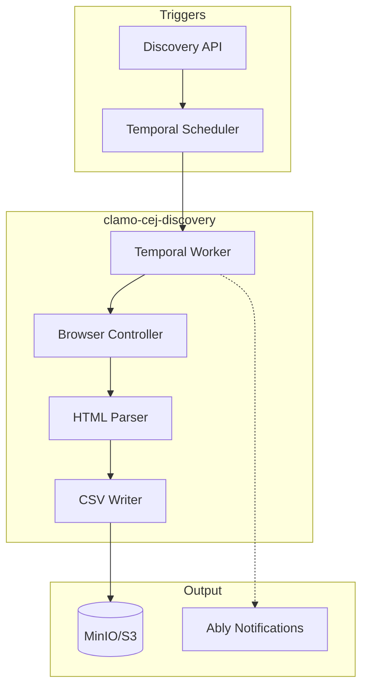

Bulk search and discovery service for court cases in the CEJ. Automates case discovery by correlative numbers and stores results in CSV format.

## General Information

| Property | Value |
|----------|-------|
| **Repository** | `GetClamo/clamo-cej-discovery` |
| **Language** | Python 3.11 |
| **Orchestration** | Temporal |
| **Browser** | Playwright + Steel.dev |
| **Storage** | MinIO/S3 (CSV) |

## Difference with clamo-cases-cej-extractor

| Aspect | clamo-cases-cej-extractor | clamo-cej-discovery |
|--------|---------------------------|---------------------|
| **Purpose** | Extracts details from known cases | Discovers new cases by correlative |
| **Input** | Specific case number | Range of correlatives (1-99999) |
| **Output** | Kafka → Database | CSV in MinIO |
| **Use Case** | Continuous monitoring | Initial bulk search |

## Architecture



## Features

- **Search by correlatives**: Searches cases from 1 to 99999
- **Local and stealth mode**: Playwright for development, Steel.dev for production
- **Smart stopping**: Automatically stops when "not found" rate is high
- **Incremental CSV**: Progressively saves results

## Configuration

### Environment Variables

```bash
# Steel.dev (stealth mode)
STEEL_API_KEY=...

# Temporal
TEMPORAL_HOST=localhost:7233
TEMPORAL_NAMESPACE=default

# MinIO/S3
ARTIFACT_STORE_S3_ENDPOINT=http://localhost:9000
ARTIFACT_STORE_S3_ACCESS_KEY=minioadmin
ARTIFACT_STORE_S3_SECRET_KEY=minioadmin
BULK_SEARCH_CSV_BUCKET=cej-bulk-search

# Ably (notifications)
ABLY_API_KEY=...
```

## Local Development

```bash
# Install dependencies
uv sync

# Install Playwright
uv run playwright install chromium

# Run tests
make test-browser
make test-parser
```

## Next Steps

<CardGroup cols={2}>
  <Card
    title="clamo-cases-cej-extractor"
    icon="plug"
    href="/en/services/clamo-cases-cej-extractor"
  >
    Detailed extraction of known cases.
  </Card>
  <Card
    title="Case Entity"
    icon="database"
    href="/en/entities/case"
  >
    Case entity documentation.
  </Card>
</CardGroup>
