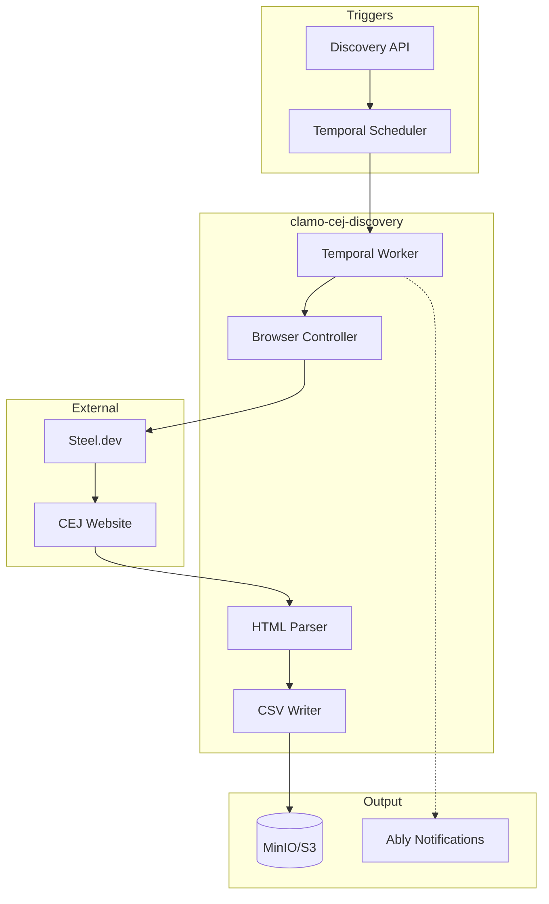

# clamo-cej-discovery

Bulk search and discovery service for court cases in the CEJ (Centro de Justicia Electrónico - Electronic Justice Center). Automates case discovery by correlative numbers and stores results in CSV format for later analysis.

## General Information

| Property | Value |
|----------|-------|
| **Repository** | `GetClamo/clamo-cej-discovery` |
| **Language** | Python 3.11 |
| **Orchestration** | Temporal |
| **Browser** | Playwright + Steel.dev |
| **Storage** | MinIO/S3 (CSV) |

## Difference with clamo-cej-connector

| Aspect | clamo-cej-connector | clamo-cej-discovery |
|--------|---------------------|---------------------|
| **Purpose** | Extracts details from known cases | Discovers new cases by correlative |
| **Input** | Specific case number | Range of correlatives (1-99999) |
| **Output** | Kafka → Database | CSV in MinIO |
| **Use Case** | Continuous monitoring | Initial bulk search |

## Architecture



## Features

- **Search by correlatives**: Searches cases from 1 to 99999
- **Local and stealth mode**: Playwright for development, Steel.dev for production
- **Block processing**: Divides work into configurable blocks
- **Smart stopping**: Automatically stops when "not found" rate is high
- **Incremental CSV**: Progressively saves results
- **Ably notifications**: Alerts when a case is found

## Workflows

### BulkSearchWorkflow

```python
@workflow.defn
class BulkSearchWorkflow:
    @workflow.run
    async def run(self, input: BulkSearchInput) -> BulkSearchResult:
        # 1. Split range into blocks
        blocks = create_blocks(
            start=input.start_correlativo,
            end=input.end_correlativo,
            block_size=input.block_size,
        )
        
        results = []
        not_found_count = 0
        
        for block in blocks:
            # 2. Process block
            block_result = await workflow.execute_activity(
                search_correlativo_block,
                args=[input.search_params, block],
                start_to_close_timeout=timedelta(minutes=30),
            )
            
            results.extend(block_result.cases)
            not_found_count += block_result.not_found_count
            
            # 3. Save incremental CSV
            await workflow.execute_activity(
                save_csv_incremental,
                args=[input.empresa, block_result.cases],
            )
            
            # 4. Check "not found" rate
            if should_stop_early(not_found_count, len(results)):
                break
        
        return BulkSearchResult(
            total_found=len(results),
            csv_path=f"{input.empresa}/{input.distrito}/{input.anio}.csv",
        )
```

## CSV Structure

CSVs are stored in MinIO with the following structure:

```
{company}/{instance}/{specialty}/{year}/{district}.csv
```

| Property | Value |
|----------|-------|
| Separator | `\|` (pipe) |
| Encoding | `latin9` |
| Header | No header |
| Columns | 25 |

## Configuration

### Environment Variables

```bash
# Steel.dev (stealth mode)
STEEL_API_KEY=...

# Temporal
TEMPORAL_HOST=localhost:7233
TEMPORAL_NAMESPACE=default

# MinIO/S3
ARTIFACT_STORE_S3_ENDPOINT=http://localhost:9000
ARTIFACT_STORE_S3_ACCESS_KEY=minioadmin
ARTIFACT_STORE_S3_SECRET_KEY=minioadmin
BULK_SEARCH_CSV_BUCKET=cej-bulk-search

# Ably (notifications)
ABLY_API_KEY=...
```

## Usage

### Start Bulk Search

```bash
# Start services
docker compose -f docker-compose.dev.yml up -d

# Run search
uv run python scripts/start_bulk_search.py \
    "TestCompany" \
    "LIMA" \
    "Sala Superior" \
    "Laboral" \
    "2025" \
    "" \
    "local" \
    1 \
    100 \
    10
```

| Parameter | Description |
|-----------|-------------|
| `empresa` | Company name |
| `distrito` | Judicial district |
| `instancia` | Instance (e.g., "Sala Superior") |
| `especialidad` | Specialty (e.g., "Laboral") |
| `anio` | Year |
| `parte` | Party name (optional) |
| `mode` | "local" or "stealth" |
| `start` | Starting correlative |
| `end` | Ending correlative |
| `block_size` | Block size |

## Smart Stopping

The workflow automatically stops when:
- The "not found" rate exceeds 95% in the last 100 correlatives
- The consecutive error limit is reached

## Local Development

```bash
# Install dependencies
uv sync

# Install Playwright
uv run playwright install chromium

# Run tests
make test-browser
make test-parser

# All tests
make check-all
```

## Next Steps

<CardGroup cols={2}>
  <Card
    title="clamo-cej-connector"
    icon="plug"
    href="/en/services/clamo-cej-connector"
  >
    Detailed extraction of known cases.
  </Card>
  <Card
    title="Ingestion Pipeline"
    icon="database"
    href="/en/guides/debugging-ingestion"
  >
    Complete data flow.
  </Card>
</CardGroup>
