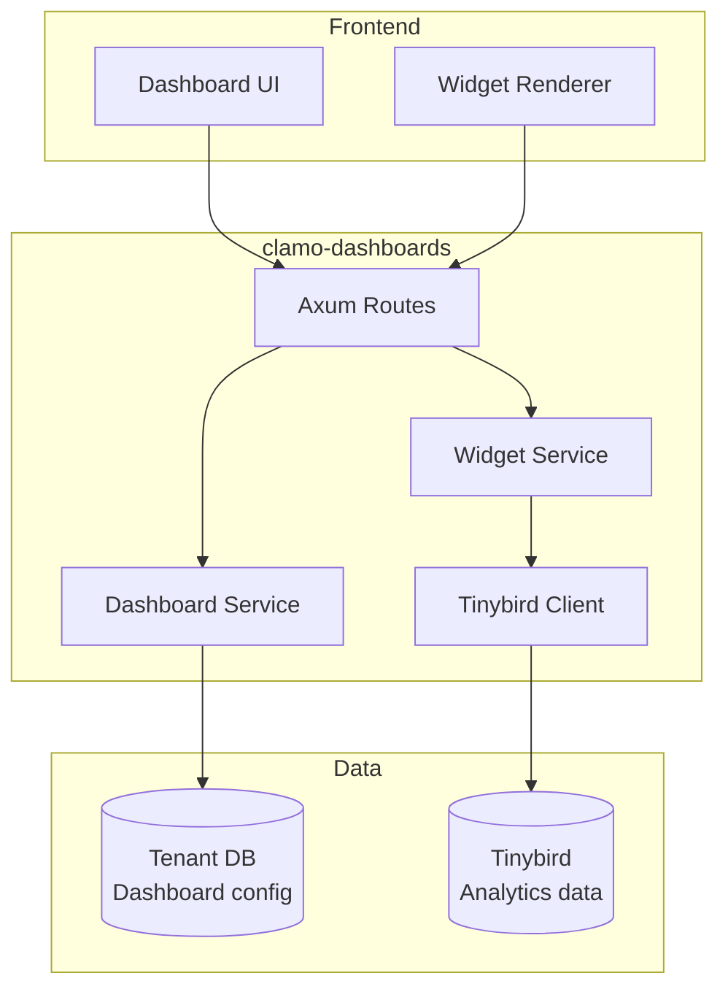

# clamo-dashboards

Rust API for managing customizable dashboards and analytics widgets. Consumes data from **Tinybird** for real-time visualizations.

## General Information

| Property | Value |
|----------|-------|
| **Repository** | `GetClamo/clamo-dashboards` |
| **Language** | Rust |
| **Framework** | Axum |
| **Port** | 8020 |
| **Data Source** | Tinybird |

## Architecture



## Data Model

### Dashboard

```rust
#[derive(Debug, Serialize, Deserialize)]
pub struct Dashboard {
    pub id: String,
    pub company_id: String,
    pub name: String,
    pub description: Option<String>,
    pub config: DashboardConfig,
    pub is_default: bool,
    pub created_at: DateTime<Utc>,
    pub updated_at: DateTime<Utc>,
}

#[derive(Debug, Serialize, Deserialize)]
pub struct DashboardConfig {
    pub layout: Vec<WidgetPlacement>,
}

#[derive(Debug, Serialize, Deserialize)]
pub struct WidgetPlacement {
    pub widget_type: WidgetType,
    pub title: String,
    pub data_source: String,  // Tinybird pipe name
    pub filters: HashMap<String, String>,
    pub col_span: u8,
    pub row_span: u8,
}
```

### Widget Types

```rust
#[derive(Debug, Serialize, Deserialize)]
#[serde(tag = "type")]
pub enum WidgetType {
    Counter {
        value_field: String,
        format: String,
    },
    Chart {
        chart_type: String,  // line, bar, pie
        x_axis: String,
        y_axis: String,
    },
    Table {
        columns: Vec<String>,
    },
    List {
        item_template: String,
    },
}
```

## API Endpoints

### Dashboards

| Method | Endpoint | Description |
|--------|----------|-------------|
| GET | `/dashboards` | List dashboards |
| GET | `/dashboards/:id` | Get dashboard |
| POST | `/dashboards` | Create dashboard |
| PATCH | `/dashboards/:id` | Update dashboard |
| DELETE | `/dashboards/:id` | Delete dashboard |

### Widget Data

| Method | Endpoint | Description |
|--------|----------|-------------|
| GET | `/widgets/:id/data` | Get widget data |
| POST | `/widgets/query` | Custom query |

## Tinybird Client

```rust
pub struct TinybirdClient {
    client: reqwest::Client,
    token: String,
    base_url: String,
}

impl TinybirdClient {
    pub async fn query(
        &self,
        pipe: &str,
        params: &HashMap<String, String>,
    ) -> Result<serde_json::Value, Error> {
        let url = format!("{}/v0/pipes/{}.json", self.base_url, pipe);
        
        let response = self.client
            .get(&url)
            .query(params)
            .header("Authorization", format!("Bearer {}", self.token))
            .send()
            .await?;
        
        let data: TinybirdResponse = response.json().await?;
        Ok(data.data)
    }
}
```

## Predefined Widgets

### Counter Widget

```json
{
  "type": "Counter",
  "title": "Active Cases",
  "data_source": "cases_summary",
  "filters": { "status": "EN_TRAMITE" },
  "value_field": "count",
  "format": "number"
}
```

### Chart Widget

```json
{
  "type": "Chart",
  "title": "Risk Distribution",
  "data_source": "risk_distribution",
  "chart_type": "pie",
  "value_field": "count",
  "label_field": "risk_level"
}
```

## Configuration

### Environment Variables

```bash
# Server
PORT=8020

# Tinybird
TINYBIRD_TOKEN=p.eyJ...
TINYBIRD_API_URL=https://api.tinybird.co

# Database (for dashboard config)
DATABASE_URL=postgresql://...
```

## Local Development

```bash
# Build
cargo build

# Run
cargo run

# Tests
cargo test

# Watch mode
cargo watch -x run
```

## Next Steps

<CardGroup cols={2}>
  <Card
    title="clamo-sync"
    icon="sync"
    href="/en/services/clamo-sync"
  >
    Data synchronization to Tinybird.
  </Card>
  <Card
    title="ask-clamo"
    icon="robot"
    href="/en/services/ask-clamo"
  >
    Clamy profile for AI analytics.
  </Card>
</CardGroup>
