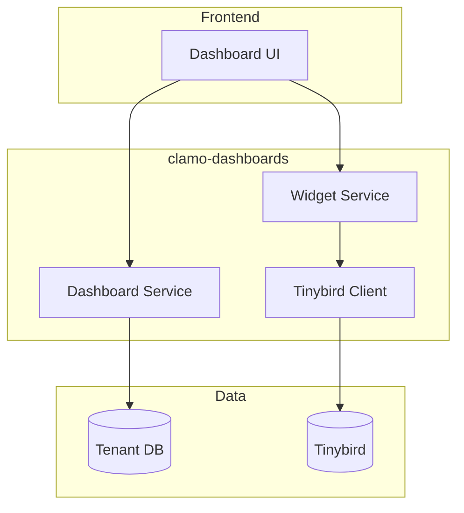

Rust API for managing customizable dashboards and analytics widgets. Consumes data from Tinybird for real-time visualizations.

## General Information

| Property | Value |
|----------|-------|
| **Repository** | `GetClamo/clamo-dashboards` |
| **Language** | Rust |
| **Framework** | Axum |
| **Port** | 8020 |
| **Data Source** | Tinybird |

## Architecture



## Widget Types

- **Counter**: Single value display (e.g., "Active Cases")
- **Chart**: Line, bar, pie charts
- **Table**: Tabular data display
- **List**: Item list with templates

## Configuration

### Environment Variables

```bash
# Server
PORT=8020

# Tinybird
TINYBIRD_TOKEN=p.eyJ...
TINYBIRD_API_URL=https://api.tinybird.co

# Database (for dashboard config)
DATABASE_URL=postgresql://...
```

## Local Development

```bash
# Build
cargo build

# Run
cargo run

# Tests
cargo test
```

## Next Steps

<CardGroup cols={2}>
  <Card
    title="clamo-sync"
    icon="sync"
    href="/en/services/clamo-sync"
  >
    Data synchronization to Tinybird.
  </Card>
  <Card
    title="ask-clamo"
    icon="robot"
    href="/en/services/ask-clamo"
  >
    Clamy profile for AI analytics.
  </Card>
</CardGroup>
