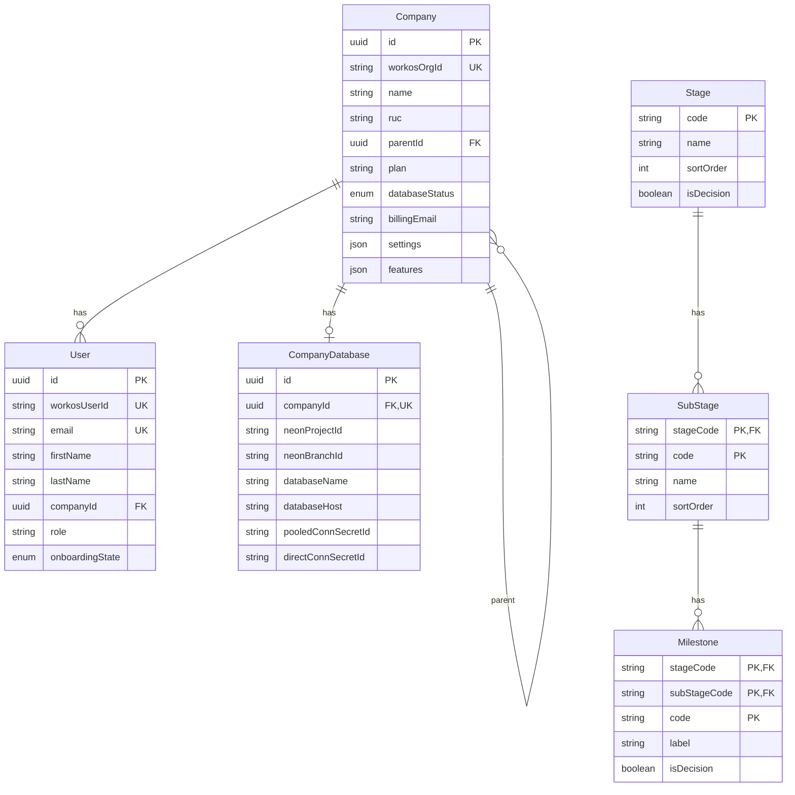
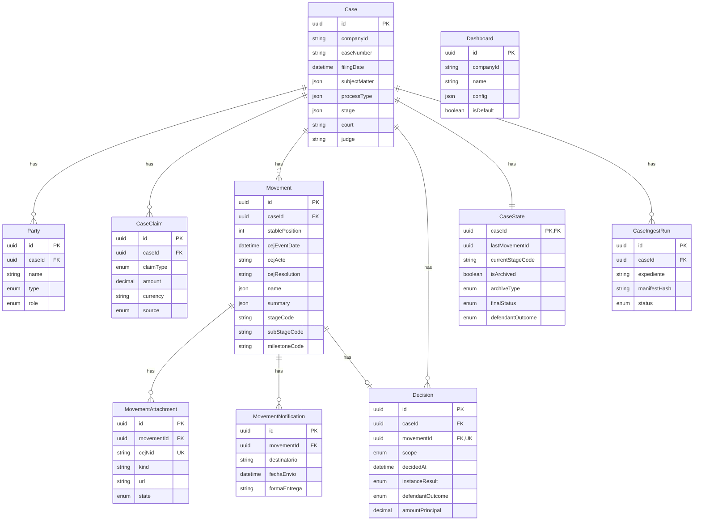

Shared package containing Prisma schemas, migrations, and utilities for multi-tenant connection management.

## General Information

| Property | Value |
|----------|-------|
| **Repository** | `GetClamo/clamo-database` |
| **Language** | TypeScript |
| **ORM** | Prisma |
| **Package** | `@getclamo/database` |
| **Databases** | Supabase (Control) + Neon (Tenants) |

## Architecture

```mermaid
flowchart TB
    subgraph Package [@getclamo/database]
        ControlSchema[Control Schema]
        TenantSchema[Tenant Schema]
        ClientFactory[Client Factory]
        LRUCache[LRU Cache]
    end

    subgraph Databases [Databases]
        Supabase[(Supabase<br/>Control Plane)]
        Neon1[(Neon Tenant 1)]
        Neon2[(Neon Tenant 2)]
        NeonN[(Neon Tenant N)]
    end

    ControlSchema --> Supabase
    TenantSchema --> Neon1
    TenantSchema --> Neon2
    TenantSchema --> NeonN

    ClientFactory --> LRUCache
    LRUCache --> Neon1
    LRUCache --> Neon2
    LRUCache --> NeonN
```

## Control Plane Schema



## Tenant Schema



## Usage

```typescript
import { controlDb, createTenantPrisma } from "@getclamo/database";

// Control plane client (singleton)
const companies = await controlDb.company.findMany();

// Tenant client (cached by connection)
const tenantDb = createTenantPrisma(connectionString);
const cases = await tenantDb.case.findMany();
```

## Configuration

### Environment Variables

```bash
# Control database
CONTROL_DATABASE_URL=postgresql://...

# Supabase (for Vault)
SUPABASE_URL=https://...
SUPABASE_SERVICE_KEY=...

# For local development with specific tenant
TENANT_DATABASE_URL=postgresql://...
```

## Local Development

```bash
# Install dependencies
pnpm install

# Generate Prisma clients
pnpm db:generate

# Run control migrations
pnpm migrate:control

# Run tenant migrations (all tenants)
pnpm migrate:tenants

# Build package
pnpm build
```

## Next Steps

<CardGroup cols={2}>
  <Card
    title="Entities"
    icon="database"
    href="/en/entities/index"
  >
    Complete entity reference.
  </Card>
  <Card
    title="Multi-Tenancy"
    icon="building"
    href="/en/guides/multi-tenancy"
  >
    Multi-tenant architecture.
  </Card>
</CardGroup>
