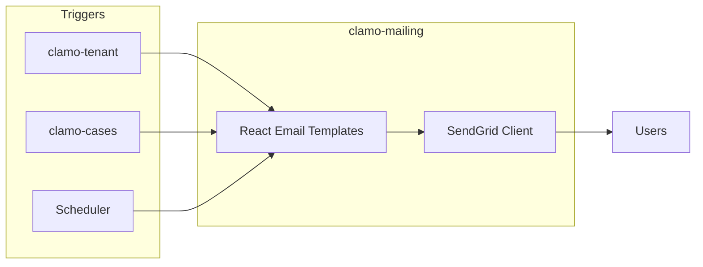

Service for sending transactional emails and notifications using React Email for templates and SendGrid for delivery.

## General Information

| Property | Value |
|----------|-------|
| **Repository** | `GetClamo/clamo-mailing` |
| **Language** | TypeScript |
| **Framework** | Hono |
| **Templates** | React Email |
| **Provider** | SendGrid |
| **Port** | 4002 |

## Architecture



## Available Templates

| Template | Trigger | Description |
|----------|---------|-------------|
| `InvitationEmail` | clamo-tenant | Invitation to join company |
| `NewMovementEmail` | clamo-cases | New movement in case |
| `RiskAlertEmail` | clamo-cases | Risk level change alert |
| `WeeklyReportEmail` | Scheduler | Weekly summary |

## Configuration

### Environment Variables

```bash
# SendGrid
SENDGRID_API_KEY=SG.xxx

# Email settings
FROM_EMAIL=noreply@clamo.dev
FROM_NAME=Clamo

# App URLs
APP_URL=https://app.clamo.dev
```

## Local Development

```bash
# Install dependencies
pnpm install

# Run in development
pnpm dev

# Email preview (React Email)
pnpm email:preview

# Build
pnpm build
```

## Next Steps

<CardGroup cols={2}>
  <Card
    title="clamo-tenant"
    icon="building"
    href="/en/services/clamo-tenant"
  >
    Service that triggers invitations.
  </Card>
  <Card
    title="clamo-cases"
    icon="folder"
    href="/en/services/clamo-cases"
  >
    Service that triggers alerts.
  </Card>
</CardGroup>
