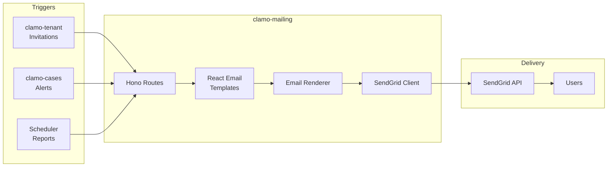

# clamo-mailing

Service for sending transactional emails and notifications using **React Email** for templates and **SendGrid** for delivery.

## General Information

| Property | Value |
|----------|-------|
| **Repository** | `GetClamo/clamo-mailing` |
| **Language** | TypeScript |
| **Framework** | Hono |
| **Templates** | React Email |
| **Provider** | SendGrid |
| **Port** | 4002 |

## Architecture



## Available Templates

| Template | Trigger | Description |
|----------|---------|-------------|
| `InvitationEmail` | clamo-tenant | Invitation to join company |
| `NewMovementEmail` | clamo-cases | New movement in case |
| `RiskAlertEmail` | clamo-cases | Risk level change alert |
| `WeeklyReportEmail` | Scheduler | Weekly summary |

## Directory Structure

```
clamo-mailing/src/
├── emails/
│   ├── components/
│   │   ├── Header.tsx
│   │   ├── Footer.tsx
│   │   └── Button.tsx
│   ├── InvitationEmail.tsx
│   ├── NewMovementEmail.tsx
│   ├── RiskAlertEmail.tsx
│   └── WeeklyReportEmail.tsx
├── routes/
│   ├── send.ts
│   └── preview.ts
├── lib/
│   └── sendgrid.ts
└── index.ts
```

## Example: InvitationEmail

```tsx
// src/emails/InvitationEmail.tsx
import {
  Body,
  Button,
  Container,
  Head,
  Heading,
  Html,
  Preview,
  Text,
} from '@react-email/components';

interface InvitationEmailProps {
  inviterName: string;
  companyName: string;
  inviteUrl: string;
  role: 'admin' | 'member';
}

export function InvitationEmail({
  inviterName,
  companyName,
  inviteUrl,
  role,
}: InvitationEmailProps) {
  return (
    <Html>
      <Head />
      <Preview>
        {inviterName} has invited you to join {companyName} on Clamo
      </Preview>
      <Body style={main}>
        <Container style={container}>
          <Heading style={heading}>
            You've been invited to {companyName}
          </Heading>
          
          <Text style={text}>
            {inviterName} has invited you to join {companyName} on Clamo
            as {role === 'admin' ? 'Administrator' : 'Member'}.
          </Text>
          
          <Button style={button} href={inviteUrl}>
            Accept Invitation
          </Button>
        </Container>
      </Body>
    </Html>
  );
}
```

## API Endpoints

| Method | Endpoint | Description |
|--------|----------|-------------|
| POST | `/send/invitation` | Send invitation |
| POST | `/send/movement` | Notify movement |
| POST | `/send/risk-alert` | Risk alert |
| POST | `/send/weekly-report` | Weekly report |
| GET | `/preview/:template` | Template preview |

## SendGrid Integration

```typescript
// src/lib/sendgrid.ts
import sgMail from '@sendgrid/mail';

sgMail.setApiKey(process.env.SENDGRID_API_KEY!);

interface SendEmailOptions {
  to: string;
  subject: string;
  html: string;
}

export async function sendEmail(options: SendEmailOptions) {
  await sgMail.send({
    to: options.to,
    from: {
      email: 'noreply@clamo.dev',
      name: 'Clamo',
    },
    subject: options.subject,
    html: options.html,
    trackingSettings: {
      clickTracking: { enable: true },
      openTracking: { enable: true },
    },
  });
}
```

## Configuration

### Environment Variables

```bash
# SendGrid
SENDGRID_API_KEY=SG.xxx

# Email settings
FROM_EMAIL=noreply@clamo.dev
FROM_NAME=Clamo

# App URLs
APP_URL=https://app.clamo.dev
```

## Local Development

```bash
# Install dependencies
pnpm install

# Run in development
pnpm dev

# Email preview (React Email)
pnpm email:preview
# Opens http://localhost:3000

# Build
pnpm build
```

## Next Steps

<CardGroup cols={2}>
  <Card
    title="clamo-tenant"
    icon="building"
    href="/en/services/clamo-tenant"
  >
    Service that triggers invitations.
  </Card>
  <Card
    title="clamo-cases"
    icon="folder"
    href="/en/services/clamo-cases"
  >
    Service that triggers alerts.
  </Card>
</CardGroup>
