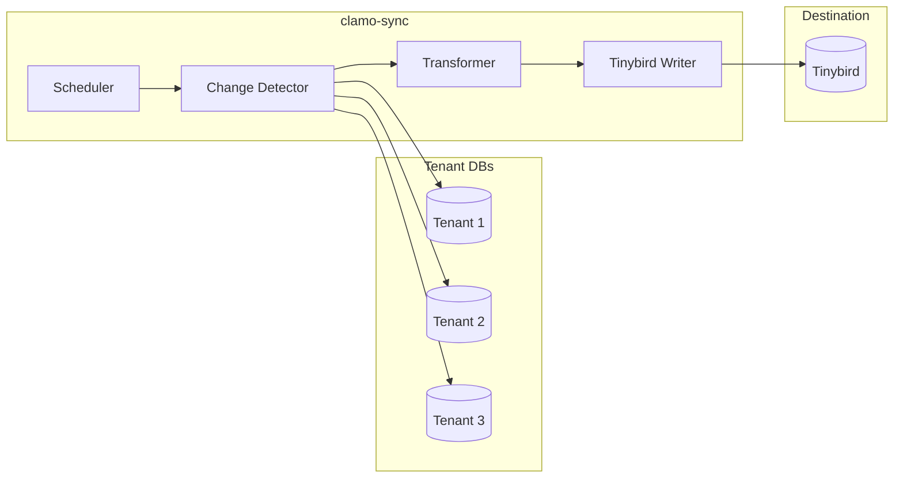

Rust service that synchronizes data from tenant databases to Tinybird for real-time analytics.

## General Information

| Property | Value |
|----------|-------|
| **Repository** | `GetClamo/clamo-sync` |
| **Language** | Rust |
| **Runtime** | Tokio |
| **Destination** | Tinybird |
| **Frequency** | Every 5 minutes |

## Architecture



## Synchronization Flow

1. **Scheduler**: Runs every 5 minutes
2. **Get companies**: Lists active companies from control DB
3. **For each tenant**: Detect changes, transform, send to Tinybird
4. **Update timestamp**

## Configuration

### Environment Variables

```bash
# Tenant SDK
TENANT_SERVICE_URL=http://localhost:4001

# Tinybird
TINYBIRD_TOKEN=p.eyJ...

# Sync
SYNC_INTERVAL_SECONDS=300
SYNC_BATCH_SIZE=10000
```

## Local Development

```bash
# Build
cargo build

# Run
cargo run

# Tests
cargo test

# Release build
cargo build --release
```

## Next Steps

<CardGroup cols={2}>
  <Card
    title="clamo-dashboards"
    icon="chart-bar"
    href="/en/services/clamo-dashboards"
  >
    Consumes Tinybird data for dashboards.
  </Card>
  <Card
    title="ask-clamo"
    icon="robot"
    href="/en/services/ask-clamo"
  >
    Clamy profile uses Tinybird for analytics.
  </Card>
</CardGroup>
