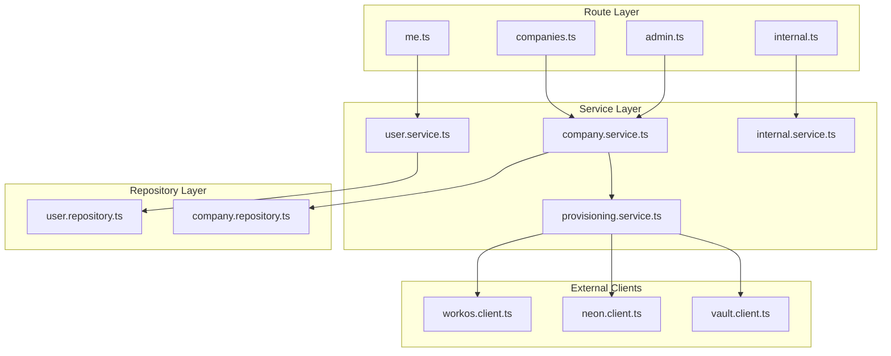
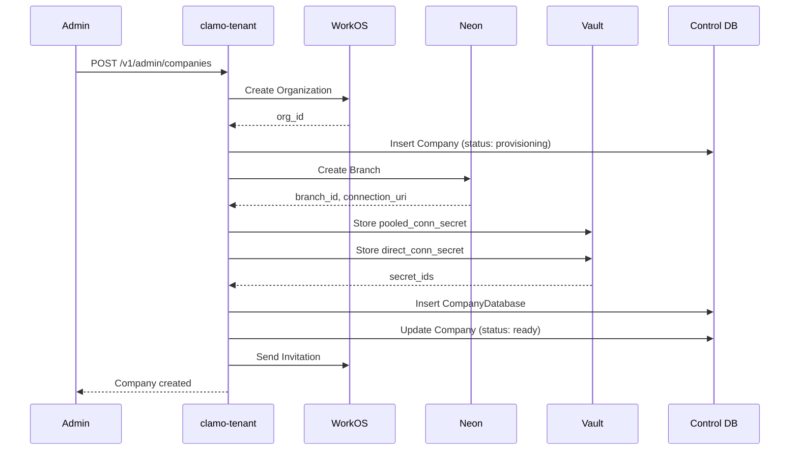

# clamo-tenant

Central service for tenant (company) management, users, onboarding, and database provisioning. Acts as the **source of truth** for tenant connection resolution.

## General Information

| Property | Value |
|----------|-------|
| **Repository** | `GetClamo/clamo-tenant` |
| **Language** | TypeScript |
| **Framework** | Hono |
| **Port** | 4001 |
| **Database** | Supabase PostgreSQL (Control Plane) |
| **ORM** | Prisma (`@getclamo/database`) |

## Responsibilities

- Company lifecycle management (create, update, delete)
- **Database provisioning** per tenant in Neon
- Integration with **WorkOS** for authentication and organizations
- User and role management
- Onboarding flow for new companies
- Credential storage in **Supabase Vault**
- **Source of truth** for tenant connection resolution

## RRS Architecture



## Directory Structure

```
clamo-tenant/src/
├── routes/
│   ├── me.ts              # /v1/me - Current user
│   ├── companies.ts       # /v1/companies
│   ├── admin.ts           # /v1/admin/... - Admin operations
│   ├── internal.ts        # /internal/v1/... - Service-to-service
│   └── reference-data.ts  # Reference data
├── services/
│   ├── user.service.ts
│   ├── company.service.ts
│   ├── provisioning.service.ts  # Creates Neon branches
│   └── internal.service.ts      # Connection resolution
├── repositories/
│   ├── user.repository.ts
│   └── company.repository.ts
├── clients/
│   ├── workos.client.ts   # WorkOS SDK
│   ├── neon.client.ts     # Neon API
│   └── vault.client.ts    # Supabase Vault
├── middleware/
│   └── auth.ts            # Parses x-workos-* headers
└── events/
    └── kafka.adapter.ts   # Provisioning events
```

## Authentication

The service uses `x-workos-*` headers injected by Kong:

```typescript
// middleware/auth.ts
const userId = headers.get("x-workos-user-id");
const orgId = headers.get("x-workos-org-id");
const role = headers.get("x-workos-role") ?? "member";
const permissionsHeader = headers.get("x-workos-permissions");
```

## Main Endpoints

### Current User

| Method | Endpoint | Description |
|--------|----------|-------------|
| GET | `/v1/me` | Get current user |
| GET | `/v1/me/company` | Get user's company |
| PATCH | `/v1/me/onboarding` | Complete onboarding |

### Companies

| Method | Endpoint | Description |
|--------|----------|-------------|
| GET | `/v1/companies/:id` | Get company |
| PATCH | `/v1/companies/:id` | Update company |

### Admin

| Method | Endpoint | Description |
|--------|----------|-------------|
| POST | `/v1/admin/companies` | Create company |
| GET | `/v1/admin/companies` | List companies |
| DELETE | `/v1/admin/companies/:id` | Delete company |
| POST | `/v1/admin/companies/:id/invite` | Invite user |

### Internal Endpoints

<Warning>
**Service-to-service only.** These endpoints are the source of truth for connection resolution.
</Warning>

| Method | Endpoint | Description |
|--------|----------|-------------|
| GET | `/internal/v1/companies/:id` | Get company (internal) |
| GET | `/internal/v1/companies/:id/database` | Get DB connection |
| GET | `/internal/v1/companies/by-org/:orgId` | Find by WorkOS org |

## Provisioning Flow



## Data Model

### Company

```typescript
interface Company {
  id: string;
  workosOrgId: string;
  name: string;
  ruc: string | null;
  parentId: string | null;
  plan: 'free' | 'pro' | 'enterprise';
  settings: Record<string, unknown>;
  metadata: Record<string, unknown>;
  databaseStatus: 'pending' | 'provisioning' | 'ready' | 'failed';
  ownerEmail: string | null;
  createdAt: Date;
  updatedAt: Date;
}
```

### CompanyDatabase

```typescript
interface CompanyDatabase {
  id: string;
  companyId: string;
  neonProjectId: string;
  neonBranchId: string;
  neonEndpointId: string | null;
  databaseName: string;
  databaseHost: string;
  databaseUser: string;
  pooledConnSecretId: string;  // ID in Supabase Vault
  directConnSecretId: string;  // ID in Supabase Vault
  status: 'active' | 'suspended' | 'deleted';
}
```

### User

```typescript
interface User {
  id: string;
  workosUserId: string;
  email: string;
  firstName: string | null;
  lastName: string | null;
  companyId: string;
  role: 'admin' | 'member';
  onboardingState: 'pending_onboarding' | 'completed';
  createdAt: Date;
}
```

## Connection Resolution

The service exposes internal endpoints for other services to resolve connections:

```typescript
// From clamo-cases using the SDK
import Tenant from "@getclamo/tenant";

const tenant = new Tenant({ baseURL: env.TENANT_SERVICE_URL });

// Get database connection
const { connectionString } = await tenant.internal
  .companies(companyId)
  .database.get();
```

## Configuration

### Environment Variables

```bash
# Server
PORT=4001

# Control database
CONTROL_DATABASE_URL=postgresql://...

# WorkOS
WORKOS_API_KEY=sk_...
WORKOS_CLIENT_ID=client_...

# Neon
NEON_API_KEY=...
NEON_PROJECT_ID=...

# Supabase (for Vault)
SUPABASE_URL=https://...
SUPABASE_SERVICE_KEY=...

# Kafka (provisioning events)
KAFKA_BROKERS=localhost:9092
```

## SDK

This service publishes a TypeScript SDK:

```bash
pnpm add @getclamo/tenant
```

```typescript
import Tenant from "@getclamo/tenant";

const tenant = new Tenant({ baseURL: process.env.TENANT_SERVICE_URL });

// Get current user
const user = await tenant.me.get();

// Get user's company
const company = await tenant.me.company();

// Internal endpoints (service-to-service)
const companyData = await tenant.internal.companies(companyId).get();
const dbConnection = await tenant.internal.companies(companyId).database.get();
```

## Local Development

```bash
# Install dependencies
pnpm install

# Generate Prisma client
pnpm db:generate

# Run in development mode
pnpm dev

# Build
pnpm build

# Tests
pnpm test
```

## Next Steps

<CardGroup cols={2}>
  <Card
    title="Service SDKs"
    icon="plug"
    href="/en/architecture/service-sdks"
  >
    Service-to-service communication.
  </Card>
  <Card
    title="Security"
    icon="shield"
    href="/en/architecture/security"
  >
    Chain of trust and Vault.
  </Card>
</CardGroup>
