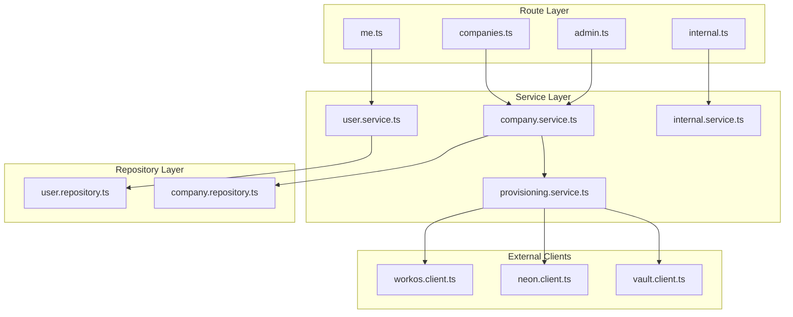
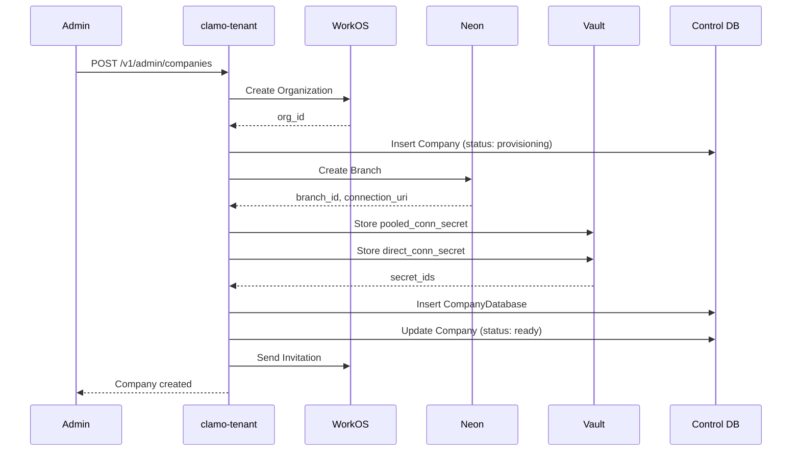

Central service for tenant (company) management, users, onboarding, and database provisioning. Acts as the **source of truth** for tenant connection resolution.

## General Information

| Property | Value |
|----------|-------|
| **Repository** | `GetClamo/clamo-tenant` |
| **Language** | TypeScript |
| **Framework** | Hono |
| **Port** | 4001 |
| **Database** | Supabase PostgreSQL (Control Plane) |
| **ORM** | Prisma (`@getclamo/database`) |

## Responsibilities

- Company lifecycle management (create, update, delete)
- **Database provisioning** per tenant in Neon
- Integration with **WorkOS** for authentication and organizations
- User and role management
- Onboarding flow for new companies
- Credential storage in **Supabase Vault**
- **Source of truth** for tenant connection resolution

## Architecture



## Authentication

The service uses `x-workos-*` headers injected by Kong:

```typescript
// middleware/auth.ts
const userId = headers.get("x-workos-user-id");
const orgId = headers.get("x-workos-org-id");
const role = headers.get("x-workos-role") ?? "member";
const permissionsHeader = headers.get("x-workos-permissions");
```

## API Endpoints

<Info>
For the complete interactive API documentation, see the [Tenant API Reference](/api-reference/tenant/usuario/obtener-usuario-actual).
</Info>

## Provisioning Flow



## Data Model

<Info>
For complete entity documentation including Company, CompanyDatabase, and User, see the [Entities](/en/entities/company) section.
</Info>

## Connection Resolution

The service exposes internal endpoints for other services to resolve tenant database connections. See the [SDKs](#sdks) section for usage examples in TypeScript, Python, and Rust.

## Configuration

### Environment Variables

```bash
# Server
PORT=4001

# Control database
CONTROL_DATABASE_URL=postgresql://...

# WorkOS
WORKOS_API_KEY=sk_...
WORKOS_CLIENT_ID=client_...

# Neon
NEON_API_KEY=...
NEON_PROJECT_ID=...

# Supabase (for Vault)
SUPABASE_URL=https://...
SUPABASE_SERVICE_KEY=...

# Kafka (provisioning events)
KAFKA_BROKERS=localhost:9092
```

## SDKs

This service publishes typed SDKs generated from the OpenAPI specification using [Stainless](https://stainless.com) (TypeScript/Python) and OpenAPI Generator (Rust).

| SDK | Package | Repository |
|-----|---------|------------|
| TypeScript | `@getclamo/tenant` | [GetClamo/clamo-tenant-sdk-ts](https://github.com/GetClamo/clamo-tenant-sdk-ts) |
| Python | `getclamo-tenant` | [GetClamo/clamo-tenant-sdk-py](https://github.com/GetClamo/clamo-tenant-sdk-py) |
| Rust | `clamo-tenant-sdk` | [GetClamo/clamo-tenant-sdk-rust](https://github.com/GetClamo/clamo-tenant-sdk-rust) |

### Installation

<CodeGroup>
```bash TypeScript
pnpm add @getclamo/tenant
# or
npm install @getclamo/tenant
```

```bash Python
pip install getclamo-tenant
```

```bash Rust
cargo add clamo-tenant-sdk
```
</CodeGroup>

### Usage

<Tabs>
<Tab title="TypeScript">
```typescript
import Tenant from "@getclamo/tenant";

const tenant = new Tenant({ baseURL: process.env.TENANT_SERVICE_URL });

// Get current user
const user = await tenant.me.get();

// Get user's company
const company = await tenant.me.company();

// Internal endpoints (service-to-service)
const companyData = await tenant.internal.companies(companyId).get();
const dbConnection = await tenant.internal.companies(companyId).database.get();
```
</Tab>
<Tab title="Python">
```python
from getclamo_tenant import Tenant

tenant = Tenant(base_url=os.environ["TENANT_SERVICE_URL"])

# Get current user
user = tenant.me.get()

# Get user's company
company = tenant.me.company()

# Internal endpoints (service-to-service)
company_data = tenant.internal.companies(company_id).get()
db_connection = tenant.internal.companies(company_id).database.get()
```
</Tab>
<Tab title="Rust">
```rust
use clamo_tenant_sdk::Client;

let tenant = Client::new(std::env::var("TENANT_SERVICE_URL")?);

// Get current user
let user = tenant.me().get().send().await?;

// Get user's company
let company = tenant.me().company().send().await?;
```
</Tab>
</Tabs>

## Local Development

```bash
# Install dependencies
pnpm install

# Generate Prisma client
pnpm db:generate

# Run in development mode
pnpm dev

# Build
pnpm build

# Tests
pnpm test
```

## Next Steps

<CardGroup cols={2}>
  <Card
    title="Entities"
    icon="database"
    href="/en/entities/company"
  >
    Company entity documentation.
  </Card>
  <Card
    title="clamo-cases"
    icon="briefcase"
    href="/en/services/clamo-cases"
  >
    Case management service.
  </Card>
</CardGroup>
