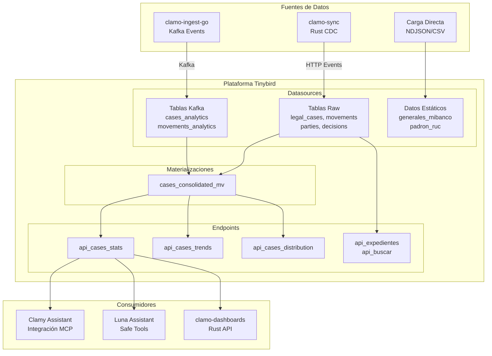
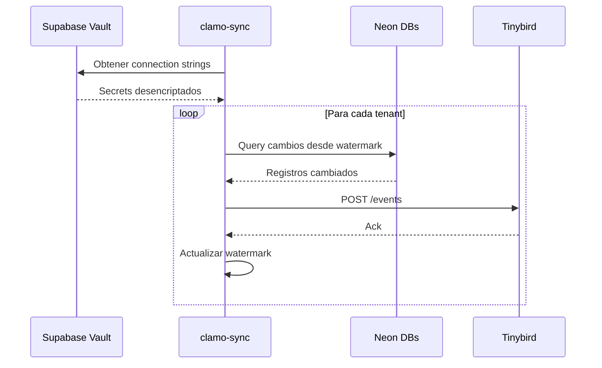
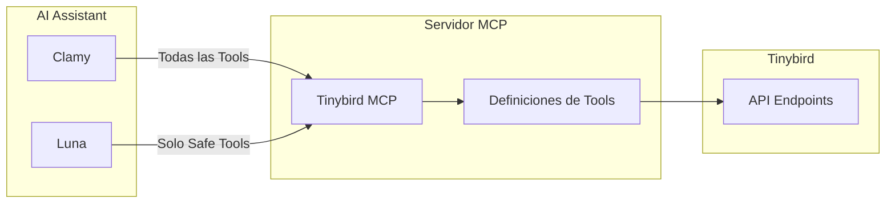
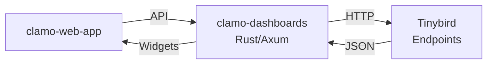

# Arquitectura de Analytics

Clamo usa Tinybird como su motor de analytics, proporcionando agregaciones en tiempo real e insights a través de más de 200 bases de datos de tenants consolidadas en una única capa de analytics.

## Visión General de la Arquitectura



## Flujo de Datos

### clamo-sync (Rust)

El servicio principal de sincronización de datos que consolida más de 200 bases de datos Neon PostgreSQL en Tinybird.

**Características Clave**:
- **Sync incremental** usando watermarks de `updated_at`
- **Detección de esquema** con sync completo automático en cambios
- **Detección de eliminaciones** vía reconciliación (intervalo configurable)
- **Rate limiting** con backoff exponencial para límites de Tinybird
- **Escalamiento horizontal** con concurrencia de workers configurable

**Flujo de Sync**:


### clamo-ingest-go (Kafka)

Transmite eventos en tiempo real desde el pipeline de ingesta directamente a Tinybird vía Kafka.

**Tablas**:
- `cases_analytics` - Eventos de casos en tiempo real
- `movements_analytics` - Notificaciones de movimientos
- `milestones_analytics` - Logros de hitos

## Configuración de Tinybird

La configuración de Tinybird vive en el repositorio `clamo-clickhouse`.

### Datasources

| Datasource | Fuente | Descripción |
|------------|--------|-------------|
| `legal_cases` | clamo-sync | Datos core de casos |
| `movements` | clamo-sync | Movimientos/acciones de casos |
| `parties` | clamo-sync | Partes del caso (demandante/demandado) |
| `decisions` | clamo-sync | Decisiones judiciales |
| `case_states` | clamo-sync | Snapshots de estado actual |
| `cases_analytics` | Kafka | Eventos de casos en tiempo real |
| `movements_analytics` | Kafka | Eventos de movimientos en tiempo real |
| `cases_sync_consolidated` | ETL | Output del ETL en Rust |
| `generales_mibanco` | Static | Datos de referencia |
| `padron_ruc` | Static | Datos de validación de RUC |

### Materializaciones

**`cases_consolidated_mv`** - Vista pre-computada que desnormaliza datos de casos con:
- Estado más reciente
- Información de partes
- Conteos de movimientos
- Cálculos de riesgo
- Progreso de etapas

### Endpoints API

| Endpoint | Descripción |
|----------|-------------|
| `api_cases_consolidated` | Lista completa de casos consolidados |
| `api_case_detail` | Caso individual con todas las relaciones |
| `api_cases_stats` | KPIs agregados |
| `api_cases_distribution` | Distribución por dimensión |
| `api_cases_trends` | Tendencias de series temporales |
| `api_expedientes` | Listado de casos filtrado |
| `api_buscar` | Búsqueda de texto completo |
| `api_estadisticas` | Estadísticas globales |
| `api_analisis_juez` | Análisis de rendimiento de jueces |
| `api_analisis_tipologia` | Tasas de éxito por tipo de caso |

## Integración MCP

Clamy y Luna acceden a Tinybird a través del servidor MCP (Model Context Protocol).



**Luna Safe Tools** (whitelist para asistente global):
- `api_estadisticas` - KPIs globales
- `api_por_zona` - Distribución geográfica
- `api_expedientes` - Listado filtrado
- `api_buscar` - Búsqueda de texto
- `api_estados_caso` - Distribución de estados
- `api_casos_atencion` - Casos críticos
- `api_cases_trends` - Tendencias temporales
- `api_cases_distribution` - Distribución dimensional

**Luna Blocked Tools** (pueden generar errores):
- `text_to_sql` - Generación de SQL personalizado
- `execute_query` - Ejecución de SQL personalizado
- `explore_data` - Queries problemáticas

## Integración con clamo-dashboards

El servicio de dashboards basado en Rust consulta Tinybird para datos de widgets:



**Características del Dashboard**:
- Layouts de widgets personalizables
- Resultados de queries cacheados
- Aislamiento multi-tenant
- Actualizaciones en tiempo real

## Observabilidad

### Métricas de clamo-sync

Métricas de Prometheus expuestas en `/metrics`:
- `sync_records_total` - Registros sincronizados por tenant
- `sync_duration_seconds` - Histograma de duración de sync
- `sync_errors_total` - Conteos de errores por tipo
- `tinybird_rate_limit_hits` - Encuentros con rate limit

### Alertas

Integración con Alertmanager envía notificaciones vía clamo-mailing:
- Fallos de sync
- Advertencias de rate limit
- Detecciones de cambios de esquema
- Discrepancias de reconciliación

## Estructura del Proyecto

```
clamo-clickhouse/
├── connections/
│   └── kafka_analytics.connection    # Config de conexión Kafka
├── datasources/
│   ├── legal_cases.datasource
│   ├── movements.datasource
│   ├── parties.datasource
│   ├── decisions.datasource
│   ├── case_states.datasource
│   ├── cases_analytics.datasource    # Kafka
│   └── ...
├── endpoints/
│   ├── api_cases_consolidated.pipe
│   ├── api_cases_stats.pipe
│   ├── api_cases_trends.pipe
│   └── ...
├── materializations/
│   └── cases_consolidated.pipe
└── fixtures/
    └── generales_mibanco.ndjson      # Datos de prueba
```

## Documentación Relacionada

- [Servicio clamo-sync](/es/servicios/clamo-sync)
- [Servicio clamo-dashboards](/es/servicios/clamo-dashboards)
- [Arquitectura de Asistentes IA](/es/arquitectura/asistentes-ia)
