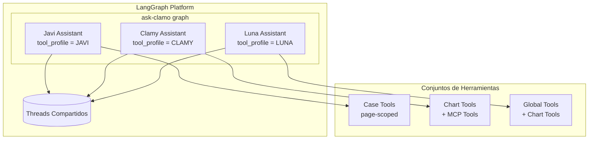
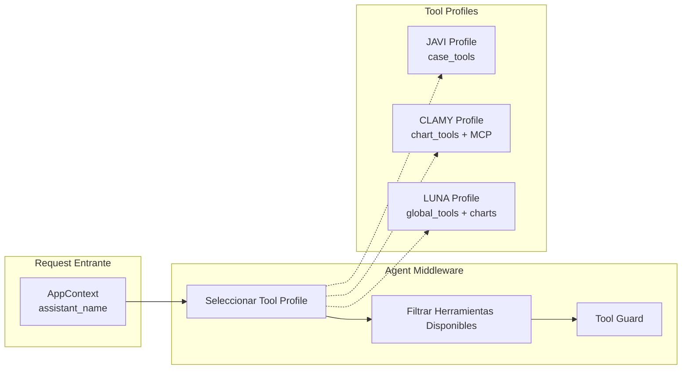

# Asistentes IA

Clamo integra asistentes de IA especializados construidos con LangGraph Platform. Los tres asistentes están consolidados en un único despliegue llamado **ask-clamo**.

## Visión General de la Arquitectura



## Características Clave

| Característica | Descripción |
|----------------|-------------|
| **Despliegue Único** | Un solo grafo sirve a los tres asistentes |
| **Threads Compartidos** | Javi, Clamy y Luna comparten historial de mensajes en el mismo thread |
| **Aislamiento de Herramientas** | Cada asistente solo ve sus herramientas designadas vía middleware + guard |
| **Prompts Dinámicos** | Los system prompts se seleccionan según `assistant_name` en el contexto |
| **Integración MCP** | Clamy carga herramientas de analytics de Tinybird vía protocolo MCP |
| **Acceso Global** | Luna puede consultar cualquier caso sin contexto de página |

## Los Tres Asistentes

### Javi (Asistente de Casos)

Javi es el asistente de casos con alcance de página, embebido en las páginas de detalle de casos. Ayuda a los usuarios a entender casos legales individuales.

**Capacidades:**
- Explicar el estado actual del caso y nivel de riesgo
- Detallar montos demandados y exposición financiera
- Resumir movimientos recientes del caso
- Explicar etapas procesales y próximos pasos

**Herramientas:**
- `get_case_details` - Información completa del caso (partes, monto, riesgo, estado)
- `get_case_progress` - Línea de tiempo del proceso por etapas
- `get_case_movements` - Acciones/movimientos del expediente
- `get_case_milestones` - Hitos importantes alcanzados

**Contexto Requerido:**
- `case_id` - El caso específico que se está viendo
- `company_id` - Identificador del tenant
- `access_token` - Autenticación del usuario

### Clamy (Asistente de Analytics)

Clamy es el asistente de analytics que genera gráficos y visualizaciones para insights del portafolio legal.

**Capacidades:**
- Generar gráficos interactivos y KPIs
- Consultar endpoints de analytics de Tinybird vía MCP
- Crear visualizaciones personalizadas
- Proporcionar insights a nivel de portafolio

**Herramientas:**
- `show_chart` - Mostrar tipos de gráficos predefinidos
- `show_kpi` - Mostrar indicadores clave de rendimiento
- `show_custom_chart` - Generación de visualización personalizada
- `get_chart_template` - Obtener plantillas de configuración de gráficos
- Herramientas MCP de Tinybird (cargadas dinámicamente)

**Contexto Requerido:**
- `company_id` - Identificador del tenant
- `case_id` - Opcional, para analytics específicos del caso

### Luna (Asistente Global)

Luna es el asistente generalista con acceso a TODOS los casos, sin limitarse a un contexto de página único.

**Capacidades:**
- Consultar cualquier caso en el portafolio
- Análisis y comparaciones entre casos
- Vista general del portafolio y búsqueda
- Estadísticas y tendencias globales

**Herramientas:**
- `get_case_details_by_id` - Detalles del caso con case_id como argumento
- `get_case_progress_by_id` - Progreso con case_id como argumento
- `get_case_movements_by_id` - Movimientos con case_id como argumento
- `get_case_milestones_by_id` - Hitos con case_id como argumento
- `search_cases` - Búsqueda en todos los casos
- `list_cases` - Listar casos con filtros
- Más todas las herramientas de gráficos de Clamy

**Contexto Requerido:**
- `company_id` - Identificador del tenant
- `access_token` - Autenticación del usuario
- `case_id` - NO requerido (se pasa como argumento de herramienta)

**Whitelist de Herramientas MCP:**
Luna tiene acceso a un conjunto curado de herramientas MCP seguras:
- `api_estadisticas` - KPIs globales
- `api_por_zona` - Distribución geográfica
- `api_expedientes` - Listado de casos filtrado
- `api_buscar` - Búsqueda de texto
- `api_estados_caso` - Distribución por estado
- `api_casos_atencion` - Casos críticos
- `api_cases_trends` - Tendencias temporales
- `api_cases_distribution` - Distribución dimensional

## Arquitectura de Aislamiento de Herramientas



El middleware asegura:
1. El tool profile se selecciona basado en `assistant_name` en el contexto
2. Solo las herramientas del profile seleccionado se exponen al LLM
3. Un guard previene la ejecución de herramientas que no están en el profile

## Estructura del Proyecto

```
ask-clamo/
├── langgraph.json          # Configuración de LangGraph Platform
├── pyproject.toml          # Dependencias de Python
└── src/
    └── ask_clamo/
        ├── agent.py            # Entry point principal del grafo
        ├── settings.py         # Configuración unificada
        ├── widget_types.py     # Definiciones de tipos de gráficos
        ├── state/
        │   └── schemas.py      # AgentState + AppContext
        ├── tools/
        │   ├── registry.py     # Tool profiles (JAVI, CLAMY, LUNA)
        │   ├── case_api.py     # Herramientas de casos de Javi (page-scoped)
        │   ├── charts.py       # Herramientas de gráficos de Clamy
        │   └── luna_global.py  # Herramientas globales de Luna
        ├── middleware/
        │   ├── case_context.py # Fetcher de contexto compartido
        │   └── agent_middleware.py  # Aislamiento de herramientas
        └── prompts/
            ├── javi.py         # System prompt de Javi
            ├── clamy.py        # System prompt de Clamy
            └── luna.py         # System prompt de Luna
```

## Configuración

Variables de entorno para ask-clamo:

| Variable | Descripción |
|----------|-------------|
| `LANGCHAIN_API_KEY` | API key de LangSmith para tracing |
| `OPENAI_API_KEY` | API key de OpenAI para el LLM |
| `CLAMO_CASES_URL` | URL del servicio clamo-cases |
| `TINYBIRD_MCP_URL` | URL del servidor MCP de Tinybird |
| `TINYBIRD_TOKEN` | Token de autenticación de Tinybird |

## Desarrollo Local

```bash
# Navegar a ask-clamo
cd ask-clamo

# Instalar dependencias
uv sync

# Ejecutar localmente
langgraph dev
```

El servicio corre en el puerto **8123** por defecto.

## Documentación Relacionada

- [Servicio ask-clamo](/es/servicios/ask-clamo) - Documentación a nivel de servicio
- [Arquitectura de Analytics](/es/arquitectura/analiticas) - Detalles de integración con Tinybird
