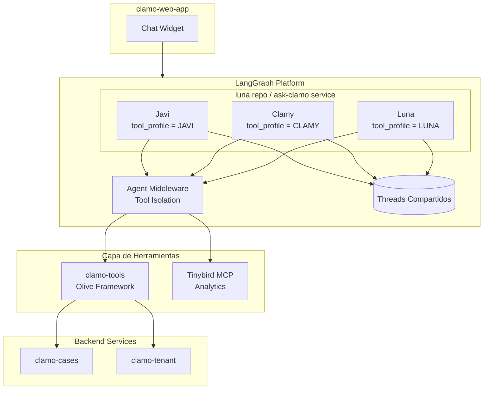
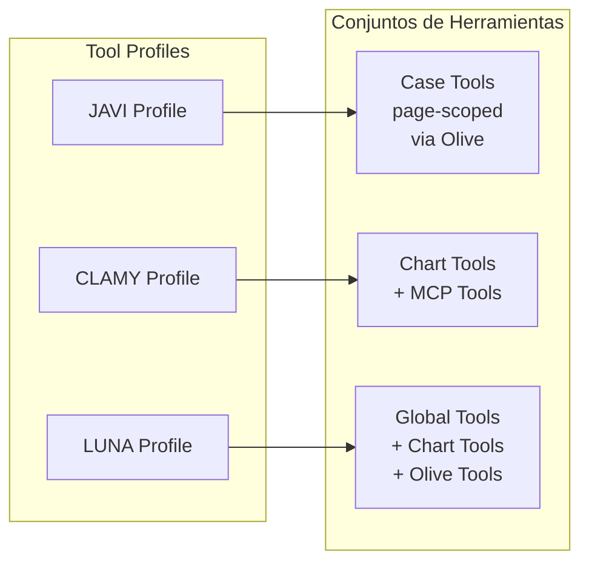
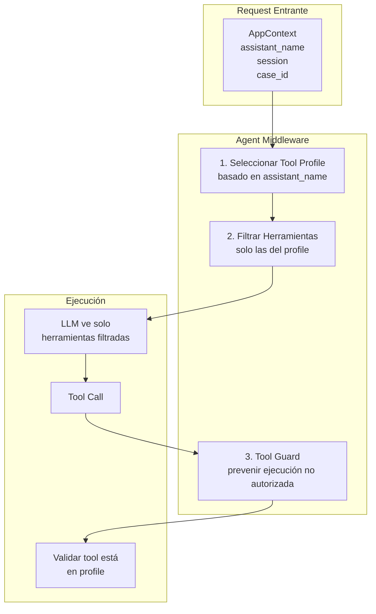
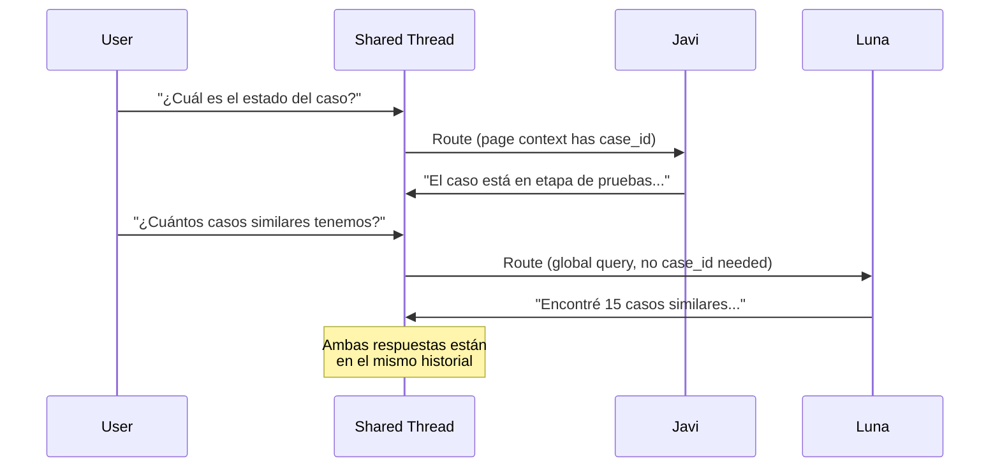
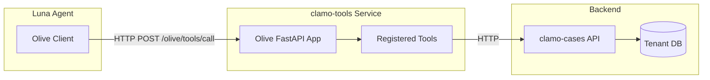

# Arquitectura Unified AI Assistant

Clamo implementa un modelo de **Unified AI Assistant** donde todos los asistentes (Javi, Clamy, Luna) están consolidados en un único despliegue LangGraph. El código fuente está en el repositorio **luna** y el servicio desplegado se llama **ask-clamo**. Este diseño reemplaza la arquitectura anterior de agentes separados por un modelo más eficiente con threads compartidos y aislamiento de herramientas vía middleware.

<Note>
**Nomenclatura:** El repositorio se llama `luna`, pero el servicio desplegado en LangGraph Platform se llama `ask-clamo`. Ambos nombres se refieren al mismo sistema.
</Note>

## Visión General de la Arquitectura



## Características Clave del Modelo Unificado

| Característica | Descripción |
|----------------|-------------|
| **Despliegue Único** | Un solo grafo LangGraph sirve a los tres asistentes |
| **Threads Compartidos** | Javi, Clamy y Luna comparten historial de mensajes en el mismo thread |
| **Aislamiento de Herramientas** | Middleware + Guard aseguran que cada asistente solo vea sus herramientas |
| **Prompts Dinámicos** | Los system prompts se seleccionan según `assistant_name` en el contexto |
| **Integración MCP** | Clamy carga herramientas de analytics de Tinybird vía protocolo MCP |
| **Integración Olive** | Luna accede a herramientas Python remotas vía clamo-tools (framework Olive) |

## Perfiles de Herramientas (Tool Profiles)

El sistema define tres perfiles de herramientas que determinan qué capacidades tiene cada asistente:



### JAVI Profile (Asistente de Casos)

Javi es el asistente de casos con **alcance de página**, embebido en las páginas de detalle de casos.

**Herramientas disponibles:**
- `get_case_details` - Información completa del caso (partes, monto, riesgo, estado)
- `get_case_progress` - Línea de tiempo del proceso por etapas
- `get_case_movements` - Acciones/movimientos del expediente
- `get_case_milestones` - Hitos importantes alcanzados

**Contexto requerido:**
```python
{
    "case_id": "case_abc123",      # El caso específico que se está viendo
    "company_id": "cmp_xyz789",    # Identificador del tenant
    "access_token": "..."          # Autenticación del usuario
}
```

<Note>
Las herramientas de Javi usan **inyección de contexto** - el `case_id` se obtiene automáticamente del contexto de la página, no se pasa como argumento.
</Note>

### CLAMY Profile (Asistente de Analytics)

Clamy es el asistente de analytics que genera gráficos y visualizaciones.

**Herramientas disponibles:**
- `show_chart` - Mostrar tipos de gráficos predefinidos
- `show_kpi` - Mostrar indicadores clave de rendimiento
- `show_custom_chart` - Generación de visualización personalizada
- `get_chart_template` - Obtener plantillas de configuración de gráficos
- Herramientas MCP de Tinybird (cargadas dinámicamente)

**Contexto requerido:**
```python
{
    "company_id": "cmp_xyz789",    # Identificador del tenant
    "case_id": "..."               # Opcional, para analytics específicos del caso
}
```

### LUNA Profile (Asistente Global)

Luna es el asistente generalista con acceso a **TODOS los casos**, sin limitarse a un contexto de página único.

**Herramientas disponibles:**
- `get_case_details_by_id` - Detalles del caso con case_id como argumento
- `get_case_progress_by_id` - Progreso con case_id como argumento
- `get_case_movements_by_id` - Movimientos con case_id como argumento
- `get_case_milestones_by_id` - Hitos con case_id como argumento
- `search_cases` - Búsqueda en todos los casos
- `list_cases` - Listar casos con filtros
- Todas las herramientas de gráficos de Clamy
- Herramientas MCP curadas (whitelist)

**Whitelist de Herramientas MCP para Luna:**
```python
LUNA_MCP_WHITELIST = {
    "api_estadisticas",      # KPIs globales
    "api_por_zona",          # Distribución geográfica
    "api_expedientes",       # Listado de casos filtrado
    "api_buscar",            # Búsqueda de texto
    "api_estados_caso",      # Distribución por estado
    "api_casos_atencion",    # Casos críticos
    "api_cases_trends",      # Tendencias temporales
    "api_cases_distribution" # Distribución dimensional
}
```

## Arquitectura de Aislamiento de Herramientas

El middleware de aislamiento es crítico para la seguridad y correctitud del sistema:



### ¿De dónde viene `assistant_name`?

El `assistant_name` se especifica en el **body del request** cuando el cliente llama a LangGraph Platform:

```bash
# POST /runs (LangGraph Platform API)
curl -X POST http://localhost:8000/runs \
  -H "Content-Type: application/json" \
  -d '{
    "assistant_id": "luna",
    "thread_id": "thread_abc123",
    "input": {
      "messages": [{"role": "user", "content": "¿Cuál es el estado del caso?"}]
    },
    "config": {
      "configurable": {
        "assistant_name": "javi",
        "case_id": "case_xyz789",
        "company_id": "cmp_abc123",
        "user_id": "user_01HQMK...",
        "org_id": "org_01HQML..."
      }
    }
  }'
```

El frontend (`clamo-web-app`) determina qué asistente usar basado en el contexto de la página:
- **Página de detalle de caso** → `assistant_name: "javi"` + `case_id`
- **Página de analytics** → `assistant_name: "clamy"`
- **Chat global** → `assistant_name: "luna"`

### Implementación del Middleware

```python
# luna/src/luna/middleware/agent_middleware.py

class AgentMiddleware:
    """Middleware que asegura aislamiento de herramientas por profile."""
    
    def filter_tools(self, context: AppContext) -> list[Tool]:
        """Filtra herramientas basado en el profile del asistente."""
        profile = self.get_profile(context.assistant_name)
        return [t for t in self.all_tools if t.name in profile.allowed_tools]
    
    def guard_tool_call(self, context: AppContext, tool_name: str) -> bool:
        """Previene ejecución de herramientas no autorizadas."""
        profile = self.get_profile(context.assistant_name)
        if tool_name not in profile.allowed_tools:
            raise ToolNotAllowedError(
                f"Tool '{tool_name}' not allowed for {context.assistant_name}"
            )
        return True
```

## Threads Compartidos

Una característica clave del modelo unificado es que los tres asistentes pueden operar en el **mismo thread**, compartiendo historial de mensajes:



**Beneficios:**
- Contexto conversacional continuo entre asistentes
- El usuario puede cambiar de asistente sin perder contexto
- Reducción de latencia al no crear nuevos threads

## Integración con clamo-tools (Framework Olive)

<Warning>
Luna **no accede a la base de datos directamente** para todas las operaciones. En su lugar, usa **clamo-tools** (vía framework Olive) como una capa intermedia segura para ejecutar herramientas Python.
</Warning>

### ¿Qué es Olive?

[Olive](https://github.com/YaVendio/olive) es un framework para exponer herramientas Python como endpoints REST que pueden ser consumidos por agentes LLM.



### Arquitectura de clamo-tools

```
clamo-tools/
├── src/
│   └── clamo_tools/
│       ├── app.py              # Olive FastAPI application
│       ├── config.py           # Configuration (Settings)
│       ├── services/           # Service clients
│       │   └── __init__.py
│       └── tools/
│           ├── __init__.py     # Auto-register all tools
│           ├── cases.py        # Case tools (@olive_tool)
│           └── health.py       # Health check tool
├── pyproject.toml
└── Makefile
```

### Definición de Herramientas con Olive

```python
# clamo-tools/src/clamo_tools/tools/cases.py

from olive import olive_tool

@olive_tool
async def get_case_details(
    case_id: str,
    company_id: str,
    headers: dict[str, str] | None = None,
) -> dict[str, Any]:
    """Fetch complete details for a specific legal case.
    
    Args:
        case_id: The unique identifier of the case (UUID)
        company_id: The company ID for tenant isolation
        headers: Optional headers to forward for audit trail
    
    Returns:
        Dictionary with case details or error information
    """
    client = get_cases_client()
    response = await client.companies.cases.retrieve(
        case_id,
        company_id=company_id,
        include_movements=True,
        include_parties=True,
    )
    # ... process response
    return {"success": True, "case": {...}}
```

### Consumo desde Luna

```python
# luna/src/luna/tools/olive_client.py

class OliveToolClient:
    """HTTP client for calling Olive tools on clamo-tools server."""
    
    def __init__(self, base_url: str):
        """Initialize the Olive client."""
        self.base_url = base_url.rstrip("/")
        self._client: httpx.AsyncClient | None = None

    async def __aenter__(self) -> "OliveToolClient":
        """Enter async context."""
        self._client = httpx.AsyncClient(
            base_url=self.base_url,
            timeout=httpx.Timeout(60.0, connect=10.0),
        )
        return self

    async def __aexit__(self, *args: Any) -> None:
        """Exit async context."""
        if self._client:
            await self._client.aclose()
    
    async def call_tool(self, tool_name: str, arguments: dict) -> Any:
        """Call a tool on the Olive server."""
        response = await self._client.post(
            "/olive/tools/call",
            json={"tool_name": tool_name, "arguments": arguments},
        )
        response.raise_for_status()
        return response.json()

# Uso en Luna (JAVI profile con context injection)
# El case_id y company_id se inyectan automáticamente desde el runtime context
@tool
async def get_case_details(runtime: InjectedRuntime) -> dict[str, Any]:
    ctx = runtime.context
    async with OliveToolClient(settings.clamo_tools_url) as client:
        return await client.call_tool(
            "get_case_details",
            {
                "case_id": ctx.case_id,
                "company_id": ctx.company_id,
            }
        )
```

### Endpoints de Olive

| Método | Endpoint | Descripción |
|--------|----------|-------------|
| `GET` | `/olive/tools` | Listar todas las herramientas registradas |
| `POST` | `/olive/tools/call` | Ejecutar una herramienta |
| `GET` | `/olive/tools/elevenlabs` | Obtener herramientas en formato ElevenLabs |

### Timeouts y Configuración de Olive

<Note>
**Timeouts:** Las llamadas a clamo-tools tienen un timeout por defecto de **30 segundos**. Para operaciones que pueden tardar más (ej. búsquedas complejas), considera ajustar el timeout en el cliente.
</Note>

| Configuración | Default | Descripción |
|---------------|---------|-------------|
| `timeout` | 30s | Timeout para llamadas HTTP a Olive |
| `max_retries` | 3 | Reintentos automáticos en caso de error transitorio |
| `retry_delay` | 1s | Delay entre reintentos (con backoff exponencial) |

Si una herramienta falla por timeout, el agente recibirá un error y puede decidir reintentar o informar al usuario.

## Integración MCP (Model Context Protocol)

Clamy y Luna usan el protocolo MCP para acceder a herramientas de analytics de Tinybird:

```python
# luna/src/luna/tools/mcp_wrapper.py

async def load_mcp_tools() -> list[Tool]:
    """Load tools from Tinybird MCP server."""
    async with MCPClient(settings.tinybird_mcp_url) as client:
        tools_info = await client.list_tools()
        return [
            create_langchain_tool(tool_def)
            for tool_def in tools_info
            if tool_def["name"] in ALLOWED_MCP_TOOLS
        ]
```

## Configuración

### Variables de Entorno para luna (ask-clamo)

```bash
# LLM
ANTHROPIC_API_KEY=sk-ant-...

# APIs Backend (defaults en settings.py)
CASES_SERVICE_URL=http://localhost:4000      # Default
TENANT_SERVICE_URL=http://localhost:8001     # Default (Kong)
CLAMO_TOOLS_URL=http://localhost:8080        # Olive REST API (REQUERIDO)

# Tinybird MCP
TINYBIRD_TOKEN=p.eyJ...
TINYBIRD_API_URL=https://api.tinybird.co

# LangSmith (Tracing)
LANGCHAIN_API_KEY=ls__...
LANGCHAIN_TRACING_V2=true
LANGCHAIN_PROJECT=clamo-dev
```

<Warning>
`CLAMO_TOOLS_URL` es **requerido**. Sin esta variable, Luna no podrá delegar herramientas a clamo-tools vía Olive y las herramientas de casos no funcionarán.
</Warning>

### Variables de Entorno para clamo-tools

```bash
# Backend APIs (defaults en config.py)
CASES_SERVICE_URL=http://localhost:4000      # Default
TENANT_SERVICE_URL=http://localhost:8001     # Default (Kong)

# Server
HOST=0.0.0.0
PORT=8080
```

## Estructura del Proyecto luna

```
luna/
├── langgraph.json              # Configuración de LangGraph Platform
├── pyproject.toml              # Dependencias de Python
└── src/
    └── luna/
        ├── agent.py            # Entry point principal del grafo
        ├── graph_loader.py     # Cargador del grafo para LangGraph
        ├── settings.py         # Configuración unificada
        ├── widget_types.py     # Definiciones de tipos de gráficos
        ├── webapp.py           # FastAPI app wrapper
        ├── state/
        │   └── schemas.py      # AgentState + AppContext
        ├── tools/
        │   ├── registry.py     # Tool profiles (JAVI, CLAMY, LUNA)
        │   ├── case_api.py     # Herramientas de casos de Javi (page-scoped)
        │   ├── charts.py       # Herramientas de gráficos de Clamy
        │   ├── luna_global.py  # Herramientas globales de Luna
        │   ├── olive_client.py # Cliente para clamo-tools (Olive)
        │   ├── mcp_wrapper.py  # Wrapper de herramientas MCP
        │   └── error_handling.py # Manejo de errores de tools
        ├── middleware/
        │   ├── agent_middleware.py # Aislamiento de herramientas
        │   ├── auth_middleware.py  # Autenticación
        │   ├── case_context.py     # Fetcher de contexto de caso
        │   └── tenant_middleware.py # Resolución de tenant
        ├── prompts/
        │   ├── javi.py         # System prompt de Javi
        │   ├── clamy.py        # System prompt de Clamy
        │   └── luna.py         # System prompt de Luna
        └── services/
            └── cases_client.py # Cliente HTTP para clamo-cases
```

## Desarrollo Local

```bash
# Navegar al repo luna
cd luna

# Instalar dependencias
uv sync

# Ejecutar localmente (puerto 8000)
uv run langgraph dev --port 8000

# En otra terminal, ejecutar clamo-tools (puerto 8080)
cd clamo-tools
uv run uvicorn clamo_tools.app:app --host 0.0.0.0 --port 8080 --reload
```

## Debugging

### LangSmith Integration

Configura las variables de entorno para ver traces en [LangSmith](https://smith.langchain.com):

```bash
LANGCHAIN_TRACING_V2=true
LANGCHAIN_API_KEY=ls__...
LANGCHAIN_PROJECT=clamo-dev
```

### LangGraph Studio

```bash
cd luna
uv run langgraph dev --port 8000
```

Accede a http://localhost:8000 para:
- Visualizar el grafo
- Ejecutar pruebas interactivas
- Inspeccionar estado

## Documentación Relacionada

<CardGroup cols={2}>
  <Card
    title="Servicio luna (ask-clamo)"
    icon="robot"
    href="/es/servicios/ask-clamo"
  >
    Documentación a nivel de servicio.
  </Card>
  <Card
    title="Arquitectura de Analytics"
    icon="chart-line"
    href="/es/arquitectura/analiticas"
  >
    Detalles de integración con Tinybird.
  </Card>
  <Card
    title="Multi-Tenancy"
    icon="building"
    href="/es/guias/multi-tenancy"
  >
    Modelo de datos multi-tenant.
  </Card>
  <Card
    title="Autenticación"
    icon="lock"
    href="/es/guias/autenticacion"
  >
    Headers y flujo de autenticación.
  </Card>
</CardGroup>
