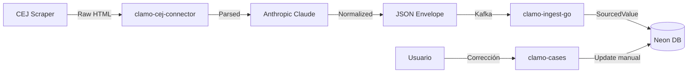

# Modelo de Datos

Clamo maneja datos de múltiples orígenes: scrapers del CEJ, inferencias de IA y correcciones manuales de usuarios. Esta guía explica los patrones arquitectónicos para gestionar esta complejidad.

## El Problema: Datos Multi-Origen

En un sistema legal como Clamo, un mismo campo puede tener valores de diferentes fuentes:

```
Materia del Caso:
├── CEJ dice: "INDEMNIZACIÓN POR DESPIDO"
├── IA infiere: "Despido Arbitrario - Indemnización"
└── Usuario corrige: "Despido Nulo por Discriminación"
```

**¿Cuál es el valor correcto?** Depende del contexto:
- Para auditoría: necesitas ver todos los valores
- Para display: el usuario quiere ver su corrección
- Para analytics: quizás prefieras el valor normalizado por IA

## Patrón SourcedValue

Clamo implementa el patrón **SourcedValue** (Trusted Source Value) para campos que pueden tener múltiples orígenes:

```typescript
interface SourcedValue<T = string> {
  /** Valor extraído del CEJ (scraper) */
  cej?: T;
  /** Valor inferido por IA (normalización) */
  ai?: T;
  /** Valor corregido manualmente por usuario */
  manual?: T;
  /** Timestamp de última actualización por fuente */
  updatedAt?: {
    cej?: string;
    ai?: string;
    manual?: string;
  };
}
```

### Almacenamiento en Base de Datos

Los campos SourcedValue se almacenan como **JSONB** en PostgreSQL:

```prisma
model Case {
  id            String   @id
  expediente    String   @unique
  
  // Campos simples (single source)
  caseNumber    String
  filingDate    DateTime?
  
  // SourcedValue fields stored as JSONB
  subjectMatter    Json? @default("[]") // Array of SourcedValue
  processType      Json? // SourcedValue
  stage            Json? // SourcedValue
  abstract         Json? // SourcedValue (Sumilla)
  observation      Json? // SourcedValue
  conclusionReason Json? // SourcedValue
  
  // CEJ-sourced fields (raw, no transformation)
  cejJudicialDistrict String?
  cejProceduralStage  String?
  
  // AI-sourced fields
  aiConclusionDate DateTime?
}
```

### Ejemplo de Datos

```json
{
  "id": "case_abc123",
  "expediente": "00001-2024-0-1234-JR-LA-01",
  "subjectMatter": {
    "cej": "INDEMNIZACIÓN POR DESPIDO ARBITRARIO",
    "ai": "Despido Arbitrario - Indemnización por Daños",
    "manual": null,
    "updatedAt": {
      "cej": "2024-01-15T10:00:00Z",
      "ai": "2024-01-15T10:05:00Z"
    }
  },
  "stage": {
    "cej": "EJECUCIÓN DE SENTENCIA",
    "ai": "Ejecución",
    "manual": "Ejecución - Pendiente Pago",
    "updatedAt": {
      "cej": "2024-01-15T10:00:00Z",
      "ai": "2024-01-15T10:05:00Z",
      "manual": "2024-01-20T14:30:00Z"
    }
  }
}
```

## Resolución de Valores

### Prioridad por Defecto

La función `resolveValue` aplica la siguiente prioridad:

```typescript
function resolveValue<T>(sourced: SourcedValue<T>): T | null {
  // 1. Manual siempre gana (usuario tiene la última palabra)
  if (sourced.manual !== undefined && sourced.manual !== null) {
    return sourced.manual;
  }
  
  // 2. AI es preferido sobre CEJ (normalizado)
  if (sourced.ai !== undefined && sourced.ai !== null) {
    return sourced.ai;
  }
  
  // 3. CEJ como fallback (raw)
  return sourced.cej ?? null;
}
```

### Resolución Contextual

Para casos específicos, puedes solicitar una fuente particular:

```typescript
function getValueBySource<T>(
  sourced: SourcedValue<T>, 
  source: 'cej' | 'ai' | 'manual' | 'resolved'
): T | null {
  switch (source) {
    case 'cej': return sourced.cej ?? null;
    case 'ai': return sourced.ai ?? null;
    case 'manual': return sourced.manual ?? null;
    case 'resolved': return resolveValue(sourced);
  }
}
```

## Fuentes de Datos

### ClaimSource Enum

Para campos que solo tienen una fuente (no SourcedValue), usamos el enum `ClaimSource`:

```prisma
enum ClaimSource {
  CEJ     // Extraído del scraper
  AI      // Inferido por modelo
  MANUAL  // Ingresado por usuario
}

model Claim {
  id          String      @id
  type        ClaimType
  amount      Decimal?
  description String?
  source      ClaimSource // Indica el origen del claim
}
```

## Movimientos y SourcedValue

Los movimientos procesales también usan SourcedValue para campos que pueden ser enriquecidos:

```prisma
model Movement {
  id              String   @id
  caseId          String
  
  // Raw CEJ data (inmutable)
  cejDate         DateTime
  cejDescription  String?
  cejRawPayload   Json?    // Payload completo del scraper
  
  // SourcedValue fields as JSONB
  name     Json?  // Display name normalizado
  summary  Json?  // Resumen generado por IA
  tags     Json?  // Tags de clasificación
  metadata Json?  // Metadata adicional
}
```

## Beneficios del Patrón

### 1. Trazabilidad Completa

Siempre puedes ver de dónde vino cada valor:

```typescript
// En el frontend
function renderFieldWithSource(field: SourcedValue<string>) {
  const resolved = resolveValue(field);
  const source = field.manual ? 'manual' : field.ai ? 'ai' : 'cej';
  
  return (
    <div>
      <span>{resolved}</span>
      <Badge variant={source}>{source.toUpperCase()}</Badge>
    </div>
  );
}
```

### 2. Auditoría y Compliance

Para casos legales, es crítico poder demostrar el origen de los datos:

```sql
-- Ver historial de cambios por fuente
SELECT 
  id,
  expediente,
  subject_matter->>'cej' as cej_value,
  subject_matter->>'ai' as ai_value,
  subject_matter->>'manual' as manual_value,
  subject_matter->'updatedAt'->>'manual' as manual_updated_at
FROM "Case"
WHERE subject_matter->>'manual' IS NOT NULL;
```

### 3. Rollback Granular

Si la IA comete un error, el valor del CEJ sigue disponible:

```typescript
async function rollbackToSource(caseId: string, field: string, source: 'cej' | 'ai') {
  const case = await db.case.findUnique({ where: { id: caseId } });
  const sourced = case[field] as SourcedValue;
  
  // Limpiar manual y usar la fuente especificada
  await db.case.update({
    where: { id: caseId },
    data: {
      [field]: {
        ...sourced,
        manual: null,
      }
    }
  });
}
```

### 4. Analytics Diferenciados

Puedes analizar la calidad de cada fuente:

```sql
-- Tasa de correcciones manuales (indica problemas con IA/CEJ)
SELECT 
  COUNT(*) FILTER (WHERE subject_matter->>'manual' IS NOT NULL) as corrected,
  COUNT(*) as total,
  ROUND(
    COUNT(*) FILTER (WHERE subject_matter->>'manual' IS NOT NULL)::numeric / 
    COUNT(*)::numeric * 100, 2
  ) as correction_rate
FROM "Case";
```

## Integración con el Pipeline

### Flujo de Datos



### Ejemplo de Ingesta

```typescript
// clamo-ingest-go recibe el envelope normalizado
const envelope = {
  case: {
    expediente: "00001-2024-0-1234-JR-LA-01",
    subjectMatter: "INDEMNIZACIÓN POR DESPIDO", // del CEJ
    normalizedSubjectMatter: "Despido Arbitrario - Indemnización", // de IA
  }
};

// Se transforma a SourcedValue antes de insertar
const caseData = {
  expediente: envelope.case.expediente,
  subjectMatter: {
    cej: envelope.case.subjectMatter,
    ai: envelope.case.normalizedSubjectMatter,
    manual: null,
    updatedAt: {
      cej: new Date().toISOString(),
      ai: new Date().toISOString(),
    }
  }
};
```

## Próximos Pasos

<CardGroup cols={2}>
  <Card
    title="Multi-Tenancy"
    icon="building"
    href="/es/guias/multi-tenancy"
  >
    Arquitectura de base de datos por tenant.
  </Card>
  <Card
    title="Pipeline de Datos"
    icon="diagram-project"
    href="/es/arquitectura/pipeline-datos"
  >
    Flujo completo de extracción e ingesta.
  </Card>
</CardGroup>
