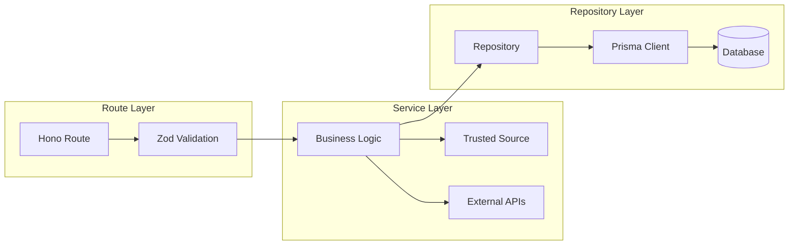

# Patrón RRS (Repository-Route-Service)

El patrón **RRS** es la columna vertebral de cómo está organizado el código en los backends de Clamo (`clamo-cases` y `clamo-tenant`). Entenderlo es fundamental para no meter lógica de negocio en los controladores ni consultas SQL en los servicios.

## Visión General



## Las Tres Capas

### 1. Route (Controlador)

**Responsabilidad:** Validar entrada y formatear salida. **NADA MÁS.**

```typescript
// ✅ CORRECTO: Route solo valida y responde
// clamo-cases/src/routes/cases.ts
import { Hono } from "hono";
import { zValidator } from "@hono/zod-validator";
import { z } from "zod";
import { CaseService } from "../services/case.service.js";

const UpdateCaseSchema = z.object({
  riskLevel: z.enum(["LOW", "MEDIUM", "HIGH", "CRITICAL"]).optional(),
  notes: z.string().max(5000).optional(),
});

export function createCasesRoutes(deps: { caseService: CaseService }) {
  const app = new Hono();

  app.patch(
    "/:id",
    zValidator("json", UpdateCaseSchema),
    async (c) => {
      const id = c.req.param("id");
      const data = c.req.valid("json");
      const tenantDb = c.get("tenantDb");

      // Delegar TODO al servicio
      const result = await deps.caseService.updateCase(tenantDb, id, data);

      return c.json(result);
    }
  );

  return app;
}
```

<Warning>
**Anti-patrón:** Lógica de negocio en el Route

```typescript
// ❌ INCORRECTO: Lógica de negocio en el controlador
app.patch("/:id", async (c) => {
  const id = c.req.param("id");
  const data = c.req.valid("json");
  const tenantDb = c.get("tenantDb");

  // ❌ Esto NO debe estar aquí
  const existingCase = await tenantDb.case.findUnique({ where: { id } });
  
  if (existingCase.status === "ARCHIVED") {
    return c.json({ error: "Cannot update archived case" }, 400);
  }

  // ❌ Lógica de Trusted Source en el controlador
  const currentSource = existingCase.riskLevel?.manual ? "manual" : "ai";
  if (currentSource === "manual" && data.source === "ai") {
    return c.json({ error: "Cannot override manual with AI" }, 400);
  }

  const updated = await tenantDb.case.update({
    where: { id },
    data: { riskLevel: data.riskLevel },
  });

  return c.json(updated);
});
```
</Warning>

### 2. Service (Lógica de Negocio)

**Responsabilidad:** Toda la lógica de negocio, validaciones de dominio, orquestación de llamadas.

```typescript
// ✅ CORRECTO: Service contiene la lógica
// clamo-cases/src/services/case.service.ts
import type { PrismaClient } from "@getclamo/database";
import { CaseRepository } from "../repositories/case.repository.js";
import { resolveSourcedValue, canOverwrite } from "../utils/trusted-source.js";

export class CaseService {
  constructor(private caseRepo: CaseRepository) {}

  async updateCase(
    tenantDb: PrismaClient,
    id: string,
    data: UpdateCaseInput
  ): Promise<Case> {
    // 1. Obtener caso existente
    const existingCase = await this.caseRepo.findById(tenantDb, id);

    if (!existingCase) {
      throw new NotFoundError("Case not found");
    }

    // 2. Validaciones de negocio
    if (existingCase.status === "ARCHIVED") {
      throw new BusinessError("Cannot update archived case");
    }

    // 3. Lógica de Trusted Source
    const updateData: Partial<CaseUpdateData> = {};

    if (data.riskLevel !== undefined) {
      const currentRiskLevel = existingCase.riskLevel as SourcedValue;
      
      // Verificar si podemos sobrescribir
      if (!canOverwrite(currentRiskLevel, "manual")) {
        throw new BusinessError(
          "Cannot override manually corrected risk level"
        );
      }

      updateData.riskLevel = {
        ...currentRiskLevel,
        manual: data.riskLevel,
        updatedAt: {
          ...currentRiskLevel.updatedAt,
          manual: new Date().toISOString(),
        },
      };
    }

    // 4. Delegar persistencia al repository
    return this.caseRepo.update(tenantDb, id, updateData);
  }
}
```

### 3. Repository (Acceso a Datos)

**Responsabilidad:** Interactuar con la base de datos. **SOLO AQUÍ** se importa `@getclamo/database`.

```typescript
// ✅ CORRECTO: Repository maneja Prisma
// clamo-cases/src/repositories/case.repository.ts
import type { PrismaClient, Case } from "@getclamo/database";

export class CaseRepository {
  async findById(db: PrismaClient, id: string): Promise<Case | null> {
    return db.case.findUnique({
      where: { id },
      include: {
        movements: { orderBy: { cejDate: "desc" }, take: 10 },
        parties: true,
      },
    });
  }

  async update(
    db: PrismaClient,
    id: string,
    data: Partial<CaseUpdateData>
  ): Promise<Case> {
    return db.case.update({
      where: { id },
      data,
    });
  }

  async findByExpediente(
    db: PrismaClient,
    expediente: string
  ): Promise<Case | null> {
    return db.case.findUnique({
      where: { expediente },
    });
  }

  async list(
    db: PrismaClient,
    filters: CaseFilters,
    pagination: Pagination
  ): Promise<{ data: Case[]; total: number }> {
    const where = this.buildWhereClause(filters);

    const [data, total] = await Promise.all([
      db.case.findMany({
        where,
        skip: (pagination.page - 1) * pagination.limit,
        take: pagination.limit,
        orderBy: { [pagination.sortBy]: pagination.sortOrder },
      }),
      db.case.count({ where }),
    ]);

    return { data, total };
  }

  private buildWhereClause(filters: CaseFilters): Prisma.CaseWhereInput {
    const where: Prisma.CaseWhereInput = {};

    if (filters.status) {
      where.status = filters.status;
    }

    if (filters.riskLevel) {
      // Filtrar por valor resuelto del SourcedValue
      where.OR = [
        { riskLevel: { path: ["manual"], equals: filters.riskLevel } },
        {
          AND: [
            { riskLevel: { path: ["manual"], equals: Prisma.DbNull } },
            { riskLevel: { path: ["ai"], equals: filters.riskLevel } },
          ],
        },
      ];
    }

    return where;
  }
}
```

## Estructura de Directorios

```
clamo-cases/src/
├── routes/              # Capa Route
│   ├── cases.ts
│   ├── movements.ts
│   └── index.ts
├── services/            # Capa Service
│   ├── case.service.ts
│   ├── movement.service.ts
│   └── ingest.service.ts
├── repositories/        # Capa Repository
│   ├── case.repository.ts
│   ├── movement.repository.ts
│   └── index.ts
├── middleware/          # Middleware (auth, tenant)
│   ├── auth.ts
│   └── tenant.ts
├── utils/               # Utilidades compartidas
│   ├── trusted-source.ts
│   └── errors.ts
└── index.ts             # Entry point
```

## Inyección de Dependencias

Las dependencias se inyectan en el punto de entrada:

```typescript
// clamo-cases/src/index.ts
import { Hono } from "hono";
import { CaseRepository } from "./repositories/case.repository.js";
import { CaseService } from "./services/case.service.js";
import { createCasesRoutes } from "./routes/cases.js";

// Crear instancias
const caseRepo = new CaseRepository();
const caseService = new CaseService(caseRepo);

// Inyectar en routes
const app = new Hono();
app.route("/v1/cases", createCasesRoutes({ caseService }));

export default app;
```

## Reglas de Oro

### Lo que PUEDE hacer cada capa

| Capa | Puede | No Puede |
|------|-------|----------|
| **Route** | Validar con Zod, formatear respuesta JSON, extraer params/headers | Lógica de negocio, queries de DB, llamadas a APIs externas |
| **Service** | Lógica de negocio, validaciones de dominio, orquestar repositories, llamar APIs externas | Queries directas de Prisma, formatear respuestas HTTP |
| **Repository** | Queries de Prisma, construir WHERE clauses, manejar transacciones | Lógica de negocio, validaciones de dominio |

### Imports permitidos

```typescript
// Route
import { Hono } from "hono";
import { zValidator } from "@hono/zod-validator";
import { z } from "zod";
import { SomeService } from "../services/some.service.js";
// ❌ NO: import { PrismaClient } from "@getclamo/database";

// Service
import { SomeRepository } from "../repositories/some.repository.js";
import { ExternalApiClient } from "../clients/external.client.js";
// ❌ NO: import { Hono } from "hono";

// Repository
import type { PrismaClient } from "@getclamo/database";
// ❌ NO: import { Hono } from "hono";
// ❌ NO: import { SomeService } from "../services/...";
```

## Ejemplo Completo: Crear Caso

### Route

```typescript
// routes/cases.ts
const CreateCaseSchema = z.object({
  expediente: z.string().regex(/^\d{5}-\d{4}-\d-\d{4}-[A-Z]{2}-[A-Z]{2}-\d{2}$/),
  monitoredEntityId: z.string().uuid(),
});

app.post(
  "/",
  zValidator("json", CreateCaseSchema),
  async (c) => {
    const data = c.req.valid("json");
    const tenantDb = c.get("tenantDb");
    const session = c.get("session");

    const result = await deps.caseService.createCase(tenantDb, {
      ...data,
      createdBy: session.userId,
    });

    return c.json(result, 201);
  }
);
```

### Service

```typescript
// services/case.service.ts
async createCase(
  tenantDb: PrismaClient,
  input: CreateCaseInput
): Promise<Case> {
  // 1. Verificar que no existe
  const existing = await this.caseRepo.findByExpediente(
    tenantDb,
    input.expediente
  );

  if (existing) {
    throw new ConflictError("Case with this expediente already exists");
  }

  // 2. Verificar que la entidad monitoreada existe
  const entity = await this.entityRepo.findById(
    tenantDb,
    input.monitoredEntityId
  );

  if (!entity) {
    throw new NotFoundError("Monitored entity not found");
  }

  // 3. Crear caso con valores iniciales
  const caseData: CaseCreateData = {
    expediente: input.expediente,
    monitoredEntityId: input.monitoredEntityId,
    status: "PENDING",
    // SourcedValue inicial vacío
    subjectMatter: { cej: null, ai: null, manual: null },
    riskLevel: { cej: null, ai: null, manual: null },
    createdBy: input.createdBy,
  };

  return this.caseRepo.create(tenantDb, caseData);
}
```

### Repository

```typescript
// repositories/case.repository.ts
async create(db: PrismaClient, data: CaseCreateData): Promise<Case> {
  return db.case.create({
    data: {
      id: generateCaseId(),
      expediente: data.expediente,
      monitoredEntityId: data.monitoredEntityId,
      status: data.status,
      subjectMatter: data.subjectMatter,
      riskLevel: data.riskLevel,
      createdBy: data.createdBy,
      createdAt: new Date(),
      updatedAt: new Date(),
    },
  });
}
```

## Testing por Capa

### Test de Route (Integration)

```typescript
// routes/cases.test.ts
describe("POST /v1/cases", () => {
  it("validates expediente format", async () => {
    const res = await app.request("/v1/cases", {
      method: "POST",
      body: JSON.stringify({ expediente: "invalid" }),
    });

    expect(res.status).toBe(400);
    const body = await res.json();
    expect(body.error.code).toBe("VALIDATION_ERROR");
  });
});
```

### Test de Service (Unit)

```typescript
// services/case.service.test.ts
describe("CaseService.createCase", () => {
  it("throws ConflictError if expediente exists", async () => {
    const mockRepo = {
      findByExpediente: vi.fn().mockResolvedValue({ id: "existing" }),
    };

    const service = new CaseService(mockRepo as any);

    await expect(
      service.createCase(mockDb, { expediente: "00001-2024-..." })
    ).rejects.toThrow(ConflictError);
  });
});
```

### Test de Repository (Integration)

```typescript
// repositories/case.repository.test.ts
describe("CaseRepository.create", () => {
  it("creates case with correct structure", async () => {
    const repo = new CaseRepository();

    const result = await repo.create(testDb, {
      expediente: "00001-2024-0-1234-JR-LA-01",
      status: "PENDING",
    });

    expect(result.id).toMatch(/^case_/);
    expect(result.expediente).toBe("00001-2024-0-1234-JR-LA-01");
  });
});
```

## Beneficios del Patrón

| Beneficio | Descripción |
|-----------|-------------|
| **Testabilidad** | Cada capa se puede testear de forma aislada |
| **Mantenibilidad** | Cambios en DB no afectan lógica de negocio |
| **Claridad** | Sabes exactamente dónde buscar cada tipo de código |
| **Reutilización** | Services y Repositories se pueden reutilizar |
| **Onboarding** | Nuevos desarrolladores entienden la estructura rápido |

## Próximos Pasos

<CardGroup cols={2}>
  <Card
    title="Modelo de Datos"
    icon="database"
    href="/es/arquitectura/modelo-datos"
  >
    Patrón SourcedValue para datos multi-origen.
  </Card>
  <Card
    title="SDKs de Servicio"
    icon="plug"
    href="/es/arquitectura/sdks-servicio"
  >
    Comunicación servicio-a-servicio.
  </Card>
</CardGroup>
